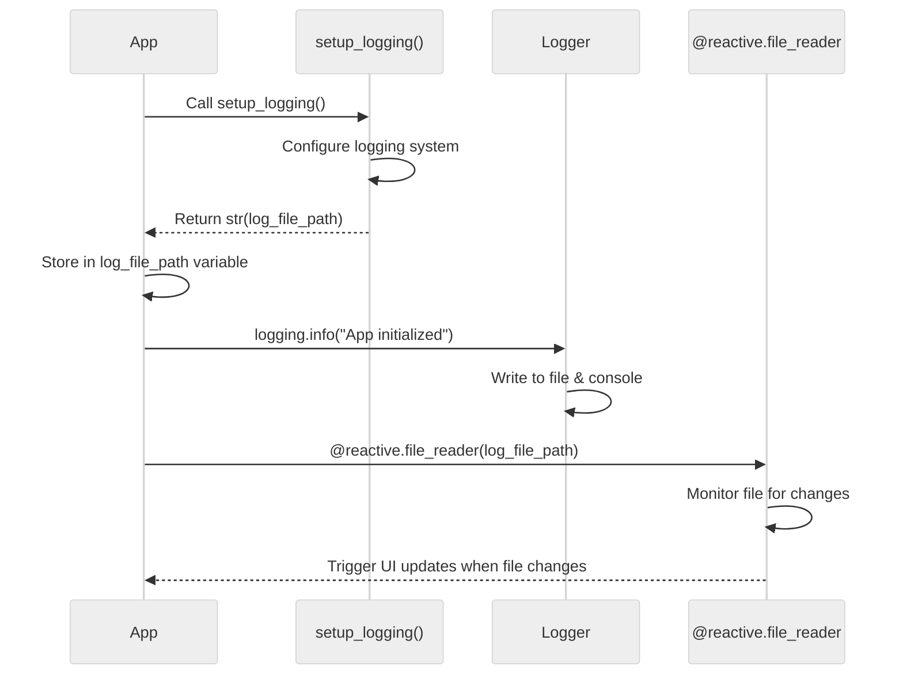

# Shiny for Python App Logging (lab 4) 

This folder contains a Shiny for Python app that makes requests to a vetiver API. 

## Set up

1. Determine Python

```bash
# check  Python version
which python3
python3 --version
```

2. Create virtual environment 

```bash
# cd Python/app/ # run if not in app directory 
/usr/bin/python3 -m venv .venv # using system Python because it has SSL
source .venv/bin/activate  
```

3. Install libraries

```bash
pip install --upgrade pip
pip install logging
pip install -r requirements.txt
```

4. Verify

```bash
# verify install
python -c "import shiny; print('✅ Shiny installed:', shiny.__version__)"
python -c "import requests; print('✅ Requests installed:', requests.__version__)"
```

Should show: 

```bash
# ✅ Shiny installed: 1.4.0
# ✅ Requests installed: 2.32.5
```

## Launch

Launch API:

In a separate Terminal, launch the API by navigating to `do4ds-labs/_labs/lab4/Python/api/` and entering:

```bash
# source .env/bin/activate # if not activated 
python3 mod-api.py
```

Run app using: 

```bash
shiny run app.py --host 127.0.0.1 --port 3000 --reload
```

### Architecture 

