# <em>Python App Logging</em> {.unnumbered}

```{r}
#| label: common
#| include: false
source("_common.R")
```

```{r}
#| label: co_box_rev
#| echo: false
#| results: asis
#| eval: true
co_box(
  color = "o",
  look = "default", 
  hsize = "1.25", 
  size = "1.00", 
  header = "Caution", 
  fold = FALSE,
  contents = "This section is being revised. Thank you for your patience."
)
```

In this lab, I'll be updating the  Shiny for Python application from [lab 3](py-app-api.qmd) with logging and performance metrics. As a refresher, I've created a diagram below that illustrates the  app user inputs, reactives, and the API request/response. 

```{=html}
<style>

.codeStyle span:not(.nodeLabel) {
  font-family: monospace;
  font-size: 1.5em;
  font-weight: bold;
  color: #d80808 !important;
  background-color: #ffffff;
  padding: 0.2em;
}
</style>
```

```{mermaid}
%%| fig-cap: 'Python Shiny App and API'
%%| fig-width: 7.0
%%| fig-align: center
%%{init: {'theme': 'neutral', 'look': 'handDrawn', 'themeVariables': { 'fontFamily': 'monospace', "fontSize":"18px"}}}%%

sequenceDiagram
    participant User
    participant Input
    participant Reactive
    participant API
    participant Output
    
    User->>Input: Adjusts bill length slider
    Input->>Reactive: Value changes
    Note over Reactive: vals()<br>recalculates
    User->>Input: Clicks "Predict" button
    Input->>Reactive: predict event triggered
    Reactive->>API: POST request with data
    API->>Reactive: Returns prediction
    Reactive->>Output: Updates display
    Output->>User: Shows predicted mass

```

You can access the code for this application in [this folder on GitHub](https://github.com/mjfrigaard/do4ds-labs/tree/main/_labs/lab4/Python).

## Packages 

In the top of our `app-log.py` file, we load the following packages. 

```{python}
#| label: packages 
#| eval: false 
#| code-fold: false 
from shiny import App, render, ui, reactive
import requests
import json
import logging
import time
import os
from datetime import datetime
from pathlib import Path
```


### Configure logging 

Below we configure the logging in the application with `logging`.[^logging] `Path("logs")` creates a [`pathlib.Path` object](https://docs.python.org/3/library/pathlib.html#basic-use), which is our log directory (`log_dir`). The `log_file` is created by joining paths with `/`, which automatically handles path separators for different operating systems. 

[^logging]: [`logging`](https://docs.python.org/3/library/logging.html#) — Logging facility for Python.


```{python}
#| label: setup_logging
#| eval: false 
#| code-fold: false 
def setup_logging():
    """Configure logging with file and console output"""
    log_dir = Path("logs")#<1>
    log_dir.mkdir(exist_ok=True)#<2>
    
    log_file = log_dir / "shiny_app.log"#<3>
    
    logging.basicConfig( #<4>
        level=logging.INFO, #<5>
        format='%(asctime)s - %(levelname)s - %(message)s',  #<6>
        handlers=[
            logging.FileHandler(log_file, mode='a'), #<7>
            logging.StreamHandler()
        ]
    ) #<4>
    
    return str(log_file) #<8>

log_file_path = setup_logging() #<9>
logging.info("Shiny for Python application initialized") #<10>
```
1. creates a `pathlib.Path` object, which is more powerful than a string. 
2. creates directory if it doesn't exist (won't raise an error if directory already exists) 
3. Joins paths using `/` operator (equivalent to `os.path.join(log_dir, "filename")`)  
4. Configuration for log level, file format, and handlers.    
5. Only `INFO`, `WARNING`, `ERROR`, and `CRITICAL` messages are logged).  
6. Every log entry has the same format (`timestamp` - `level` - `message`)
7. Logs accumulate across application restarts    
8. Convert `Path` object to string    
9. Store the path (kater used for file monitoring)      
10. Log app initialization with `logging.info()`    


[`logging.basicConfig()`](https://docs.python.org/3/library/logging.html#logging.basicConfig) "*does basic configuration for the logging system.*" We specify the `level`, `format`, and `handlers`. 

* `level`: `logging.INFO` is the "*root logger level*." This means `DEBUG` messages are ignored.  

* `format`: "*Defaults to attributes `levelname`, `name` and `message` separated by colons*."
    
```{mermaid}
%%| fig-cap: 'Python logging'
%%| fig-width: 7.0
%%| fig-align: center
%%{init: {'theme': 'neutral', 'look': 'handDrawn', 'themeVariables': { 'fontFamily': 'monospace'}}}%%

graph LR
    LogMessage(["<strong>Log<br>created</strong>"]) --> Logger("Python<br>logger")
    Logger --> FileHandler("<strong>logging.FileHandler</strong>")
    Logger --> ConsoleHandler("<strong>logging.StreamHandler</strong>")
    
    subgraph FH["FileHandler"]
        FH1("mode='a'<br>(append mode)")
        FH2("Creates file if doesn't exist")
        FH3(["<strong>Writes to: logs/shiny_app.log</strong>"])
    end

    FileHandler -.-> FH1 & FH2 & FH3
    
    subgraph SH["StreamHandler"]
        SH1("Default: <em>sys.stderr</em>")
        SH2(["<strong>Outputs to console/terminal</strong>"])
        SH3("Real-time display")
    end

    ConsoleHandler -.-> SH1 & SH2 & SH3

	style LogMessage fill:#d8e4ff
	style FH3 fill:#31e981
	style SH2 fill:#31e981
    
```

`handlers`: these are '*an iterable of already created handlers to add to the root logger.*' 

* [`FileHandler()`](https://docs.python.org/3/library/logging.handlers.html#logging.FileHandler) "*sends logging output to a disk file. It inherits the output functionality from `StreamHandler`.*"   
    * `mode='a'` means previous log entries are preserved       
* [`StreamHandler()`](https://docs.python.org/3/library/logging.handlers.html#logging.StreamHandler) "*sends logging output to streams such as `sys.stdout`, `sys.stderr` or any file-like object (or, more precisely, any object which supports `write()` and `flush()` methods).*"   

This results in the following log in the **Console**:

```{verbatim}
2025-09-15 06:58:53,346 - INFO - New session started - Session: py_79024
```

And our log file is created in `logs/` directory: 

```{verbatim}
├── app-log.py
├── logs
│   └── shiny_app.log #<1> 
├── Python.Rproj
├── README.md
└── requirements.txt

2 directories, 5 files
```
1. New log file!    

### API configuration 

Below we define the URLs for the API and `ping` (for the health check).

```{python}
#| label: api
#| eval: false 
#| code-fold: false 
api_url = 'http://127.0.0.1:8080/predict'
ping_url = 'http://127.0.0.1:8080/ping'
```

### Session token

At the top of our application we're going to create a `ui.div()` for displaying the `session` id.[^ui-html] 

[^ui-html]: Shiny for Python [HTML tag objects](https://shiny.posit.co/py/docs/ui-html.html#html-tag-objects). 

#### UI

Inside the `ui.div()`, we'll add some custom CSS styling so the **Session** has persistent visibility (i.e., the element stays visible when the user is scrolling). The following CSS variables are used to style session ID output: 

1. [`position`](https://developer.mozilla.org/en-US/docs/Web/CSS/position)  
2. [`top`](https://developer.mozilla.org/en-US/docs/Web/CSS/top)  
3. [`right`](https://developer.mozilla.org/en-US/docs/Web/CSS/right)  
4. [`z-index`](https://developer.mozilla.org/en-US/docs/Web/CSS/z-index)    
5. [`color`](https://developer.mozilla.org/en-US/docs/Web/CSS/color)  
6. [`background`](https://developer.mozilla.org/en-US/docs/Web/CSS/background)  
7. [`padding`](https://developer.mozilla.org/en-US/docs/Web/CSS/padding)  
8. [`border-radius`](https://developer.mozilla.org/en-US/docs/Web/CSS/border-radius)  
9. [`box-shadow`](https://developer.mozilla.org/en-US/docs/Web/CSS/box-shadow)  


```{python}
#| label: token-ui
#| eval: false 
#| code-fold: false 
ui.div(
    ui.strong("Session: "),
    ui.output_text("session_display"), #<1>
    style="position: fixed; top: 10px; right: 10px; z-index: 1000; color: #333; background: #fff; padding: 5px; border-radius: 3px; box-shadow: 0 2px 4px rgba(0,0,0,0.1);" #<2>
)
```
1. Session ID output    
2. CSS styling for session ID   

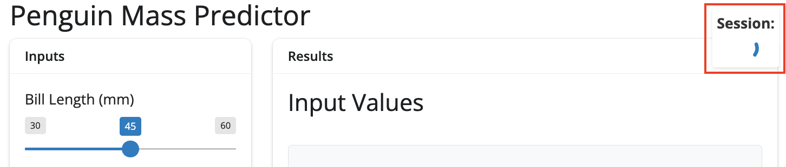{width='100%' fig-align='center'}

The [`ui.output_text()`](https://shiny.posit.co/py/api/core/ui.output_text.html) contains an `id` for the `session_display`. 

#### Server

In the server, we start by creating the `session_id` object with f-string formatting (`f"py_{result}"`). This prepends `py_` to the output (i.e., `py_result`).[^f-string] The `py_` prefix is like as a namespace identifier so it's clear these are Python-generated session IDs (not R, JavaScript, etc.), and provides a consistent format for parsing/filtering logs later.

[^f-string]: [Formatted string literals](https://docs.python.org/3/tutorial/inputoutput.html#formatted-string-literals) "*let you include the value of Python expressions inside a string by prefixing the string with `f` or `F` and writing expressions as `{expression}`*."

```{r}
#| label: co_box_session_id
#| echo: false
#| results: asis
#| eval: true
co_box(
  color = "b",
  look = "default", 
  hsize = "1.15", 
  size = "1.00", 
  header = "**LLM: Session ID Expression Breakdown**", 
  fold = TRUE,
  contents = "I asked Claude 'How should I create a unique session ID for my Shiny for Python applicaion' and received the answer below:
  
- `time.time()` is a Python function that returns the current time as a floating-point number representing seconds since the Unix epoch (January 1, 1970, 00:00:00 UTC). The return value includes fractional seconds with microsecond precision, so we get something like `1694438318.619247` where the decimal portion represents microseconds.

- Multiplying by 1000 (`* 1000`) converts the seconds-based timestamp into milliseconds. This transforms `1694438318.619247` into `1694438318619.247`, effectively *moving the decimal point three places to the right*. The fractional part now represents sub-millisecond precision (microseconds), but we're primarily interested in the whole number milliseconds.

- `int()` truncates the floating-point number to an integer, discarding the fractional microsecond portion (`int(1694438318619.247)` becomes `1694438318619`). This *gives us millisecond precision for uniqueness and eliminates the floating-point arithmetic* that could cause issues in string formatting or comparisons.

- The modulo operation (`% 100000`) with 100,000 takes the remainder when dividing by 100,000. *This effectively keeps only the last 5 digits of the timestamp*. For example, `1694438318619 % 100000 = 18619`. This serves multiple purposes:    
  - it keeps the ID short and human-readable        
  - prevents extremely long session IDs that could cause UI layout issues     
  - maintains reasonable uniqueness since the last 5 digits of a millisecond timestamp cycle through all possibilities     
  
"
)
```

```{python}
#| eval: false 
#| code-fold: false 
def server(input, output, session): #<1> 
  
    session_id = f"py_{int(time.time() * 1000) % 100000}" #<2> 
    
    logging.info(f"New session started - Session: {session_id}") #<3> 
```
1. Shiny server definition  
2. f-string for time  
3. f-string for session ID  

The first log (`logging.info`) tells us the Shiny session has started. 

```{verbatim}
2025-09-14 21:29:39,024 - INFO - New session started - Session: py_79024
```

To render the `session_id`, we define `session_display()` under the [`@render.text`](https://shiny.posit.co/py/api/core/render.text.html) decorator and link this to the `id` we created in the [`ui.output_text()`](https://shiny.posit.co/py/api/core/ui.output_text.html).

```{python}
#| eval: false 
#| code-fold: false 
    @render.text #<1>
    def session_display(): #<2> 
        return session_id[:8] #<3> 
```
1. Render decorator for session ID display      
2. Definition of `session_display()` function   
3. Index the first 8 characters in `session_id`   

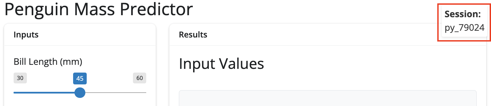{width='100%' fig-align='center'}

```{mermaid}
%%| fig-cap: 'Session ID'
%%| fig-width: 7.0
%%| fig-align: center
%%{init: {'theme': 'neutral', 'look': 'handDrawn', 'themeVariables': { 'fontFamily': 'monospace'}}}%%

graph TB
    Decorator(["<strong>@render.text</strong>"]) --"<em>defines</em>"--> Function("session_display()")
    Function --> Registration{{"Registers with Shiny's<br>reactive system"}}
    Registration --"<em>binds to</em>"--> UIBinding("ui.output_text('session_display')")
    UIBinding --> AutoUpdate(["<strong>Automatically updates<br>UI when called</strong>"])
    

	style Decorator fill:#d8e4ff
	style Registration text-align:center
	style AutoUpdate fill:#31e981

```

### Params and Predictions

The model parameter inputs (penguin bill length, sex, and species) are described below. The inputs are passed to the API when the **Predict** button is clicked, and a model prediction is returned. The UI for this section of the application hasn't changed much from the [previous lab](py-app-api.qmd), but I've included a section for logging and monitoring.

#### UI

The diagram below attempts to capture the hierarchy of the UI functions: 

```{mermaid}
%%| fig-cap: 'Predictions (UI)'
%%| fig-width: 7.0
%%| fig-align: center
%%{init: {'theme': 'neutral', 'look': 'handDrawn', 'themeVariables': { 'fontFamily': 'monospace'}}}%%

graph TD
    subgraph "UI Hierarchy"
        Card(["ui.card(<strong>'Results'</strong>) container"])
        Header("ui.card_header(<strong>'Results'</strong>)")
    end
    
    subgraph Inputs["Input Values"]
        InputHeader("ui.h3(<strong>'Input Values'</strong>)")
        subgraph iDiv["<strong>ui.div()</strong>"]
            InpValOut(["ui.output('<strong>vals_out</strong>')"])
        end
    end
    
    subgraph Preds["Predictions"]
        PredHeader("ui.h3(<strong>'Predicted Mass'</strong>)")
        subgraph pDiv["<strong>ui.div()</strong>"]
            PredOut(["ui.output_text('<strong>pred_out</strong>')"])
        end
    end
    
    Card --> Header
    Header --> Inputs
    Header --> Preds
    PredHeader --"<em>Styled container</em>" --> pDiv
    InputHeader --"<em>Styled container</em>" --> iDiv

	style Card fill:#d8e4ff
	style InpValOut fill:#31e981
	style PredOut fill:#31e981
    
    
```

The input values are stored in a `ui.card()` and include our four reactives: `input.bill_length()`, `input.sex()`. `input.species()`, and `input.predict()`.

```{python}
#| eval: false 
#| code-fold: false 
ui.layout_columns(
    ui.card(
        ui.card_header("Inputs"),
        ui.input_slider(id="bill_length", label="Bill Length (mm)", min=30, max=60, value=45, step=0.1),#<1>
        ui.input_select(id="sex", label="Sex", choices=["Male", "Female"]),#<2>
        ui.input_select(id="species", label="Species", choices=["Adelie", "Chinstrap", "Gentoo"]),#<2>
        ui.input_action_button(id="predict", label="Predict")#<3>
    ), 
    # ...
```
1. Numeric input for penguin bill length (mm)   
2. Drop-down inputs for penguin sex and species   
3. Make a prediction (send request to API)    

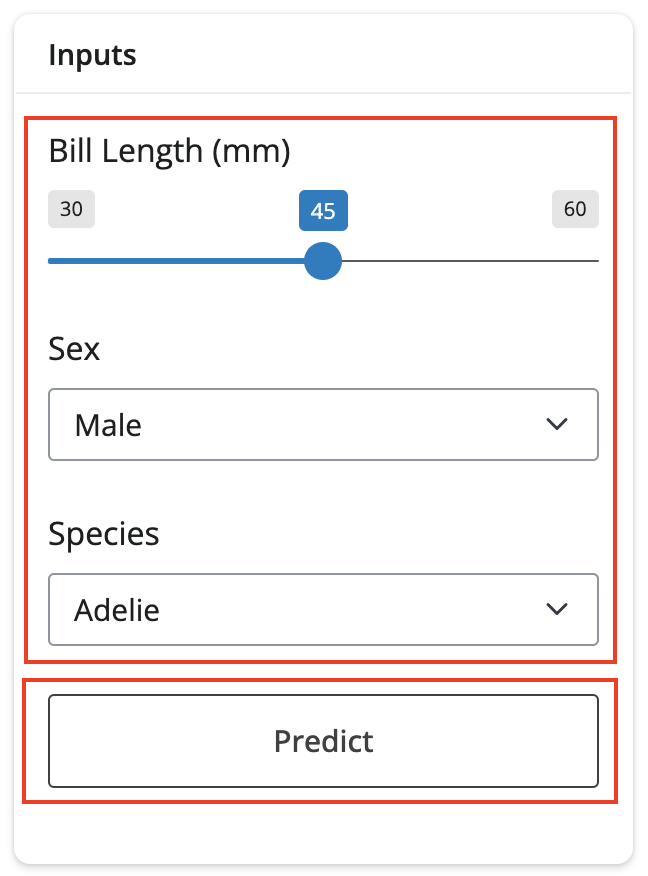{width='70%' fig-align='center'}

Instead of using the sidebar layout, I've place a second `ui.card()` inside the `ui.layout_columns()` and titled it **Results**. This includes the **Input Values** and **Predicted Mass** sections. 

We can set the widths for each `ui.card()` with `col_widths=[4, 8]`, which will give the general appearance of a sidebar (while leaving us with more screen real-estate for the **System Status** section we'll add below). 

The following CSS styling variables are used to give the input values display a console-like appearance: 

1. [`font-family`](https://developer.mozilla.org/en-US/docs/Web/CSS/font-family)      
2. [`font-size`](https://developer.mozilla.org/en-US/docs/Web/CSS/font-size)          
3. [`background-color`](https://developer.mozilla.org/en-US/docs/Web/CSS/background-color)           
4. [`padding`](https://developer.mozilla.org/en-US/docs/Web/CSS/padding)            
5. [`border-radius`](https://developer.mozilla.org/en-US/docs/Web/CSS/border-radius)            
6. [`max-height`](https://developer.mozilla.org/en-US/docs/Web/CSS/max-height)           
7. [`overflow-y`](https://developer.mozilla.org/en-US/docs/Web/CSS/overflow-y)           
8. [`border`](https://developer.mozilla.org/en-US/docs/Web/CSS/border)         
9. [`white-space`](https://developer.mozilla.org/en-US/docs/Web/CSS/white-space)            

The returned prediction is styled with the following CSS variables:

1. [`font-size`](https://developer.mozilla.org/en-US/docs/Web/CSS/font-size)      
2. [`font-weight`](https://developer.mozilla.org/en-US/docs/Web/CSS/font-weight)         
3. [`text-align`](https://developer.mozilla.org/en-US/docs/Web/CSS/text-align)        
4. [`center`](https://developer.mozilla.org/en-US/docs/Web/CSS/center)        
5. [`padding`](https://developer.mozilla.org/en-US/docs/Web/CSS/padding)        
6. [`color`](https://developer.mozilla.org/en-US/docs/Web/CSS/color)        

```{python}
#| eval: false 
#| code-fold: false 
  ui.layout_columns(
    # ... <Inputs section omitted> ...
        ui.card(
            ui.card_header("Results"),
            ui.h3("Input Values"),
            ui.div(#<1>
                ui.output_text("vals_out"),#<2>
                style="font-family: 'Monaco', 'Courier New', monospace; font-size: 14px; background-color: #f8f9fa; padding: 10px; border-radius: 5px; max-height: 250px; overflow-y: auto; border: 1px solid #dee2e6; white-space: pre-wrap;"#<3>
            ),#<1>
            ui.h3("Predicted Mass"),
            ui.div( #<4>
                ui.output_text("pred_out"), #<5>
                style="font-size: 24px; font-weight: bold; text-align: center; padding: 15px; color: #0066cc;" #<6>
            )
        ), #<4>
    col_widths=[4, 8]
  )
```
1. `div()` for values being sent to API   
2. Text output for values (plain text)    
3. CSS styling for API values (formatted like the console output)   
4. `div()` for prediction value returned from the API   
5. Text output for response from API    
6. CSS styling for API values (formatted to be large and colorful)    


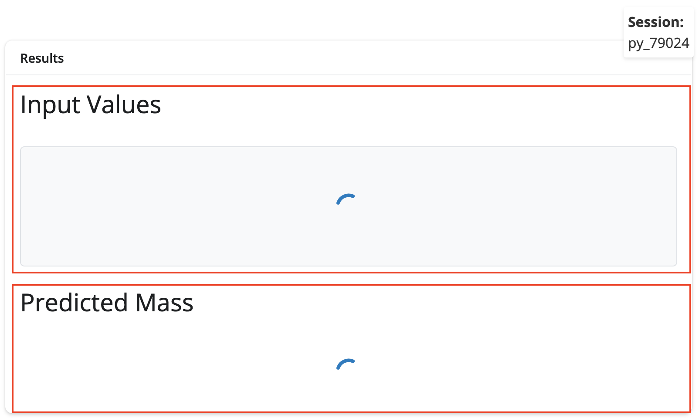{width='100%' fig-align='center'}


These outputs won't render until we add the corresponding server components. 


#### ***Input Values***

I've separated the server code for the **Input Values** and **Predicted Mass** sections below. The user inputs are displayed as a plain-text representation of the values before they are sent to the API. 

```{python}
#| eval: false 
#| code-fold: false 
    @reactive.calc
    def vals():
        bill_length = input.bill_length() #<1>
        species = input.species()
        sex = input.sex() #<1>
        
        if bill_length < 30 or bill_length > 60: #<2>
            logging.warning(f"Bill length out of typical range - Session: {session_id} - bill_length: {bill_length}") #<2>
        
        d = [{ #<3>
            "bill_length_mm": float(bill_length),
            "species_Chinstrap": int(species == "Chinstrap"),
            "species_Gentoo": int(species == "Gentoo"),
            "sex_male": int(sex == "Male")
        }] #<3>
        
        logging.debug(f"Input data prepared - Session: {session_id} - data: {json.dumps(d)}") #<4>
        return d
```
1. Reactive inputs 
2. Input validation with logging      
3. Create data in LIST format (what API expects)  
4. Debug logging (with JSON formatted inputs)   

```{mermaid}
%%| fig-cap: 'Reactive Inputs'
%%| fig-width: 7.0
%%| fig-align: center
%%{init: {'theme': 'neutral', 'look': 'handDrawn', 'themeVariables': { 'fontFamily': 'monospace'}}}%%

graph LR
    subgraph Inputs["Reactive Inputs"]
        InputBillLength[/"<strong>input.bill_length()</strong>"/]
        InputSex[/"<strong>input.sex()</strong>"/]
        InputSpecies[/"<strong>input.species()</strong>"/]
    end

        
    Validation("Input Validation Logic")
    APIFormat("API Format<br>Creation")
    
    subgraph "Logging Behaviors"
        ValidationLog(["<strong>logging.warning for out-of-range</strong>"])
        DebugLog(["<strong>logging.debug for data prep</strong>"])
        SessionLog(["<strong>Session-specific logging</strong>"])
    end
    
    InputBillLength --> Validation
    InputSex & InputSpecies --"data<br>transformation"--> APIFormat
    Validation --> ValidationLog
    APIFormat --> DebugLog

	style InputBillLength fill:#d8e4ff
	style InputSex fill:#d8e4ff
	style InputSpecies fill:#d8e4ff

	style ValidationLog fill:#31e981
	style DebugLog fill:#31e981
	style SessionLog fill:#31e981

```

To render the reactive `vals()`, we define `vals_out()` with `@render.text` and include a 'debug' level log to review/investigate any issues. 

```{python}
#| eval: false 
#| code-fold: false 
    @render.text
    def vals_out(): #<1>
        data = vals() #<2>
        logging.debug(f"Displaying input values to user - Session: {session_id}") #<3>
        return f"{data}" #<4>
```
1. Define `vals_out()` for rendering  
2. Dependency on reactive calculation (automatically updates when `vals()` changes)
3. Debug logging of user interactions for monitoring  
4. Simple string conversion   

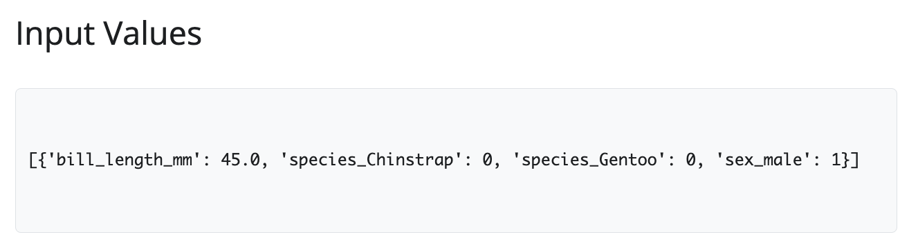{width='100%' fig-align='center'}

#### ***Predicted Mass***

The **Predicted Mass** is really the heart of the application, and it's definitely the most complicated reactive value in the server. The full definition is below, but we'll dive into each level of logging in the following sections. 

```{python}
#| eval: false 
#| code-fold: true 
#| code-summary: 'show/hide pred() reactive' 
    @reactive.calc
    @reactive.event(input.predict)
    def pred():
        """Prediction with logging"""
        request_start = time.time()
        data_to_send = vals()
        
        logging.info(f"Starting prediction request - Session: {session_id} - request_data: {json.dumps(data_to_send)}")
        
        try:
            print(f"\n=== PREDICTION REQUEST ===")
            print(f"Sending data to API: {data_to_send}")
            
            r = requests.post(api_url, json=data_to_send, timeout=30)
            response_time = time.time() - request_start
            
            # update performance metrics 
            # (keep for internal tracking)
            current_times = request_times()
            current_times.append(response_time)
            if len(current_times) > 10:
                current_times = current_times[-10:]
            request_times.set(current_times)
            
            print(f"HTTP Status Code: {r.status_code}")
            print(f"Raw response text: {r.text}")
            
            if r.status_code == 200:
                result = r.json()
                print(f"✅ Success! Parsed response: {result}")
                
                # handle different possible response formats  
                if '.pred' in result:
                    prediction = result['.pred'][0]
                elif 'predict' in result:
                    prediction = result['predict'][0]
                else:
                    logging.warning(f"Unexpected response format - Session: {session_id} - response: {result}")
                    return f"Unexpected response format: {result}"
                
                logging.info(f"Prediction successful - Session: {session_id} - response_time: {response_time:.3f}s - prediction: {prediction}")
                
                # performance warning
                if response_time > 5:
                    logging.warning(f"Slow API response - Session: {session_id} - response_time: {response_time:.3f}s")
                
                return prediction
            else:
                error_msg = f"API Error {r.status_code}: {r.text}"
                logging.error(f"Prediction request failed - Session: {session_id} - status: {r.status_code} - response: {r.text[:200]}")
                error_count.set(error_count() + 1)
                return error_msg
                
        except requests.exceptions.ConnectionError as e:
            error_msg = f"Connection Error: {str(e)}"
            logging.error(f"API connection refused during prediction - Session: {session_id} - error: {str(e)}")
            connection_errors.set(connection_errors() + 1)
            error_count.set(error_count() + 1)
            print(f"❌ Connection Error: {e}")
            return error_msg
        except requests.exceptions.Timeout:
            error_msg = "Request timed out - API may be overloaded"
            logging.warning(f"API timeout during prediction - Session: {session_id}")
            timeout_errors.set(timeout_errors() + 1)
            error_count.set(error_count() + 1)
            return error_msg
        except Exception as e:
            error_msg = f"Error: {str(e)}"
            logging.error(f"Unknown prediction error - Session: {session_id} - error: {str(e)}")
            error_count.set(error_count() + 1)
            print(f"❌ Error: {e}")
            return error_msg
```

The `@reactive.calc` and `@reactive.event(input.predict)` decorators override the standard reactive behavior so the `pred()` function only executes when the **Predict** button is clicked (rather than whenever any input changes). This allows users to adjusting input parameters without sending  accidental API calls (and ensures predictions only happen when the user explicitly requests a response).

```{python}
#| eval: false 
#| code-fold: false 
    @reactive.calc #<1>
    @reactive.event(input.predict) #<1>
    def pred(): #<1>
        """Prediction with logging""" #<2>
        request_start = time.time() #<3>
        data_to_send = vals() #<4>
        
        logging.info(f"Starting prediction request - Session: {session_id} - request_data: {json.dumps(data_to_send)}") #<5>
```
1. Stacking these decorators creates a lazy evaluation with manual trigger, where the `pred()` function is reactive (cached) (but only executes on explicit events).   
2. Docstring for function purpose.     
3. Provides precise millisecond-level stat time of API request.   
4. Values to be sent to the API.    
5. The f-string combines `{session_id}` (prints session ID) and `{json.dumps(data_to_send)}` (converts the Python data structure into a JSON string) for logging. 

This combines the performance benefits of caching with the user control of manual triggering:

```{mermaid}
%%| fig-cap: 'Predicted Values'
%%| fig-width: 7.0
%%| fig-align: center
%%{init: {'theme': 'neutral', 'look': 'handDrawn', 'themeVariables': { 'fontFamily': 'monospace', 'fontSize':'13px'}}}%%

graph TD
    subgraph Dec["<strong>Decorator Stack</strong>"]
        subgraph CalcDec["<strong>@reactive.calc</strong>"]
            Event("<strong>@reactive.event(input.predict)</strong>")
            Function("<strong>def pred()</strong>")
            Event --"<em><strong>@reactive.calc</strong> checks caching layer</em>"--> Function
        end
    end
    

        ButtonClick(["User clicks <strong>Predict</strong>"])
        EventTrigger[Event decorator activates]
        ExecuteFunction[Function executes]
        CacheResult(["<strong>Result cached</strong>"])

    

    ButtonClick --> EventTrigger
    EventTrigger --"<em>Caching Layer</em>"---> CalcDec
    Function ---> ExecuteFunction
    ExecuteFunction --> CacheResult

    style ButtonClick fill:#d8e4ff
    style CacheResult fill:#31e981
    style Function fill:#35605a,color:#fff
```

**Error Handling**

The error handling/logging for the inputs sent to the API (and the response) starts with `try` and attempts to handle all possible return values.

**Initial Request**

The predictions are stored in `r` and sent using `requests.post()`, which includes:   

- The destination (`api_url`)    
- Automatic conversion of Python dict to JSON format (`json`)   
- The maximum wait time in seconds (`timeout`) 

**Performance Metrics Tracking**

Performance timing is calculated using:   

- `response_time` is the current time minus start time = elapsed seconds.  
- `request_times()` is a Shiny-specific reactive value - we can call it like a function to get its value.    
- `current_times.append(response_time)` adds current response time to the list of times.    

The first `if` statement is a rolling window/circular buffer that focuses on the last 10 items and prevents the list from growing infinitely. Then the `request_times` is updated the stored value using `set(current_times)` (recall that `request_times` is a shiny-specific reactive value). 

```{python}
#| eval: false 
#| code-fold: false 
    try: #<1>
        print(f"\n=== PREDICTION REQUEST ===") #<2>
        print(f"Sending data to API: {data_to_send}") #<2>
        
        r = requests.post(api_url, json=data_to_send, timeout=30) #<3>
        
        response_time = time.time() - request_start #<4>
        current_times = request_times() #<5>
        current_times.append(response_time) #<6>
        
        if len(current_times) > 10: #<7>
            current_times = current_times[-10:] #<7>
            
        request_times.set(current_times) #<8>
        
        print(f"HTTP Status Code: {r.status_code}") #<9>
        print(f"Raw response text: {r.text}") #<9>
        
```
1. Wrap risky code (like network requests) to catch and handle errors gracefully    
2. Provides immediate visual feedback in the terminal/console (`logging.info()` creates a permanent record in log file.)    
3. HTTP `POST` request with timeout (`POST` (not `GET`) because we're sending data to create/compute something)  
4. Calculate how long the API request took.   
5. Retrieve the current list of response times  
6. Add the current request's time to the historical list 
7. Keep only the 10 most recent measurements  
8. Update the stored value  
9. See exactly what the API returned

The `print` statements give us an indication of what was returned in the HTTP status code: 

- **`200`** = Success! Everything worked.    
- **`400`** = Bad Request (you sent invalid data).     
- **`404`** = Not Found (wrong URL).     
- **`422`** = Validation Error (data format wrong).       
- **`500`** = Server Error (API crashed).       
- **`503`** = Service Unavailable (API overloaded). 

```{mermaid}
%%| fig-cap: 'HTTP Status Codes Explained'
%%| fig-width: 7.0
%%| fig-align: center
%%{init: {'theme': 'neutral', 'look': 'handDrawn', 'themeVariables': { 'fontFamily': 'monospace'}}}%%

graph LR
    A(["<strong>HTTP Status Codes</strong>"]) --> B("<code>2xx</code> Success")
    A --> C("<code>4xx</code> Client Error")
    A --> D("<code>5xx</code> Server Error")
    
    B --> B1("<code>200</code> OK")
    B --> B2("<code>201</code> Created")
    
    C --> C1("<code>400</code> Bad Request")
    C --> C2("<code>401</code> Unauthorized")
    C --> C3("<code>404</code> Not Found")
    C --> C4("<code>422</code> Validation Error")
    
    D --> D1("<code>500</code> Internal Server Error")
    D --> D2("<code>503</code> Service Unavailable")
    
    style A fill:#d8e4ff
    style B1 fill:#31e981
    style B2 fill:#31e981
```

**Response Debugging**

The error handling starts by checking the response code (**`200`**), `r.json()` is converted to a Python dictionary (`result`), then a confirmation message is printed if it's successful. `[0]` is used to index the first element in the returned list and store the result in `prediction`:

```{python}
#| eval: false 
#| code-fold: false 
        if r.status_code == 200: #<1>
            result = r.json() #<2>
            print(f"✅ Success! Parsed response: {result}")  #<3>
            
            if '.pred' in result: #<4>
                prediction = result['.pred'][0] #<4>
            elif 'predict' in result: #<5>
                prediction = result['predict'][0] #<5>
            else: #<6>
                logging.warning(f"Unexpected response format - Session: {session_id} - response: {result}")
                return f"Unexpected response format: {result}" #<6>
            
            logging.info(f"Prediction successful - Session: {session_id} - response_time: {response_time:.3f}s - prediction: {prediction}") #<7>
            
            if response_time > 5: #<8>
                logging.warning(f"Slow API response - Session: {session_id} - response_time: {response_time:.3f}s") #<8>
            
            return prediction #<9>
          
        else: #<10>
            error_msg = f"API Error {r.status_code}: {r.text}"
            logging.error(f"Prediction request failed - Session: {session_id} - status: {r.status_code} - response: {r.text[:200]}")
            error_count.set(error_count() + 1)
            return error_msg #<10>
```
1. Only proceed if request succeeded  
2. Convert JSON text to Python dictionary  
3. Success confirmation with result  
4. Handle different API response structures  
5. Try second possible prediction format   
6. Send error message back to UI instead of crashing    
7. Structured success logging with metrics  
8. Performance threshold monitoring (5 seconds--configurable based on requirements)
9. Send prediction back to calling function for display  
10. Error message construction (non-200 status)   


**Structured Logs**

:::{layout="[45,55]" layout-valign="top"}

If the returned prediction is anything other than `result['.pred'][0]` or `result['predict'][0]`, the app returns a `warning` (not an `error`) because response succeeded but format is unexpected. 

* **Structured `logging.warning()`**  
  * `Session: {session_id}` = *which user encountered this*   
  * `response: {result}` = *what was received*   
      
:::


:::{layout="[45,55]" layout-valign="top"}

If the returned prediction was successful, `logging.info()` returns an `info` log (i.e., a normal operational event, not a `warning` or `error`).    

* **Structured `logging.info()`**    
  * *Easier to parse/search logs*   
  * *Include metrics like average response time*      
  * *Debug issues by filtering by session ID*   
  
:::


:::{layout="[45,55]" layout-valign="top"}

If the response time exceeds the performance threshold (5 seconds), a `warning` is returned (because the API works but isn't optimal). This helps to identify performance degradation and helps diagnose API issues.  

* **Structured `logging.warning()`**   
  * *Identifies API server overload*   
  * *Tells us if the model taking too long to compute*     
  * *Can detect network latency issues*   

:::

:::{layout="[45,55]" layout-valign="top"}

Finally, if the API returns a non-200 status, `logging.error()` returns a human-readable error description with the first 200 characters only (`[:200]`).   

* **Structured `logging.error()`**   
  * *Truncated error logging*      
  * *Prevents log files from bloating*   
  * *User has enough information to see why prediction failed*    
      
:::


In the console, the returned predictions display the following logs:


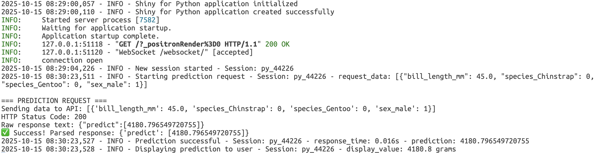{width='100%' fig-align='center'}


**Exceptions**

```{python}
#| eval: false 
#| code-fold: false 
        
    except requests.exceptions.ConnectionError as e: #<1>
        error_msg = f"Connection Error: {str(e)}" #<2>
        logging.error(f"API connection refused during prediction - Session: {session_id} - error: {str(e)}") #<3>
        connection_errors.set(connection_errors() + 1) #<4>
        error_count.set(error_count() + 1) #<4>
        print(f"❌ Connection Error: {e}")  #<5>
        return error_msg #<6>
      
```
1. Specific exception handling    
2. Convert exception object to readable string  
3. Contextual error logging   
4. Specific metric (how many connection failures?) or overall metric (total failures of any type?) 
5. Console error notification     
6. Error return   

:::{layout="[45,55]" layout-valign="top"}

The first exception uses the `requests.exceptions.` [`ConnectionError`](https://requests.readthedocs.io/en/latest/api/#requests.ConnectionError) to catch connection failures separately from other errors.

* **Exception `ConnectionError`**      
  * *The `error_msg` string is created using `str(e)` to extract the error description from exception.*      
  * *A structured `warning` log is printed to the console with the `session_id` and the error description.*   

:::

```{python}
#| eval: false 
#| code-fold: false 
      
    except requests.exceptions.Timeout: #<1>
        error_msg = "Request timed out - API may be overloaded" #<2>
        logging.warning(f"API timeout during prediction - Session: {session_id}") #<3>
        timeout_errors.set(timeout_errors() + 1) #<4>
        error_count.set(error_count() + 1) #<4>
        return error_msg #<5>
      
```
1. Timeout-specific handling (from earlier `timeout=30`)   
2. User-friendly error message to explain probable cause to user    
3. Warning-level logging (system still functional, just slow)     
4. Dual counter tracking (can analyze if performance becomes a pattern)      
5. Error message returned   

:::{layout="[45,55]" layout-valign="top"}

The second exception uses `requests.exceptions`[`.Timeout`](https://requests.readthedocs.io/en/latest/api/#requests.Timeout) as a timeout threshold, which is triggered if the API doesn't respond within 30 seconds. 

* **Exception `Timeout`**   
  * *Set with earlier `timeout=30` argument*   
  * *`warning` (not `error`) because timeouts might be temporary*     
  * *`timeout_errors.set()` and `error_count.set()` can track timeout-specific metric plus total*      
  
:::

```{python}
#| eval: false 
#| code-fold: false 
      
    except Exception as e: #<1>
        error_msg = f"Error: {str(e)}"
        logging.error(f"Unknown prediction error - Session: {session_id} - error: {str(e)}")
        error_count.set(error_count() + 1)
        print(f"❌ Error: {e}")
        return error_msg
      
```
1. Catch-all exception handler    

:::{layout="[45,55]" layout-valign="top"}

The final exception uses a generic `Exception` to handle any unexpected errors not caught above with `ConnectionError` or `Timeout`. 

* **Exception `Exception`**   
  * *Catch-all exception handler*    
  * *Only increments `error_count`, not a specific counter*     
  * *Exception order matters (i.e., more specific exceptions must be caught first)*       

:::

The `@render.text` decorator defines the `pred_out()` function, which doesn't receive the prediction value as a parameter. Instead, it calls `pred()` directly, creating an implicit reactive dependency. 

```{python}
#| eval: false 
#| code-fold: false 
@render.text
def pred_out():
    result = pred() #<1>
    if isinstance(result, (int, float)):
        display_value = f"{round(result, 1)} grams"
        logging.info(f"Displaying prediction to user - Session: {session_id} - display_value: {display_value}")
        return display_value
    else:
        return str(result)
```
1. Creates reactive dependency    

```{mermaid}
%%| fig-cap: 'API Errors for Predictions'
%%| fig-width: 7.0
%%| fig-align: center
%%{init: {'theme': 'neutral', 'look': 'handDrawn', 'themeVariables': { 'fontFamily': 'monospace', 'fontSize':'16px'}}}%%

flowchart TD
    subgraph "<strong>Error Flow</strong>"
        APIRetError(["<strong>API returns<br>error</strong>"])
        StringResult("<strong>pred()</strong><br>returns string")
        TypeCheck("<strong>isinstance()</strong><br>check fails")
        DirectDisplay("Display<br>error")
    end
    
    subgraph "<strong>Errors Displayed</strong>"
        ConnError(["<em><strong>Connection<br>Error: ...</strong></em>"])
        TimeoutError(["<em><strong>Request timed<br>out...</strong></em>"])
        APIError(["<em><strong>API Error<br>500: ...</strong></em>"])
        FormatError(["<em><strong>Unexpected<br>response format</strong></em>"])
    end
    
    APIRetError --> StringResult
    StringResult --> TypeCheck
    TypeCheck --> DirectDisplay
    DirectDisplay --> ConnError
    DirectDisplay --> TimeoutError
    DirectDisplay --> APIError
    DirectDisplay --> FormatError

    style APIRetError fill:#d8e4ff
    style APIError fill:#31e981
    style ConnError fill:#31e981
    style TimeoutError fill:#31e981
    style FormatError fill:#31e981
```

This means the render function automatically re-executes whenever the prediction function returns a new value. We use `@render.text` to render the predicted values returned from the API and include a `logging.info()` log with an f-string for the `session_id` and `display_value`: 

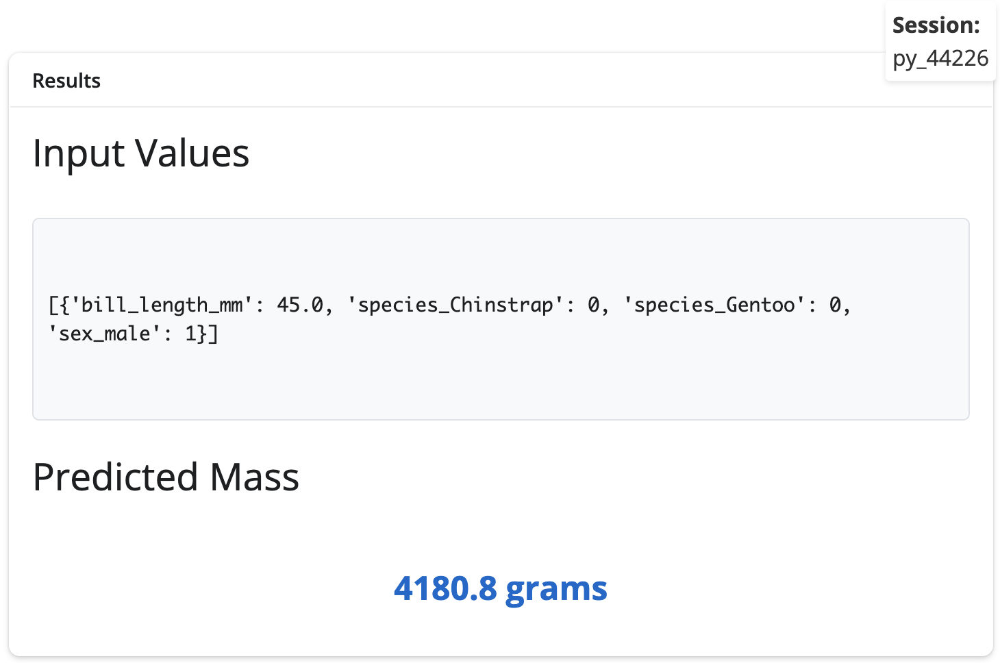{width='100%' fig-align='center'}

### System Status

The system status `ui.card()` contains the status of the API connection, a display of the recent app logs, and a date for "last updated." 


#### UI

Each section is stored in a `ui.div()` inside `ui.layout_columns()`. We can arrange each section by rows if we set a single column width to `12`. The recent log display and last updated sections also contain CSS styling.

```{python}
#| eval: false 
#| code-fold: false 
  ui.card(
      ui.card_header("System Status & Monitoring"),
      ui.card_body(
          ui.layout_columns( #<1> 
              ui.div(
                  ui.h5("API Connection:"),
                  ui.br(),
                  ui.output_text("api_status"), #<3> 
                  ui.br(),
                  ui.h5("Recent Application Logs:"),
                  ui.div( #<4> 
                      ui.output_text("recent_logs_display"),
                      style="font-family: 'Monaco', 'Courier New', monospace; font-size: 14px; background-color: #f8f9fa; padding: 10px; border-radius: 5px; max-height: 250px; overflow-y: auto; border: 1px solid #dee2e6; white-space: pre-wrap;" #<6> 
                  ), #<4> 
                  ui.p( #<5> 
                      "Last updated: ",
                      ui.output_text("log_timestamp"),
                      style="margin-top: 5px; color: #6c757d; font-size: 12px;"
                  ) #<5>
              ),
              col_widths=[12] #<2>
          ) #<1>
      )
  )
```
1. Container for the three sections  
2. Single width for entire area  
3. API health check  
4. Recent logs display  
5. Timestamp for last updated 
6. CSS styling for log display 


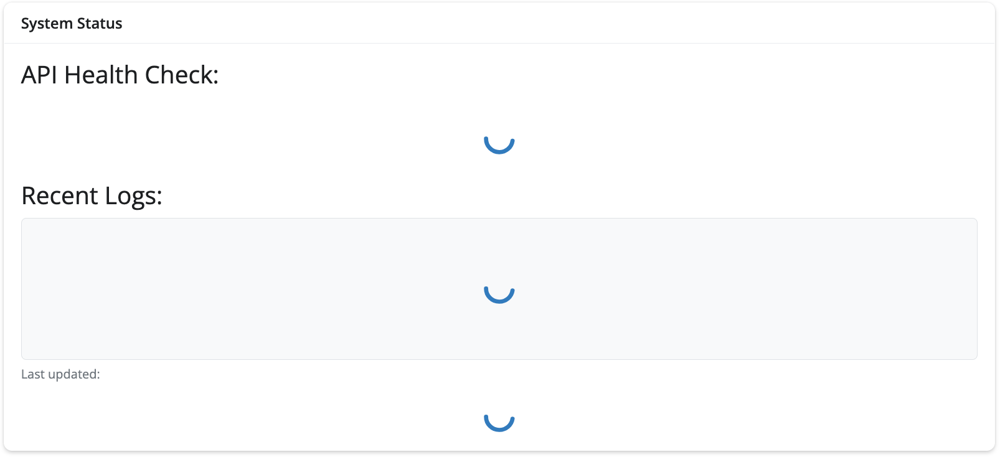{width='100%' fig-align='center'}


#### ***API Health Check***

The UI displays the API health check with a `ui.output_text()`: 

```{python}
#| eval: false 
#| code-fold: false 
    ui.h5("API Connection:"),
    ui.br(),
    ui.output_text("api_status") #<1>
```
1. Text output for API health check  

```{mermaid}
%%| fig-cap: 'API Health Check'
%%| fig-width: 7.0
%%| fig-align: center
%%{init: {'theme': 'neutral', 'look': 'handDrawn', 'themeVariables': { 'fontFamily': 'monospace'}}}%%

graph TB
    subgraph UI["UI Layer"]
        A(["<strong>ui.h5()</strong><br>header"]) --> B("<strong>ui.output_text()</strong>")
    end
    
    subgraph SERVER["Server Layer"]
        C("<strong>@reactive.calc</strong><br/>api_health_check") --> D("<strong>@render.text</strong><br/>api_status")
    end
    
    subgraph API["API Layer"]
        E(["<strong>GET /ping</strong> endpoint"])
    end
    
    B -.Displays.-> D
    D -.Calls.-> C
    C -.HTTP Request.-> E
    E -.Response.-> C
    
    style A fill:#d8e4ff
    style E fill:#31e981
```

The server contains a corresponding `@reactive.calc` and defines the `api_health_check()` with the following error catching:  

```{python}
#| eval: false 
#| code-fold: false 
    @reactive.calc #<1>
    def api_health_check(): #<1>
        """Enhanced API health check with logging""" #<2>
        try:
            logging.debug(f"Checking API health - Session: {session_id}") #<3>
            start_time = time.time() #<4>
            
            r = requests.get(ping_url, timeout=5) #<5>
            response_time = time.time() - start_time #<6>
            
            if r.status_code == 200: #<7>
                logging.info(f"API health check successful - Session: {session_id} - response_time: {response_time:.3f}s")
                return f"✅ API is running (ping: {r.json()}) - {response_time:.2f}s"  #<7>
              else: #<8>
                logging.warning(f"API ping failed - Session: {session_id} - status: {r.status_code}")
                return f"⚠️ API ping failed: {r.status_code}" #<8>
                

```
1. Reactive calculation decorator   
2. Docstring (documentation string describing function purpose)
3. Debug log entry with session ID      
4. `start_time` is the timer initialization (when operation begins)
5. `r` is the HTTP GET request with timeout   
6. `response_time` contains the elapsed time calculation  
7. Success: verified API responded positively   
8. Failure: non-success status handling   

**Structured Logs**

:::{layout="[45,55]" layout-valign="top"}

When a health check is performed, `logging.debug()` creates a `debug` log to track when health checks occurred. 

* **Structured `logging.debug()`**    
  * *`debug` = detailed diagnostic information*    
  * *Includes troubleshooting info*        
  * *Typically disabled in production*   
  
:::

:::{layout="[45,55]" layout-valign="top"}

When a health check is successful (HTTP code == `200`), `logging.info()` 

* **Structured `logging.info()`**    
  * *`info` = Normal operational event*    
  * *Record successful health check with timing*        
  * *Baseline for performance comparison*   
  
:::


:::{layout="[45,55]" layout-valign="top"}

When a health check fails to return a non-`200` HTTP status, `logging.warning()` creates 

* **Structured `logging.warning()`**    
  * *`warning` = API responded but not with success*  
  * *Unusual but non-critical responses*        
  
:::


```{python}
#| eval: false 
#| code-fold: false 
        except requests.exceptions.ConnectionError as e: #<1>
            logging.error(f"API connection refused - Session: {session_id} - error: {str(e)}")
            return "❌ Cannot connect to API - is it running on port 8080?" #<1>
        except requests.exceptions.Timeout: #<2>
            logging.warning(f"API health check timeout - Session: {session_id}")
            return "⚠️ API health check timeout"#<2>
        except Exception as e: #<3>
            logging.error(f"API health check failed - Session: {session_id} - error: {str(e)}")
            return f"❌ API health check failed: {str(e)}" #<3>
```
1. The `ConnectionError` exception with the error and session id  
2. The `Timeout` exception with the session id  
3. The general exception with error message and session id    

**Exceptions**

:::{layout="[45,55]" layout-valign="top"}

The first exception uses the `requests.exceptions.` [`ConnectionError`](https://requests.readthedocs.io/en/latest/api/#requests.ConnectionError) to catch connection failures separately from other errors.

* **Exception `ConnectionError`**      
  * *`str(e)` is used to extract the error description from exception.*   
  * *The `warning` log is printed to the console with the `session_id` and the error description.*   

:::

:::{layout="[45,55]" layout-valign="top"}

The second exception uses `requests.exceptions`[`.Timeout`](https://requests.readthedocs.io/en/latest/api/#requests.Timeout) as a timeout threshold, which is triggered if the API doesn't respond within 30 seconds. 

* **Exception `Timeout`**   
  * *Set with earlier `timeout=30` argument*   
  * *`warning` (not `error`) because timeouts might be temporary*     
  
:::

:::{layout="[45,55]" layout-valign="top"}

The final exception uses a generic `Exception` to handle any unexpected errors not caught above with `ConnectionError` or `Timeout`. 

* **Exception `Exception`**   
  * *Catch-all exception handler*    
  * *Handle any unforeseen errors gracefully*     
  * *Exception order matters (i.e., more specific exceptions must be caught first)*       

:::


The code above continuously checks if the API server is responding, like calling a phone number to see if someone answers. The `@render.text` decorator converts the returned value to a string, sends it to the UI, and automatically re-renders it when the dependencies (i.e., values) change. 

```{python}
#| eval: false 
#| code-fold: false 
    @render.text #<1>
    def api_status(): #<2>
        return api_health_check()
```
1. Output rendering decorator   
2. Function name must match UI's `output_text("api_status")`    

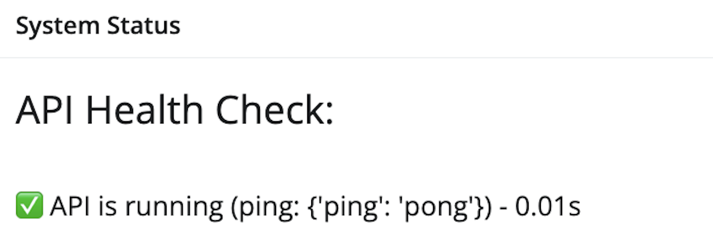{width='100%' fig-align='center'}


#### ***Recent Application Logs***

In the UI contains the following CSS styling variables to make it look like the console: 

1. [`font-family`](https://developer.mozilla.org/en-US/docs/Web/CSS/font-family)      
2. [`font-size`](https://developer.mozilla.org/en-US/docs/Web/CSS/font-size)          
3. [`background-color`](https://developer.mozilla.org/en-US/docs/Web/CSS/background-color)           
4. [`padding`](https://developer.mozilla.org/en-US/docs/Web/CSS/padding)            
5. [`border-radius`](https://developer.mozilla.org/en-US/docs/Web/CSS/border-radius)            
6. [`max-height`](https://developer.mozilla.org/en-US/docs/Web/CSS/max-height)           
7. [`overflow-y`](https://developer.mozilla.org/en-US/docs/Web/CSS/overflow-y)           
8. [`border`](https://developer.mozilla.org/en-US/docs/Web/CSS/border)         
9. [`white-space`](https://developer.mozilla.org/en-US/docs/Web/CSS/white-space)  

```{python}
#| eval: false 
#| code-fold: false 
  ui.h5("Recent Application Logs:"),
  ui.div( #<1>
      ui.output_text("recent_logs_display"),#<2>
      style="font-family: 'Monaco', 'Courier New', monospace; font-size: 14px; background-color: #f8f9fa; padding: 10px; border-radius: 5px; max-height: 250px; overflow-y: auto; border: 1px solid #dee2e6; white-space: pre-wrap;" #<3>
  ) #<1>
```
1. `div()` for recent log display   
2. Text display of recent logs    
3. CSS styling for log output (similar to console)    

In the server, we define `log_file_content()`, which watches the file and re-runs function when it's modified. The file is safely opened using `open()` and the `f` mode means read only (we do this so the file will automatically close). 

`f.readlines()` reads the entire file as a list (each line is an element in the list) and returns it in a dictionary with the `last_modified` (when it was read) and the `total_lines` (total number of lines in the log file). 

```{python}
#| eval: false 
#| code-fold: false 
    @reactive.file_reader(log_file_path) #<1>
    def log_file_content(): #<1>
        """Monitor log file for changes""" #<2>
        try: #<3>
            with open(log_file_path, 'r') as f: #<4>
                lines = f.readlines() #<5>
                return { #<6>
                    'lines': lines,
                    'last_modified': datetime.now(),
                    'total_lines': len(lines)
                } #<6>
        except Exception as e: #<7>
            logging.error(f"Error reading log file - Session: {session_id} - error: {str(e)}") #<8>
            return { #<9>
                'lines': [],
                'last_modified': datetime.now(),
                'total_lines': 0
            } #<9>
```
1. Reactive file monitoring (automatically detect when log file changes)  
2. Docstring documenting function purpose  
3. Context manager for file handling    
4. Safely open file   
5. Read entire file as list   
6. Dictionary return with metadata    
7. Generic exception    
8. `error` log for graceful degradation     
9. Return empty dictionary with identical elements. 

The exception is generic and returns an error and safe default if log file can't be read. 

For rendering, we get the last 10 lines for better monitoring and remove the whitespace with `line.rstrip()`. Before returning the logs, we combine the list of `lines` into single string with line breaks. A `debug` log is created the logs have been updated with the session id and the length (number of lines) of the recent logs. 

```{python}
#| eval: false 
#| code-fold: false 
    @render.text #<1>
    def recent_logs_display(): #<2>
        log_data = log_file_content() #<3>
        lines = log_data['lines'] #<4>
        
        if lines: #<5>
            
            recent_lines = lines[-10:] if len(lines) > 10 else lines #<6>
            clean_lines = [line.rstrip() for line in recent_lines] #<7>
            
            logging.debug(f"Updating recent logs display - Session: {session_id} - showing {len(recent_lines)} lines") #<8>
            return '\n'.join(clean_lines) #<9>
        else: #<10>
            return "No logs available yet..." #<10>
          
```
1. Text render decorator    
2. Define `recent_logs_display()` function (matches UI's `output_text("recent_logs_display")`)      
3. Call reactive dependency and create `log_data` from `log_file_content()`      
4. Extract `lines` from `log_data`      
5. Truthiness check (handle empty log file case)    
6. Slice last 10 lines      
7. Remove trailing whitespace (especially `\n`)   
8. `debug` = detailed trace information  
9. Join lines with newlines   
10. Provide clear message when no logs exist

If there are no logs, a message is returned.  

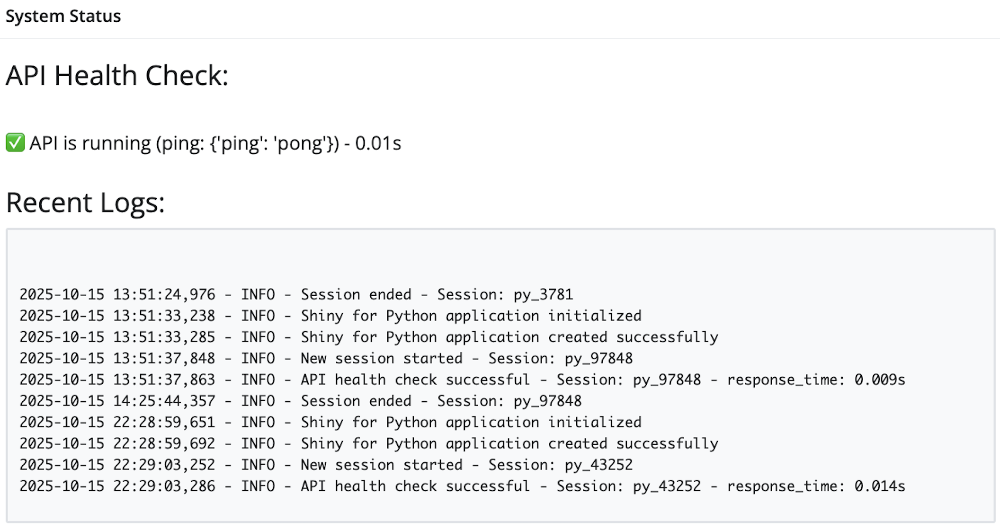{width='100%' fig-align='center'}

#### ***Last updated***

In the UI, the last updated section includes a CSS styled text output: 

1. [`margin-top`](https://developer.mozilla.org/en-US/docs/Web/CSS/margin-top)   
2. [`color`](https://developer.mozilla.org/en-US/docs/Web/CSS/color)      
3. [`font-size`](https://developer.mozilla.org/en-US/docs/Web/CSS/font-size)          

```{python}
#| eval: false 
#| code-fold: false 
  ui.p(
      "Last updated: ",
      ui.output_text("log_timestamp"), #<1> 
      style="margin-top: 5px; color: #6c757d; font-size: 12px;" #<2> 
  )
```
1. Text output for timestamp  
2. CSS styling for date  

In the server, the `log_file_content()` is used to extract the `last_modified` date, which is formatted before returning to the UI. 

```{python}
#| eval: false 
#| code-fold: false 
   @render.text #<1> 
    def log_timestamp(): #<2> 
        log_data = log_file_content() #<3> 
        return log_data['last_modified'].strftime("%Y-%m-%d %H:%M:%S") #<4> 
```
1. Render decorator for timestamp  
2. Match the UI portion (`ui.output_text("log_timestamp")`)     
3. Reactive dependency for `log_file_content()`  
4. Return formatted data with `strftime()`    

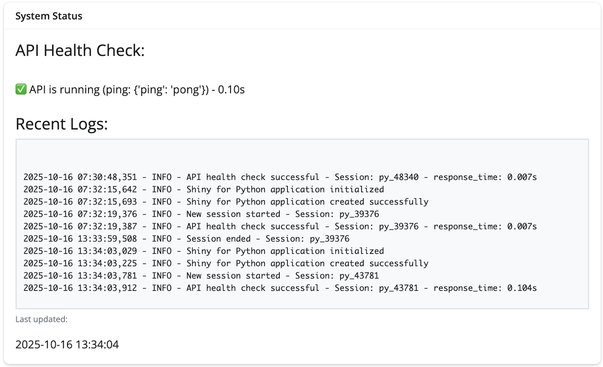{width='100%' fig-align='center'}

## Finishing touches 

Below is a diagram illustrating how the configured logs are updated in the application and displayed in the UI:  

```{mermaid}
%%| fig-cap: 'Python logging app'
%%| fig-width: 7.0
%%| fig-align: center
%%{init: {'theme': 'neutral', 'look': 'handDrawn', 'themeVariables': { 'fontFamily': 'monospace'}}}%%

sequenceDiagram
    participant Main as App
    participant Setup as setup_logging()
    participant Logger as Logger
    participant FileReader as @reactive.file_reader

    Main->>Setup: Call setup_logging()
    Setup->>Setup: Configure logging system
    Setup-->>Main: Return str(log_file_path)
    
    Main->>Main: Store in log_file_path variable
    Main->>Logger: logging.info("App initialized")
    Logger->>Logger: Write to file & console
    
    Main->>FileReader: @reactive.file_reader(log_file_path)
    FileReader->>FileReader: Monitor file for changes
    FileReader-->>Main: Trigger UI updates when file changes
```

The final files in the [`do4ds-labs/_labs/lab4/Python`](https://github.com/mjfrigaard/do4ds-labs/tree/main/_labs/lab4/Python) folder are below: 

```{verbatim}
├── app-log.py #<1> 
├── logs
│   └── shiny_app.log #<2> 
├── Python.Rproj #<3>
├── README.md #<4> 
└── requirements.txt #<5> 

2 directories, 5 files
```
1. App python script  
2. Log file   
3. RStudio project file   
4. Documentation for app    
5. Dependencies     