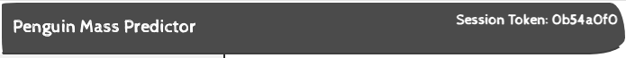
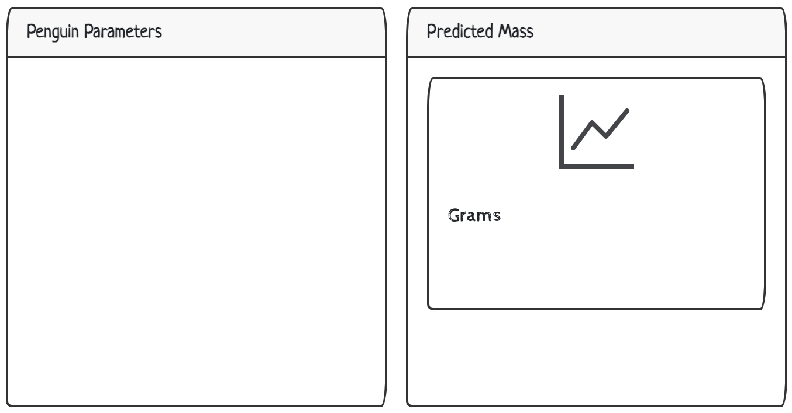
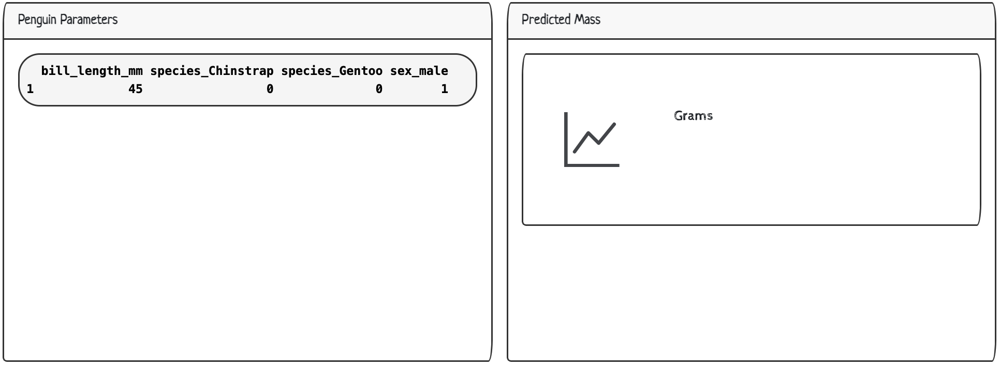
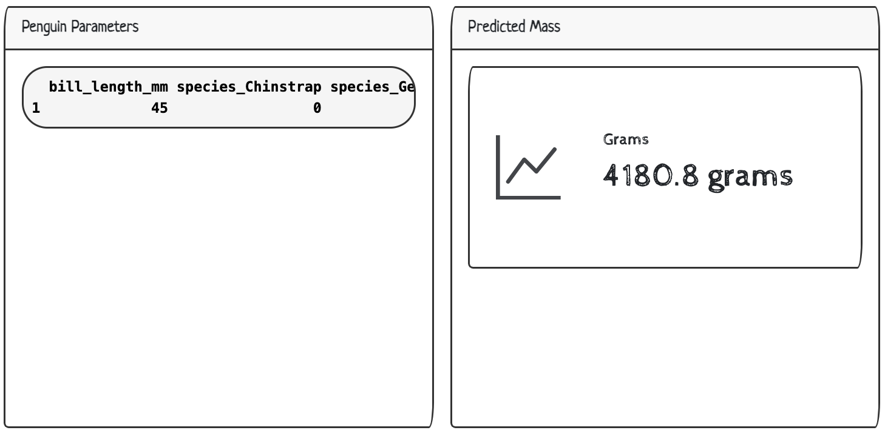
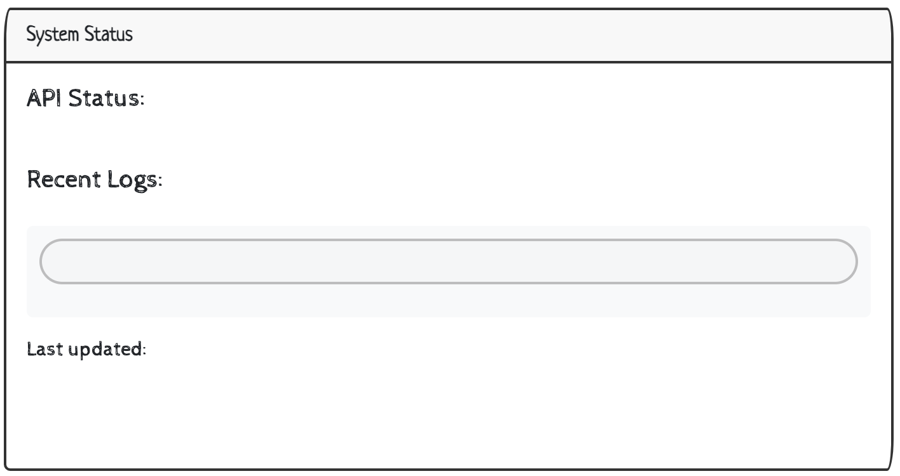
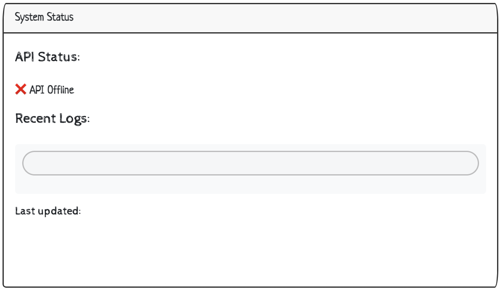
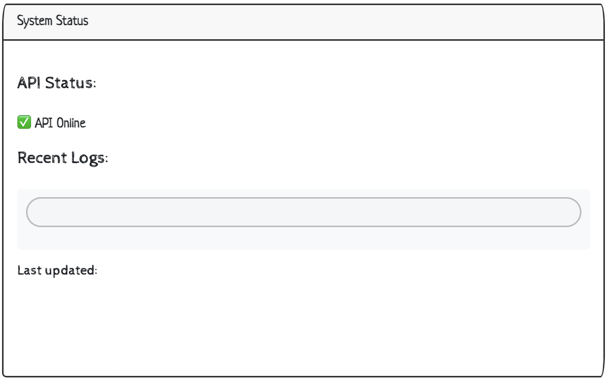
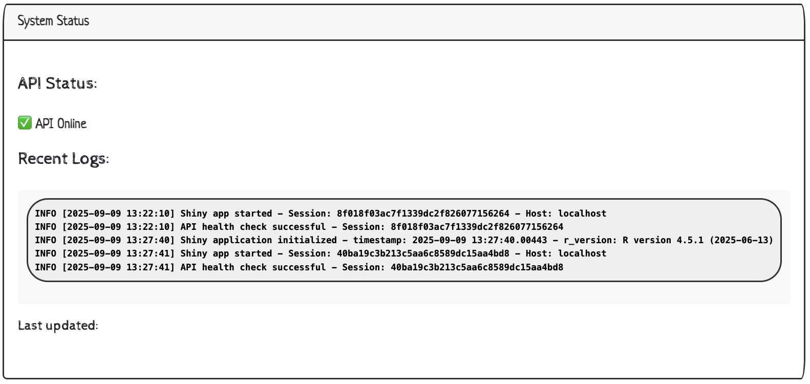
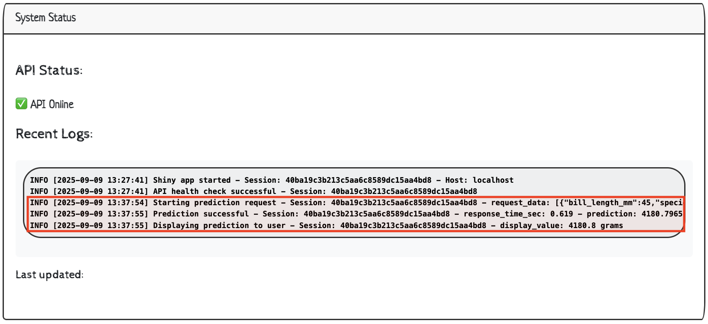
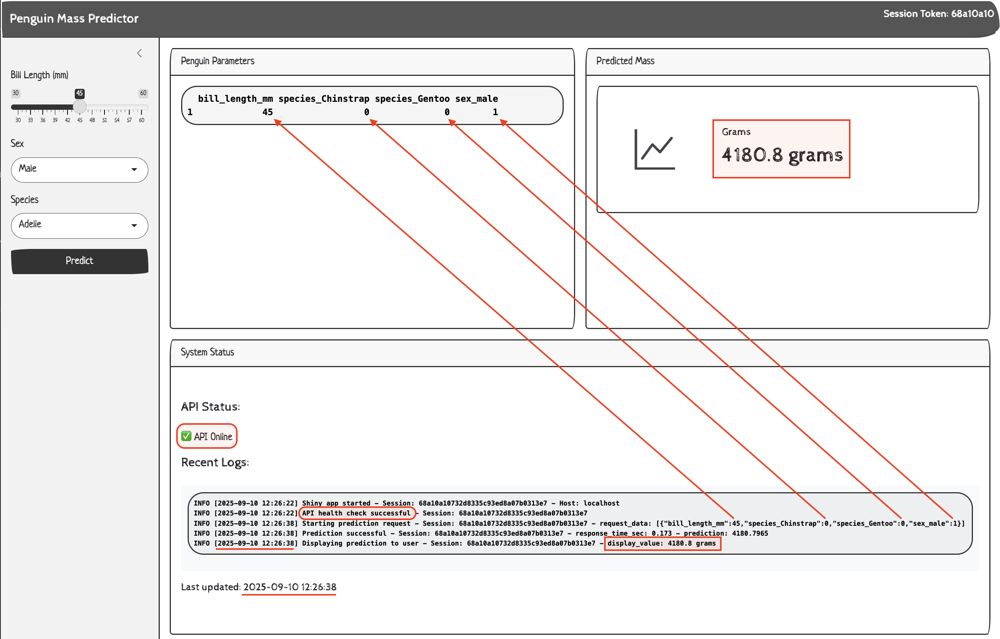

# <em>R App Logging</em> {.unnumbered}

```{r}
#| label: common
#| include: false
source("_common.R")
```

```{r}
#| label: co_box_rev
#| echo: false
#| results: asis
#| eval: true
co_box(
  color = "o",
  look = "default", 
  hsize = "1.25", 
  size = "1.00", 
  header = "Caution", 
  fold = FALSE,
  contents = "This section is being revised. Thank you for your patience."
)
```

This lab covers how to use logging and monitoring to track events inside data science projects (specifically inside a Shiny application), and what you can do with logs and metrics when they are created. 

## Overview

For a refresher, I've included a diagram of the Shiny App and API (using the [`plumber` version](plumber.qmd)) from the previous lab (i.e., the user inputs are sent to the API with the **Predict** button):

```{=html}
<style>

.codeStyle span:not(.nodeLabel) {
  font-family: monospace;
  font-size: 1.5em;
  font-weight: bold;
  color: #d80808 !important;
  background-color: #ffffff;
  padding: 0.2em;
}
</style>
```

```{mermaid}
%%| fig-cap: 'Shiny R App and plumber API'
%%| fig-align: center
%%{init: {'theme': 'base', 'look': 'handDrawn', 'themeVariables': { 'fontFamily': 'monospace', 'primaryColor': '#F2E6C2', 'primaryBorderColor': '#2A6F77', 'primaryTextColor': '#1B2A41', 'secondaryColor': '#d4e7e4', 'tertiaryColor': '#f5f0e4', 'lineColor': '#1B2A41', 'edgeLabelBackground': '#F2E6C2'}}}%%

sequenceDiagram
    participant User as User's<br>Browser
    participant Shiny as Shiny App<br>(app.R)
    participant API as Plumber API<br>(plumber.R)
    participant Model as Vetiver<br>Model
    
    User->>Shiny: Clicks "Predict" button
    
    Note over Shiny: Collect inputs:<br/>bill_length=45<br/>species=Adelie<br/>sex=Male
    
    Shiny->>Shiny: Create data.frame
    
    Shiny->>API: HTTP POST /predict<br/>{"bill_length_mm":45,...}
    
    Note over API: Parse JSON
    API->>API: prep_pred_data()
    
    API->>Model: predict(v, data)
    Note over Model: Linear regression:<br/>4180.797 grams
    Model-->>API: 4180.797
    
    API-->>Shiny: HTTP 200 OK<br/>{".pred":[4180.797]}
    
    Note over Shiny: Extract value<br/>Format as text
    
    Shiny-->>User: Display:<br/>"4180.8 grams"


    
```

The files for the application and API can be found in the following location: 

## The API

```{verbatim}
_labs/lab04/R/api/
              ├── api.Rproj
              ├── model.R
              ├── models/
              │   └── penguin_model/
              ├── my-db.duckdb
              ├── plumber.R
              ├── renv/
              └── renv.lock

```

### `model.R`

The `model.R` file creates our `vetiver` model: 

1. Creates the `my-db.duckdb` file (with a subset the `palmerpenguins::penguins` data). 
2. Converts the `lm()` model object to `vetiver` model.   
3. The model is stored in the `models/` folder with `pins::board_folder()` and `vetiver::vetiver_pin_write()`.   

This script only needs to be run once (or whenever the model changes). 

### `plumber.R` 

The `plumber.R` files contains the same API we created in [`plumber`](plumber.qmd). Launching the API in Positron displays the documentation and handlers: 

{width='100%' fig-align='center'}

## The App 

```{verbatim}
_labs/lab04/R/app/
              ├── app.R
              ├── app.Rproj
              ├── README.md
              ├── renv/
              ├── renv.lock
              └── shiny_app.log
```

Below we load the packages for app design (`bslib`, `bsicons`), making the API request (`httr2`), and logging and monitoring (`logger` and `jsonlite`). 

I chose the [`logger` package](https://daroczig.github.io/logger/index.html) instead of the example from the text ([`log4r`](https://github.com/r-lib/log4r)) because I'm more [familiar with it's features](https://mjfrigaard.github.io/shiny-app-pkgs/logging.html#sec-logging-logger). 

```{r}
#| eval: false
#| code-fold: false
library(shiny)
library(bslib)
library(bsicons)
library(httr2)
library(logger)
library(jsonlite)
```

### Configure logging 

Below we'll configure the log level and assign the [`log_appender()`](https://daroczig.github.io/logger/reference/log_appender.html) with the [`appender_tee()`](https://daroczig.github.io/logger/reference/appender_tee.html).[^app-tee] 

[^app-tee]: [`appender_tee()`](https://daroczig.github.io/logger/reference/appender_tee.html) determines where the logs will be stored and "*appends log messages to both console and a file*."

`logger` also gives us control over the format of the log file with [`log_formatter()`](https://daroczig.github.io/logger/reference/log_formatter.html) (I've found using the [`glue` or `sprintf`](https://daroczig.github.io/logger/reference/formatter_glue_or_sprintf.html) formatter makes the logs more UI friendly). 

```{r}
#| eval: false
#| code-fold: false
logger::log_threshold(level = "DEBUG")
logger::log_appender(appender = appender_tee(file = "shiny_app.log"))
logger::log_formatter(logger::formatter_glue_or_sprintf)
```

### App startup

We'll start by logging the application startup within an observer to access session data (high `priority` to run early). 

```{r}
#| eval: false 
#| code-fold: false
#| code-overflow: wrap
  observe({
    logger::log_info("Shiny app started - Session: {session$token} - Host: {session$clientData$url_hostname}")
  }, priority = 1000)  
```

This log records when a new user session begins with the session token and client information for user tracking and session management.


### User interactions

We'll also track user interactions (but `throttle` to avoid excessive logging).[^throttle]

[^throttle]: "*Throttling delays invalidation if the throttled reactive recently (within the time window) invalidated. New r invalidations do not reset the time window. This means that if invalidations continually come from r within the time window, the throttled reactive will invalidate regularly, at a rate equal to or slower than the time window.* - see the [`shiny::throttle()`](https://shiny.posit.co/r/reference/shiny/latest/debounce.html) documentation for more info."

```{r}
#| eval: false 
#| code-fold: false
#| code-overflow: wrap
observe({
  logger::log_debug("User input changed - Session: {session$token} - bill_length: {input$bill_length} - species: {input$species} - sex: {input$sex}")
}) |> 
  throttle(2000)  
```

This log captures user input changes for debugging user interaction flows and input validation issues.


### Session token

We'll display  **Session Token** (a subset of `session$token` as `log_status`) in the upper right-hand corner of the UI.  

{width='100%' fig-align='center'}

#### UI

A custom `div()` is a good option here (with some minimal styling):

```{r}
#| label: token
#| eval: false
#| code-fold: false
#| code-overflow: scroll
  div(
    style = "position: fixed; top: 10px; right: 10px; z-index: 1000; color: #fff;",
    strong("Session", textOutput("log_status", inline = TRUE))
  )
```

#### Server

This output is generated from `substr(session$token, 1, 8)`:

```{r}
#| label: token-server
#| eval: false
#| code-fold: false
#| code-overflow: wrap
  output$log_status <- renderText({
    paste("Token:", substr(session$token, 1, 8))
  })
```

{width='100%' fig-align='center'}

### Params and Predictions

The parameter display and predictions from the API remain largely unchanged here, other than to make room for the **System Status** `column` and `card`. 

{width='100%' fig-align='center'}

#### UI

The params and predictions are displayed in two `bslib::cards()` and include a `value_box()` and `bs_icon()` for the response from the API.

```{r}
#| label: main-content
#| eval: false
#| code-fold: true
#| code-summary: 'show/hide UI Penguin Parameters'
#| code-overflow: scroll
  layout_columns(
    card(
      card_header("Penguin Parameters"),
      card_body(
        verbatimTextOutput(outputId = "vals")
      )
    ),
    card(
      card_header("Predicted Mass"),
      card_body(
        value_box(
          showcase_layout = "left center",
          title = "Grams",
          value = textOutput(outputId = "pred"),
          showcase = bs_icon("graph-up"),
          max_height = "200px",
          min_height = "200px",
        )
      )
    ),
    col_widths = c(6, 6),
    row_heights = c(3, 1),
  )
```

Note that I've added values for `col_widths` and `row_heights`. 

#### Server

#### ***Penguin Parameters***

In the server, we create the reactive `vals()` to be displayed in the **Penguin Parameters** section. I've included warning and error logs for input validation, and a single debugging log to examine the data sent to the API: 

```{r}
#| label: main-vals-server
#| eval: false
#| code-fold: false
#| code-overflow: wrap
  vals <- reactive({
    bill_length <- input$bill_length #<1>
    species <- input$species
    sex <- input$sex #<1>
    
    if (bill_length < 30 || bill_length > 60) { #<2>
      logger::log_warn(
        "Bill length out of typical range - Session: {session$token} - bill_length: {bill_length}"
      )
    } #<2>
    
    if (is.null(species) || is.null(sex)) { #<3>
      logger::log_error(
        "Missing required inputs - Session: {session$token} - species_null: {is.null(species)} - sex_null: {is.null(sex)}"
      )
      return(NULL)
    } #<3>
    
    data <- data.frame( #<4>
      bill_length_mm = bill_length,
      species = species,
      sex = tolower(sex)
    ) #<4>
    
    logger::log_debug( #<5>
      "Input data prepared - Session: {session$token} - data: {jsonlite::toJSON(data, auto_unbox = TRUE)}"
    ) #<5>
    
    return(data) #<6>
  })
```
1. Raw reactive values        
2. Logs incorrect input values that can lead to bad predictions or user confusion.    
3. Logs critical input validation failures that prevent the application from functioning.   
4. Convert reactives into a `data.frame`.      
5. Logs formatted input data structure sent to the API. 
6. Returns `data.frame`   

The `vals()` are printed to the UI in a `data.frame`:

{width='100%' fig-align='center'}


#### ***Predicted Mass***

I've added logs to the predictions reactive values below. As you can see, the majority of the logs are errors and warning, but I've also included notifications (`showNotification()`) for major events, too. 

```{r}
#| label: main-pred-server
#| eval: false
#| code-fold: false
#| code-overflow: wrap
  pred <- reactive({
    request_start <- Sys.time() #<1>
    request_data <- vals() #<2>
    
    if (is.null(request_data)) { #<3>
      logger::log_error(
        "Cannot make prediction with invalid inputs - Session: {session$token}"
      )
      return("❌ Invalid inputs")
    } #<3>
    
    logger::log_info( #<4>
      "Starting prediction request - Session: {session$token} - request_data: {jsonlite::toJSON(request_data, auto_unbox = TRUE)}"
    ) #<4>
    
    tryCatch({ #<5>
      showNotification( #<6>
        "Predicting penguin mass...", 
        type = "default", 
        duration = 3
      ) #<6>
      
      response <- httr2::request(api_url) |> #<7>
        httr2::req_method("POST") |>
        httr2::req_body_json(request_data, auto_unbox = FALSE) |>
        httr2::req_timeout(30) |>
        httr2::req_perform() #<7>
      
      response_time <- as.numeric( #<8>
        difftime(Sys.time(), request_start, units = "secs")
      ) #<8>
      response_data <- httr2::resp_body_json(response) #<9>
      
      prediction_value <- if (is.list(response_data$.pred)) { #<10>
        as.numeric(response_data$.pred[[1]])
      } else {
        as.numeric(response_data$.pred[1])
      } #<10>
      
      logger::log_info( #<11>
        "Prediction successful - Session: {session$token} - response_time_sec: {round(response_time, 3)} - prediction: {prediction_value}"
      ) #<11>
      
      if (response_time > 5) { #<12>
        logger::log_warn(
          "Slow API response - Session: {session$token} - response_time_sec: {response_time}"
        )
      } #<12>
      
      showNotification( #<13>
        "✅ Prediction successful!", 
        type = "message", 
        duration = 3
      ) #<13>
      
      return(prediction_value) #<14>
      #<5>
    }, error = function(e) { #<15>
      error_msg <- conditionMessage(e)
      response_time <- as.numeric(  #<16>
        difftime(Sys.time(), request_start, units = "secs")
      )  #<16>
      
      logger::log_error(  #<17>
        "Prediction request failed - Session: {session$token} - error: {error_msg} - response_time_sec: {round(response_time, 3)}"
      ) #<17>
      
      if (grepl("Connection refused|couldn't connect", error_msg, ignore.case = TRUE)) { #<18>
        user_msg <- "API not available - is the server running on port 8080?"
        logger::log_error("API connection refused - Session: {session$token}") #<18>
      } else if (grepl("timeout|timed out", error_msg, ignore.case = TRUE)) { #<19>
        user_msg <- "Request timed out - API may be overloaded"
        logger::log_warn("API timeout occurred - Session: {session$token}") #<19>
      } else {
        user_msg <- paste("API Error:", substr(error_msg, 1, 50)) #<20>
        logger::log_error(
          "Unknown API error - Session: {session$token} - error: {error_msg}"
        ) #<20>
      }
      
      showNotification( #<21>
        paste("❌", user_msg), 
        type = "error", 
        duration = 5
      ) #<21>
      return(paste("❌", user_msg))
    })  #<15>
  }) |> 
    bindEvent(input$predict, ignoreInit = TRUE) #<22>
```
1. Record API request start time      
2. Reactive values from UI    
3. Logs when/if the prediction requests fail because of data validation issues (critical application logic problems).   
4. Logs initiation of prediction request w/ input parameters for request tracing and/or debugging.    
5. Handles API communication failures (i.e., network issues, timeouts, etc) and provides meaningful error messages to users instead of crashing the application.    
6. Notification for predicting penguin mass   
7. `httr2` API request  
8. Record API response time   
9. API prediction response 
10. Extracts prediction value 
11. Logs successful predictions and performance metrics/results 
12. Logs performance issues that could impact user experience and/or indicate need for system optimization.   
13. Notification for successful prediction    
14. Prediction values  
15. `tryCatch()` error message  
16. API Response time  
17. Logs complete prediction failures with diagnostic information for troubleshooting critical application functionality.   
18. Logs when the API is unreachable, indicating critical system failure.  
19. Logs API timeout events that suggest network issues or API overload.
20. Logs unexpected API errors that don't match known failure patterns. 
21. Notification for error  
22. Trigger when Predict button is clicked. 

The `tryCatch()` handles all possible API communication failures (network issues, timeouts, malformed responses, etc.) and provides meaningful error messages (instead of crashing the application).

After clicking **Predict**, the response from the API displays the predicted penguin mass in grams:

{width='100%' fig-align='center'}

### System Status

In the **System Status** display, we'll 1) send a `ping` to the API and return the result as **API Status**, 2) print a subset of **Recent Logs** from the log file specified above in the `logger::log_appender()` function, and 3) include a timestamp displaying when the log file was **Last updated**. 

{width='100%' fig-align='center'}

#### UI

We can make room for a **System Status** section in the UI as a `card()` using `layout_columns()` (as long as we set the `col_widths` and a fixed `height`). The `div()` for the logs also gets some custom styling:

```{r}
#| label: sys-status-ui
#| eval: false
#| code-fold: false
#| code-overflow: wrap
  layout_columns(
    card(
      card_header("System Status"),
      card_body(
        h5("API Status:"), #<1>
        textOutput("api_health"),#<1>
        h5("Recent Logs:"),#<2>
        div(
          style = "font-family: 'Ubuntu Mono', monospace; font-size: 13px; background-color: #f8f9fa; padding: 10px; border-radius: 5px;",
          verbatimTextOutput("recent_logs", placeholder = TRUE)
        ),#<2>
        h6("Last updated:", #<3>
            textOutput("log_timestamp", inline = TRUE)
          ),
        style = "max-height: 350px; overflow-y: auto;" #<3>
      )
    ),
    col_widths = c(12), #<4> 
    height = "300px" #<5>
  )
```
1. Results from `ping` sent to API  
2. Log display from `shiny_log.log` file 
3. Last modification time of `shiny_log.log` file     
4. Full width  
5. Fixed height  

We'll cover how to include each output in the **System Status** below. 

#### ***API Status***

The status of the `ping` sent to the API can return one of three results: `✅ API Online` (response = 200), `⚠️ API Issues` (non-200 status), `❌ API Offline` (non-response). 

```{r}
#| label: api_health
#| eval: false
#| code-fold: false
#| code-overflow: wrap
api_health <- reactive({
  tryCatch({
    logger::log_debug("Checking API health - Session: {session$token}") #<1>
    response <- httr2::request("http://127.0.0.1:8080/ping") |> #<2>
      httr2::req_timeout(5) |>
      httr2::req_perform() #<2>
    if (httr2::resp_status(response) == 200) { #<3>
      logger::log_info("API health check successful - Session: {session$token}") 
      return("✅ API Online") #<3>
    } else {
      logger::log_warn("API health check returned non-200 status - Session: {session$token} - status: {httr2::resp_status(response)}") #<4>
      return("⚠️ API Issues") #<4>
    }
  }, error = function(e) { #<5>
    logger::log_error("API health check failed - Session: {session$token} - error: {conditionMessage(e)}") 
    return("❌ API Offline") #<5>
  })
})
```
1. Logs when health checks are initiated to track frequency and timing.   
2. `ping` sent to API     
3. Logs the external API is responding normally.   
4. Logs to API degradation or partial failures that may impact user experience.   
5. Logs complete API connectivity failures that render the application non-functional.  

The `tryCatch()` prevents the application from crashing when the external API is unreachable or returns unexpected responses. This ensures 'graceful' failures of our health check display.

:::{layout="[35,65]" layout-valign="top"}

When we initially launch, we see the offline status is accurate (the API isn't running): 

{width='100%' fig-align='center'}

When we run the API, we can see the `ping` responds with an online status: 

{width='100%' fig-align='center'}

:::


#### ***Recent Logs***

All the events captured with  `logger::log_*()` functions are written to the log file (`shiny_log.log`). To display the most recent logs in the UI, we can use Shiny's [`reactiveFileReader()`](https://shiny.posit.co/r/reference/shiny/latest/reactivefilereader.html) and configure it to poll our log file every 1 second (1000ms) for changes:

```{mermaid}
%%| fig-cap: 'Logging in Server'
%%| fig-align: center
%%| fig-width: 7.0
%%{init: {'theme': 'base', 'look': 'handDrawn', 'themeVariables': { 'fontFamily': 'monospace', 'primaryColor': '#F2E6C2', 'primaryBorderColor': '#2A6F77', 'primaryTextColor': '#1B2A41', 'secondaryColor': '#d4e7e4', 'tertiaryColor': '#f5f0e4', 'lineColor': '#1B2A41', 'edgeLabelBackground': '#F2E6C2'}}}%%

flowchart TD
	 subgraph User["Log Generation"]
		Q(["User<br>inputs"])
		R(["API<br>calls"])
		S(["System<br>events"])
		%% T@{ shape: rect, label: "<strong>logger::log_</strong>*<br>functions" }
		T["<strong>logger::log_</strong>*<br>functions"]
	  end

    Q --> T
    R --> T
    S --> T
    T -- "<em>Written to</em>"--> A

	 subgraph FileSys["File System"]
		A[\"File: <strong>shiny_app.log</strong>"\]
		A1("Modification<br>Time")
		A2("Log<br>Contents")
	 end
  
    A --> A1 & A2
    A -."<em>changes trigger</em>".-> B

	subgraph ReactFile["Reactive File"]
		B("<strong>reactiveFileReader() </strong>")
		C{"Log file<br>exists?"}
		D("<strong>lines<br>last_mod<br>total_lines</strong>")
		E("<strong>lines</strong>:<strong>character(0)</strong><br><strong>last_mod</strong>:<strong>Sys.time()</strong><br><strong>total_lines</strong>:<strong>0</strong>")
	end
    
    B --"<em>checks every 1 second</em>"--> C
    C -- Yes (returns list)--> D
    C -- No (returns empty list)--> E

    
    
    classDef log fill:#d8e4ff,stroke:#000,stroke-width:1px
    class A,B,Q,R,S log
    
    classDef outcome fill:#31e981,stroke:#000,stroke-width:1px
    class D,E,A1,A2 outcome
    
```

The reactive returned from `reactiveFileReader()` will contain a list with the log line (`lines`), the time this file was last modified (`last_mod`), and a count of the total number of lines in the log file (`total_lines`). 

```{r}
#| label: log_file_content
#| eval: false
#| code-fold: false
#| code-overflow: wrap
log_file_content <- reactiveFileReader(
  intervalMillis = 1000,
  session = session,
  filePath = "shiny_app.log",
  readFunc = function(filePath) {
    
    if (file.exists(filePath)) { #<1>
      lines <- readLines(filePath, warn = FALSE) 
      mod_time <- file.mtime(filePath) #<1>
      
      list( #<2>
        lines = lines,
        last_mod = mod_time,
        total_lines = length(lines)
      ) #<2>
    
    } else {
      list( #<3>
        lines = character(0),
        last_mod = Sys.time(),
        total_lines = 0
      ) #<3>
    }
    
  }
)
```
1. Read all lines and get file modification time. 
2. Return both content and timestamp.  
3. Return empty list.  

To make this display more manageable, we'll limit the number of extracted logs to the five most recent lines (unless there are less than five total lines in the log file). We'll also format the logs to be displayed in the  `verbatimTextOutput()` and include a message if the log file is empty. 

```{mermaid}
%%| fig-cap: 'Displaying logs'
%%| fig-align: center
%%| fig-width: 7.0
%%{init: {'theme': 'base', 'look': 'handDrawn', 'themeVariables': { 'fontFamily': 'monospace', 'primaryColor': '#F2E6C2', 'primaryBorderColor': '#2A6F77', 'primaryTextColor': '#1B2A41', 'secondaryColor': '#d4e7e4', 'tertiaryColor': '#f5f0e4', 'lineColor': '#1B2A41', 'edgeLabelBackground': '#F2E6C2'}}}%%

flowchart TD
  A(["<strong>reactiveFileReader()</strong> "])

 subgraph LogProc["Log Processing"]
        H("Reads <strong>shiny_app.log</strong>")
        I{"More than 5 lines in <strong>total_lines</strong>?"}
        J("Print last 5 lines")
        K("Print all lines")
        L("Format: <strong>paste(lines,</strong><br><strong>collapse = '\\n')</strong>")
        M("Return:<br><strong>'No logs available'</strong>")
  end

    A --> H
    H --> I
    I -- "<em>Yes</em" --> J
    I -- "<em>No</em>" --> K
    J --> L
    K --> L
    H -- "<em>No lines</em>"--> M

 subgraph UI["UI Rendering"]
     N[/"<strong>log_file_content()</strong>"/]
     subgraph P["Display in <strong>div</strong>"]
         O(["<strong>verbatimTextOutput(recent_logs)</strong>"])
     end
  end
  
  L & M --> N
  N --> P

	style A stroke-width:1px
    
    classDef log fill:#d8e4ff,stroke:#000,stroke-width:1px
    class A log
    
    classDef outcome fill:#31e981,stroke:#000,stroke-width:1px
    class O outcome

```

```{r}
#| label: recent_logs
#| eval: false
#| code-fold: false
#| code-overflow: wrap
  output$recent_logs <- renderText({
    log_data <- log_file_content()
    
    if (length(log_data$lines) > 0) {  #<1>
      recent_lines <- if (log_data$total_lines > 5) {
        tail(log_data$lines, 5)
      } else {
        log_data$lines
      }  #<1>
      
      logger::log_debug("Updating recent logs display - Session: {session$token} - showing {length(recent_lines)} lines") #<2>
      
      paste(recent_lines, collapse = "\n") #<3>
    } else {
      "No logs available"
    }
  })
```
1. Get last 5 lines of log file or complete log file    
2. Log that we're updating the display (at `DEBUG` level to avoid spam)     
3. Format the recent logs before displaying in the UI.  

If the API is running, the log file will contain the status of the health check and the app start-up/initialization message:

```{verbatim}
INFO [2025-09-09 13:22:10] Shiny app started - Session: 8f018f03ac7f1339dc2f826077156264 - Host: localhost
INFO [2025-09-09 13:22:10] API health check successful - Session: 8f018f03ac7f1339dc2f826077156264
INFO [2025-09-09 13:27:40] Shiny application initialized - timestamp: 2025-09-09 13:27:40.00443 - r_version: R version 4.5.1 (2025-06-13)
INFO [2025-09-09 13:27:41] Shiny app started - Session: 40ba19c3b213c5aa6c8589dc15aa4bd8 - Host: localhost
INFO [2025-09-09 13:27:41] API health check successful - Session: 40ba19c3b213c5aa6c8589dc15aa4bd8
```

We can these logs show up in the UI:

{width='100%' fig-align='center'}

When a user clicks on **Predict**, the values are sent in a request to the API, a response is returned, and the log file is updated with: 

```{verbatim}
INFO [2025-09-09 13:37:54] Starting prediction request - Session: 40ba19c3b213c5aa6c8589dc15aa4bd8 - request_data: [{"bill_length_mm":45,"species_Chinstrap":0,"species_Gentoo":0,"sex_male":1}]
INFO [2025-09-09 13:37:55] Prediction successful - Session: 40ba19c3b213c5aa6c8589dc15aa4bd8 - response_time_sec: 0.619 - prediction: 4180.7965
INFO [2025-09-09 13:37:55] Displaying prediction to user - Session: 40ba19c3b213c5aa6c8589dc15aa4bd8 - display_value: 4180.8 grams
```

We can also see out UI updates with the recent logs: 

{width='100%' fig-align='center'}


Finally, we should see the log file included in our Shiny app directory: 

```{verbatim}
app/
├── app.R
├── R.Rproj
├── README.md
├── renv
├── renv.lock
└── shiny_app.log #<1>

2 directories, 5 files
```
1. New log file!    


#### ***Last updated***

The final **Last updated** section includes the time and date the `log_file_content()` reactive was last updated. 

```{r}
#| label: log_timestamp-server
#| eval: false
#| code-fold: false
#| code-overflow: wrap
output$log_timestamp <- renderText({
  log_data <- log_file_content()
  format(log_data$last_mod, "%Y-%m-%d %H:%M:%S")
})
```


{width='100%' fig-align='center'}

## Finishing touches 

To finish off our app, we'll include a `README.md` with instructions for launching the API and application together and capture dependencies with `renv`. 

```{r}
#| eval: false
#| code-fold: false
install.packages('renv')
renv::init()
```

```{r}
#| eval: false
#| code-fold: false
renv::snapshot()
```


