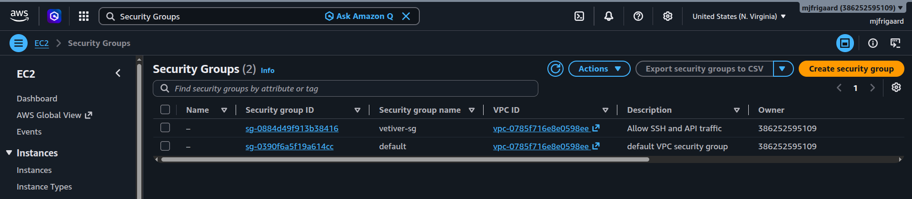

# <em>EC2 Instances</em> {.unnumbered}

```{r}
#| label: common
#| include: false
source("_common.R")
```

```{r}
#| label: co_box_rev
#| echo: false
#| results: asis
#| eval: true
co_box(
  color = "o",
  look = "default", 
  hsize = "1.25", 
  size = "1.00", 
  header = "Caution", 
  fold = FALSE,
  contents = "This section is being revised. Thank you for your patience."
)
```

This is the second part of lab 7. It assumes you've set up your AWS group, user, and configured the aws CLI.[^aws-ec2-1]

[^aws-ec2-1]: If you haven't completed these steps, please see [Getting started with AWS](start-aws.qmd).

## What is an EC2 instance?

EC2 is a rentable Linux (or Windows) machine in AWS's data center. You get `root`/`sudo` access like any VM. AWS handles the physical hardware; we handle the OS, packages, and running our app (in this case, a `vetiver` model API).

```{mermaid}
%%| fig-cap: ‘EC2 Instances’
%%| fig-width: 7.0
%%| fig-align: 'center'
%%{init: {‘theme’: ‘base’, ‘themeVariables’: {‘fontFamily’: ‘monospace’}}}%%

graph TD
    A(["Your<br>Laptop"]) -->|SSH| B["EC2<br>Instance"]
    B --> C("Runs<br>plumber/FastAPI")
    B --> D("Pulls model<br>from S3")
    C --> E("Serves<br>predictions")
    
    style A fill:#5B8C5A,stroke:#000000,stroke-width:1px,color:#ffffff
    style B fill:#E8A33D,stroke:#000000,stroke-width:1px,color:#ffffff
    style C fill:#D2562B,stroke:#000000,stroke-width:1px,color:#ffffff
    style D fill:#1B2A41,stroke:#000000,stroke-width:1px,color:#ffffff
    style E fill:#2A6F77,stroke:#000000,stroke-width:1px,color:#ffffff
    
```

Below we're going to cover some basic concepts and terminology for using EC2 instances. It's also a good idea to consult the official [AWS documentation.](https://docs.aws.amazon.com/AWSEC2/latest/UserGuide/concepts.html)

## Core EC2 Concepts

+---------------------------------+-------------------------------------------------------------------------------------------------------------------------------------------+
| Concept                         | Plain Meaning                                                                                                                             |
+=================================+===========================================================================================================================================+
| **AMI**                         | The OS disk image used to boot the instance (like choosing a Docker base image)                                                           |
+---------------------------------+-------------------------------------------------------------------------------------------------------------------------------------------+
| **Instance type**               | The hardware size (CPU/RAM) — e.g. `t3.micro` is small/cheap                                                                              |
+---------------------------------+-------------------------------------------------------------------------------------------------------------------------------------------+
| **Key pair**                    | SSH keypair AWS uses to let you log in (like your `~/.ssh` keys, but AWS-managed)                                                         |
+---------------------------------+-------------------------------------------------------------------------------------------------------------------------------------------+
| **Ingress**                     | Incoming traffic (traffic coming *into* the EC2 instance)                                                                                 |
+---------------------------------+-------------------------------------------------------------------------------------------------------------------------------------------+
| **Egress**                      | Outgoing traffic (traffic leaving the instance).                                                                                          |
+---------------------------------+-------------------------------------------------------------------------------------------------------------------------------------------+
| **Security group**              | A firewall — controls which ports/IPs can reach the instance. Security groups control both **egress**/**ingress** separately. By default: |
|                                 |                                                                                                                                           |
|                                 | - All **egress** is allowed (instance can talk to anything)                                                                               |
|                                 |                                                                                                                                           |
|                                 | - All **ingress** is blocked (nothing can reach the instance)                                                                             |
+---------------------------------+-------------------------------------------------------------------------------------------------------------------------------------------+
| **Elastic IP**                  | A static public IP you can attach/detach from instances                                                                                   |
+---------------------------------+-------------------------------------------------------------------------------------------------------------------------------------------+
| **Instance profile / IAM role** | Lets the EC2 box itself have AWS permissions (e.g. to pull from S3) without storing keys on disk                                          |
+---------------------------------+-------------------------------------------------------------------------------------------------------------------------------------------+

We're going to 'stand up' an EC2 instance using the aws CLI (i.e., from our Terminal).

### Creating a Key Pair

First, we need to create the `~/.ssh.` folder:

```{bash}
#| eval: false 
#| code-fold: false
mkdir -p ~/.ssh
```

And give it the proper permissions:

```{bash}
#| eval: false 
#| code-fold: false
chmod 700 ~/.ssh
```

`chmod 700` means only we can open, list, or add files in this folder. Nobody else can even look inside.

Now we can create the key pair.

```{bash}
#| eval: false 
#| code-fold: false
# create EC2 key pair
aws ec2 create-key-pair \ #<1>
  --key-name vetiver-deploy-key \ #<2>
  --query 'KeyMaterial' \ #<3>
  --output text \ #<4>
  --profile dev-deploy > ~/.ssh/vetiver-deploy-key.pem #<5>
```

1.  Calls AWS EC2 API to generate a new SSH key pair\
2.  Names the key pair `vetiver-deploy-key`\
3.  Filters the JSON response to extract only the `KeyMaterial` field, which contains the actual private key text.
4.  Formats the output as plain text instead of JSON\
5.  Use existing credentials, then redirect to SSH `.pem` key output

```{r}
#| label: co_box_keypair_cmnds
#| echo: false
#| results: asis
#| eval: true
co_box(
  color = "b",
  look = "default", 
  hsize = "1.15", 
  size = "1.00", 
  header = "`ec2 create-key-pair` commands", 
  fold = TRUE,
  contents = "

1. `ec2 create-key-pair` will create both public and private keys; the public key is stored in AWS, and the private key is returned (once)   
2. We set the `vetiver-deploy-key` name and reference it later when launching the EC2 instance (i.e., with `--key-name` on `run-instances`)         
3. Specifying the `--qyery` as `'KeyMaterial'` reduces the output (without this, we'd get the full JSON blob)             
4. `output text` ensures the key is saved cleanly without quotes or escape characters     
5. `--profile` uses the `dev-deploy` profile credentials to run the command, then redirects (`>`) the output into a `.pem` file in our SSH directory

")
```

The `.pem` file also needs special permissions:

```{bash}
#| eval: false 
#| code-fold: false
chmod 400 ~/.ssh/vetiver-deploy-key.pem
```

`chmod 400` means only we can view this file's contents. We can't even edit it (would need `chmod 600` for that), and no one else can read, write, or execute it. This key lets you SSH in later. **Treat the `.pem` file like a password.**

### Creating a Security Group

Now we're going to create a security group for the EC2 instance. This controls how we will access the AWS server from the command line.

```{bash}
#| eval: false 
#| code-fold: false
# create EC2 security group
aws ec2 create-security-group \#<1>
  --group-name vetiver-sg \ #<2>
  --description "Allow SSH and API traffic" \ #<3>
  --profile dev-deploy #<4>
```

1.  Creates a new security group, which acts as a virtual firewall for EC2 instances\
2.  Names the security group `vetiver-sg`\
3.  Adds a human-readable description explaining the group's purpose\
4.  Uses the `dev-deploy` AWS credentials profile to run the command

```{r}
#| label: co_box_sg_cmnds
#| echo: false
#| results: asis
#| eval: true
co_box(
  color = "b",
  look = "default", 
  hsize = "1.15", 
  size = "1.00", 
  header = "`ec2 create-security-group` commands", 
  fold = TRUE,
  contents = "

1. `aws ec2 create-security-group` doesn't allow any traffic yet, it just creates an empty rule set  
2. `vetiver-sg` is used later to reference the group when adding rules or launching instances.  
3. `--description` provides documentation (has no effect on actual firewall behavior)
4. `--profile` determines which AWS account and permissions are used (in our case, `dev-deploy`)

")
```

This will return a JSON with the following:

``` json
{
    "GroupId": "sg-0884d49f913b38416",
    "SecurityGroupArn": "arn:aws:ec2:us-east-1:386252595109:security-group/sg-0884d49f913b38416"
}
```

The security group was created successfully! AWS handed back its ID and ARN so we can reference it in future commands.

#### Response Explanation

- `GroupId` is the unique ID AWS assigned to our new security group. We'll use this ID (not the name `vetiver-sg`) in later commands, like attaching it to an EC2 instance or adding firewall rules.

- `SecurityGroupArn` is the full AWS resource identifier (ARN) for the security group. It encodes the region (`us-east-1`), account number (`386252595109`), and the resource type/ID (`security-group/sg-0884d49f913b38416`), which is not something we need to memorize or protect as secret.

We can view the new security group in the **AWS Console** by searching for **Security Groups**:

{width="100%" fig-align="center"}

### Authorizing Security Group

Now that we've created the security group, we're going to grant access to our local IP. We need to obtain this using: 

```{bash}
#| eval: false 
#| code-fold: false
curl https://checkip.amazonaws.com
```

This returns something like:

```{verbatim}
203.0.113.42
```

Replace `OUR_IP` with the IP address above and run the command:

```{bash}
#| eval: false 
#| code-fold: false
# auth EC2 security group
aws ec2 authorize-security-group-ingress \ #<1>
  --group-name vetiver-sg \ #<2>
  --protocol tcp --port 22 \ #<3>
  --cidr OUR_IP/32 \ #<4>
  --profile dev-deploy #<5>
```
1.  Adds an inbound (incoming traffic) rule to an existing security group\
2.  Specifies which security group the new rule applies to, in this case `vetiver-sg`\
3.  Allows TCP traffic specifically on port 22\
4.  Restricts access to a single IP address using CIDR notation\
5.  Runs the command using the `dev-deploy` credentials profile

```{r}
#| label: co_box_auth_sg_cmnds
#| echo: false
#| results: asis
#| eval: true
co_box(
  color = "b",
  look = "default", 
  hsize = "1.15", 
  size = "1.00", 
  header = "`ec2 authorize-security-group-ingress` commands", 
  fold = TRUE,
  contents = "
  
1. Without `authorize-security-group-ingress`, the security group blocks all traffic by default  
2. ` --group-name vetiver-sg` links the rule to the firewall created earlier with `create-security-group`     
3. Port 22 is the standard port used for SSH connections.  
4. The `/32` means exactly one IP is allowed, no range.  
5. `--profile dev-deploy` ensures the rule is added to the correct AWS account  

")
```

These commands should return something like the following:

```json
{
    "Return": true,
    "SecurityGroupRules": [
        {
            "SecurityGroupRuleId": "sgr-016b1800a27252666",
            "GroupId": "sg-0884d49f913b38416",
            "GroupOwnerId": "386252595109",
            "IsEgress": false,
            "IpProtocol": "tcp",
            "FromPort": 22,
            "ToPort": 22,
            "CidrIpv4": "70.163.154.253/32",
            "SecurityGroupRuleArn": "arn:aws:ec2:us-east-1:386252595109:security-group-rule/sgr-016b1800a27252666"
        }
    ]
}
```

We successfully opened port 22 (SSH) so only our current IP can attempt to connect.

#### Response Explanation

```json
"Return": true
```

Confirms the rule was added successfully.

```json
"SecurityGroupRuleId": "sgr-016b1800a27252666"
```

The unique ID AWS assigned to this specific rule. Useful if we ever want to modify or delete just this rule later.

```json
"GroupId": "sg-0884d49f913b38416"
```

Confirms which security group this rule belongs to, in this case, `vetiver-sg`.

```json
"GroupOwnerId": "386252595109"
```

Our AWS account number. Confirms the rule lives in our account.

```json
"IsEgress": false
```

Confirms this is an **ingress** rule (incoming traffic), not egress (outgoing).

```json
"IpProtocol": "tcp",
"FromPort": 22,
"ToPort": 22
```

Confirms the rule allows TCP traffic specifically on port 22 (SSH). `FromPort` and `ToPort` being the same means it's a single port, not a range.

```json
"CidrIpv4": "203.0.113.42/32"
```

Confirms only our specific IP address can use this rule (this should match what you replaced `OUR_IP` with above). The `/32` restricts it to exactly one IP.

```json
"SecurityGroupRuleArn": "..."
```

The full AWS resource identifier for this rule. Not sensitive, just a reference string.

```{mermaid}
%%| fig-cap: ‘EC2 Instances’
%%| fig-width: 7.0
%%| fig-align: 'center'
%%{init: {‘theme’: ‘base’, ‘themeVariables’: {‘fontFamily’: ‘monospace’}}}%%

graph TD
    Internet("Internet") -->|"Port <code>8000</code> open"| SG{{"Security<br>Group"}}
    Us("Our IP only") -->|"Port <code>22</code> SSH"| SG
    SG --> EC2["EC2 Instance"]
    
    style Internet fill:#5B8C5A,stroke:#000000,stroke-width:1px,color:#ffffff
    style Us fill:#E8A33D,stroke:#000000,stroke-width:1px,color:#ffffff
    style SG fill:#D2562B,stroke:#000000,stroke-width:1px,color:#ffffff
    %% style D fill:#1B2A41,stroke:#000000,stroke-width:1px,color:#ffffff
    style EC2 fill:#2A6F77,stroke:#000000,stroke-width:1px,color:#ffffff
    
```

The security group is like a bouncer who decides who's allowed to knock on which doors (ports).

### Creating an IAM Role for S3 Access 

Instead of putting AWS access keys inside the EC2 instance, we attach a role so the instance can *ask* AWS for temporary credentials automatically.

```{bash}
#| eval: false 
#| code-fold: false
aws iam create-role \
  --role-name ec2-s3-read-role \
  --assume-role-policy-document file://trust-policy.json
```

`trust-policy.json`:

``` json
{
  "Version": "2012-10-17",
  "Statement": [{
    "Effect": "Allow",
    "Principal": {"Service": "ec2.amazonaws.com"},
    "Action": "sts:AssumeRole"
  }]
}
```

Attach S3 read permissions:

```{bash}
#| eval: false 
#| code-fold: false
aws iam attach-role-policy \
  --role-name ec2-s3-read-role \
  --policy-arn arn:aws:iam::aws:policy/AmazonS3ReadOnlyAccess
```

```{bash}
#| eval: false 
#| code-fold: false
aws iam create-instance-profile --instance-profile-name ec2-s3-instance-profile
```

```{bash}
#| eval: false 
#| code-fold: false
aws iam add-role-to-instance-profile \
  --instance-profile-name ec2-s3-instance-profile \
  --role-name ec2-s3-read-role
```

```{mermaid}
%%| fig-cap: ‘EC2 Instances’
%%| fig-width: 7.0
%%| fig-align: 'center'
%%{init: {‘theme’: ‘base’, ‘themeVariables’: {‘fontFamily’: ‘monospace’}}}%%

sequenceDiagram
    participant EC2
    participant IAM Role
    participant S3

    EC2->>IAM Role: "Who am I? What can I access?"
    IAM Role-->>EC2: Temporary credentials
    EC2->>S3: Fetch vetiver model files
    S3-->>EC2: Model artifacts
    
```

The instance profile is like giving the EC2 box its own ID badge, instead of you handing it your personal keys.

## Launch the Instance

```{bash}
#| eval: false 
#| code-fold: false
aws ec2 run-instances \
  --image-id ami-0c02fb55956c7d316 \
  --instance-type t3.micro \
  --key-name vetiver-deploy-key \
  --security-groups vetiver-sg \
  --iam-instance-profile Name=ec2-s3-instance-profile \
  --profile dev-deploy
```

### SSH In

```{bash}
#| eval: false 
#| code-fold: false
aws ec2 describe-instances --profile dev-deploy \
  --query "Reservations[*].Instances[*].PublicIpAddress" \
  --output text

ssh -i ~/.ssh/vetiver-deploy-key.pem ubuntu@<PUBLIC_IP>
```

## Full Deployment 

```{mermaid}
%%| fig-cap: ‘EC2 Instances’
%%| fig-width: 7.0
%%| fig-align: 'center'
%%{init: {‘theme’: ‘base’, ‘themeVariables’: {‘fontFamily’: ‘monospace’}}}%%

graph TD
    A[Local Dev: Train + Pin Model] --> B[S3 Bucket]
    B --> C[EC2 Instance IAM Role]
    C --> D[Pull Model via pins::board_s3]
    D --> E[Run plumber/FastAPI app]
    E --> F[Expose API on port 8000]
    F --> G[Client Requests / Predictions]
    
```

## Summary of Why This Matters

- **Security groups** = firewall rules
- **IAM roles on EC2** = no hardcoded secrets, safer than access keys
- **Key pairs** = SSH login control
- **Instance profile** = attaches IAM identity directly to the machine

This mirrors your GitHub Actions setup: scoped permissions, no long-lived secrets sitting around, minimal blast radius if compromised. 
