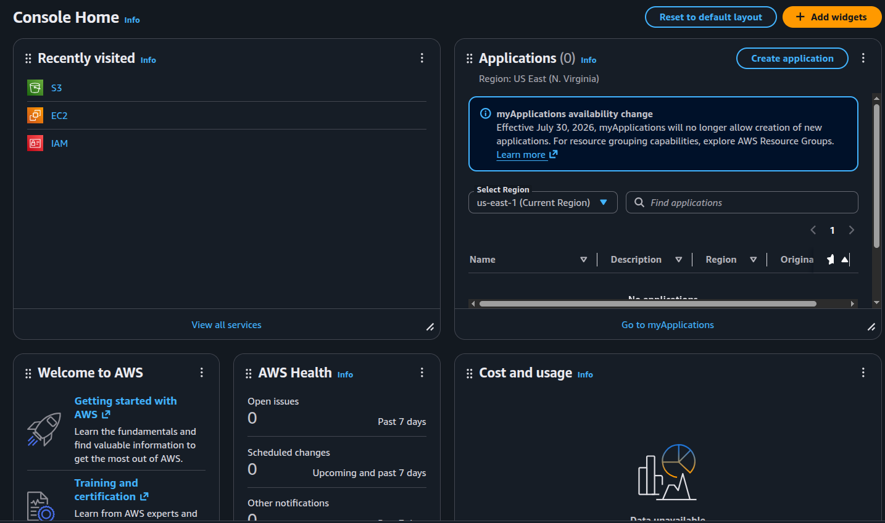
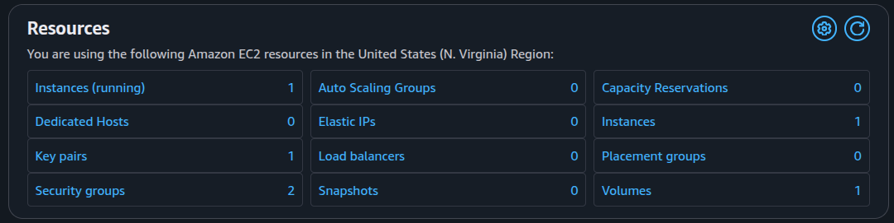

# <em>AWS Server Login </em> {.unnumbered}

```{r}
#| label: common
#| include: false
source("_common.R")
```

```{r}
#| label: co_box_rev
#| echo: false
#| results: asis
#| eval: true
co_box(
  color = "o",
  look = "default", 
  hsize = "1.25", 
  size = "1.00", 
  header = "Caution", 
  fold = FALSE,
  contents = "This section is being revised. Thank you for your patience."
)
```

This lab covers logging into our AWS EC2 server via SSH. We covered getting set up with AWS in [Stand up an EC2 instance](aws-ec2.qmd), but we'll start this lab from the AWS **Console Home**. We can see our previous labs have already added the S3, EC2, and IAM widgets to the **Recently Visited** section:

{width="100%" fig-width="center"}

If we click on the EC2 widget, we'll see we have 1 instance running, 1 key pair, 2 security groups, and 1 volume:

{width="100%" fig-width="center"}

We want to click on the **Instances (running)** to get the server information. Rather than give you another screenshot, I've created a table below of the information.

## EC2 server info

| Server Detail | Description |
|------------------------------------|------------------------------------|
| **Instance ID** | Internal identifier assigned by AWS (e.g., `i-0a1b2c3d4e5f6g7h8`). Used to reference the instance in APIs and CLI commands. |
| **Public IPv4 address** | The **public-facing** IP address assigned to the instance, accessible from the internet. Changes when the instance stops/starts unless an Elastic IP is assigned. Shown in the diagram as the connection point from our computer. |
| **Private IPv4 addresses** | The **private** internal IP address(es) within the **VPC** (e.g., `10.0.1.42`). Used for communication between instances and resources within the **VPC**. This is the address inside the **Subnet** where the instance actually lives. |
| **IPv6 address** | IPv6 address for the instance if IPv6 is enabled on the **VPC** and **subnet**. Can be **public or private** depending on configuration. |
| **Public DNS** | **Public** DNS hostname provided by AWS that resolves to the **public IPv4 address** (e.g., `ec2-X-X-X-X.compute-1.amazonaws.com`). Valid only while the instance is running. |
| **Hostname type** | Configuration setting for the type of hostname resolution used (IP-based or resource-based). Determines how the instance appears in DNS. |
| **Private IP DNS name (IPv4 only)** | **Private** DNS name that resolves to the **private IPv4 address** within the **VPC**. Used for internal communication between instances. |
| **Answer private resource DNS name** | **Private** alias or CNAME record in Route 53 for private DNS resolution within the **VPC**. |
| **Instance type** | Configuration: the size and capabilities of the **EC2 Instance** (e.g., `t2.micro`, `t3.small`, `m5.large`). Determines CPU, memory, network, and storage resources. |
| **Elastic IP addresses** | **Public** static IP address that persists through stop/start cycles. Can be associated or disassociated from instances. |
| **Auto-assigned IP address** | Configuration: indicates whether a **public IPv4 address** is automatically assigned on instance launch (temporary if not Elastic IP). |
| **VPC ID** | Internal identifier of the **Virtual Private Cloud** where the instance is deployed. Defines the network boundary and routing. |
| **AWS Compute Optimizer finding** | Configuration: AWS recommendations for optimizing instance type, size, or configuration based on usage metrics. |
| **IAM role** | Configuration: the Identity and Access Management role attached to the instance. Grants permissions for AWS service access without storing long-lived credentials. |
| **Subnet ID** | Internal identifier of the **subnet** within the **VPC** where the instance is placed. Determines availability zone and IP range. |
| **Auto Scaling Group name** | Configuration: if the instance is part of an Auto Scaling Group, this shows the group name. Otherwise empty. |
| **IMDSv2** | Configuration: Instance Metadata Service version status. IMDSv2 is more secure and requires token-based access to metadata. |
| **Instance ARN** | Internal identifier: Amazon Resource Name following AWS naming convention (e.g., `arn:aws:ec2:region:account:instance/instance-id`). |
| **Managed** | Configuration: indicates if the instance is managed by AWS Systems Manager, allowing remote management via the console. |
| **Operator** | Configuration: the account or role that created and manages the instance. Useful in multi-account environments. |

You can research each of these topics on your own in the AWS documentation, but the [do4ds chapter on the Computer Networks](https://do4ds.com/chapters/sec2/2-6-networking.html) is also helpful.

## Network Architecture Overview

Understanding how these addresses and identifiers connect is key to accessing our EC2 instance. I've tried to illustrate how public and private addressing works in the figure below:

```{mermaid}
%%| fig-cap: 'EC2 Instance Network Architecture'
%%| fig-width: 8.0
%%| fig-align: 'center'
%%{init: {'theme': 'base', 'themeVariables': {'fontFamily': 'monospace'}}}}%%

graph TD
    Client(["Our Computer"])
    PubIP("<strong>Public IPv4</strong>:<br>203.0.113.42")
    PubDNS("<strong>Public DNS</strong>:<br>ec2-203-0-113-42...")
    IGW("Internet<br>Gateway")
    VPC("<strong>VPC</strong>")
    Subnet["<strong>Subnet</strong><br>10.0.1.0/24"]
    Instance{{"<strong>EC2 Instance</strong>"}}
    PrivIP["<strong>Private IPv4</strong>:<br>10.0.1.42"]
    PrivDNS["<strong>Private DNS</strong>:<br>ip-10-0-1-42..."]
    
    Client -->|"<em>SSH port 22</em>"| PubIP
    PubIP -.->|resolves to| PubDNS
    PubIP -->|NAT| IGW
    IGW -->|route| VPC
    VPC --> Subnet
    Subnet --> Instance
    Instance --> PrivIP
    PrivIP -.->|resolves to| PrivDNS

    style Client fill:#E8E8E8,stroke:#333,stroke-width:1px,color:#000
    style PubIP fill:#E8A33D,stroke:#000,stroke-width:2px,color:#000
    style PubDNS fill:#E8A33D,stroke:#000,stroke-width:1px,color:#000
    style IGW fill:#E8A33D,stroke:#000,stroke-width:2px,color:#000
    style VPC fill:#1B2A41,stroke:#fff,stroke-width:2px,color:#fff
    style Subnet fill:#2A6F77,stroke:#fff,stroke-width:1px,color:#fff
    style Instance fill:#D2562B,stroke:#fff,stroke-width:2px,color:#fff
    style PrivIP fill:#5B8C5A,stroke:#fff,stroke-width:2px,color:#fff
    style PrivDNS fill:#5B8C5A,stroke:#000,stroke-width:1px,color:#fff
```

### Understanding NAT

The **NAT** (Network Address Translation) step in the diagram is where the **Internet Gateway** translates the ***public*** **IPv4 address** to the ***private*** **IPv4 address** of the instance. When we connect via SSH to the public IP, the gateway automatically converts that traffic so it reaches the private IP inside the **VPC** (Virtual Private Cloud)—your isolated network environment in AWS where the instance lives. This separation keeps internal instance addresses hidden from the internet while still allowing secure access through the public endpoint.

## Using Your SSH Key

When we created the key pair in AWS, a `.pem` file was downloaded to our computer. This file is our private key—keep it secure and never share it. We'll use the `.pem` key to authenticate when connecting to our **EC2 Instance**.

### Step 1: Set up the key file

First, we move the `.pem` file to our `.ssh` directory:

```{bash}
#| eval: false 
#| code-fold: false 
mv ~/Downloads/<your-key-file-name>.pem ~/.ssh/
```

Then set the correct permissions. SSH requires that private keys have restricted permissions (readable only by us):

```{bash}
#| eval: false 
#| code-fold: false 
chmod 600 ~/.ssh/<your-key-file-name>.pem
```

If we skip this step, SSH will refuse to use the key with an error like `Permissions 0644 for '.../<your-key-file-name>.pem' are too open`.

### SSH directory and file permissions

SSH is strict about permissions to prevent other users on the computer from reading our keys. Here's what the `.ssh` directory structure should look like:

```{mermaid}
%%| fig-cap: '~/.ssh Directory Permissions'
%%| fig-width: 6.0
%%| fig-align: 'center'
%%{init: {'theme': 'base', 'themeVariables': {'fontFamily': 'monospace'}}}}%%

graph LR
    ssh["~/.ssh<br/>(700)"]
    config["config<br/>(600)"]
    pem["*.pem or key<br/>(600 or 400)"]
    pub["*.pub<br/>(644)"]
    known["known_hosts<br/>(644)"]
    auth["authorized_keys<br/>(600)"]

    ssh --> config
    ssh --> pem
    ssh --> pub
    ssh --> known
    ssh --> auth

    style ssh fill:#D2562B,stroke:#fff,stroke-width:2px,color:#fff,font-family:monospace,text-align:center
    style config fill:#2A6F77,stroke:#fff,stroke-width:1px,color:#fff,font-family:monospace,text-align:center
    style pem fill:#D2562B,stroke:#fff,stroke-width:1px,color:#fff,font-family:monospace,text-align:center
    style pub fill:#5B8C5A,stroke:#fff,stroke-width:1px,color:#fff,font-family:monospace,text-align:center
    style known fill:#5B8C5A,stroke:#fff,stroke-width:1px,color:#fff,font-family:monospace,text-align:center
    style auth fill:#2A6F77,stroke:#fff,stroke-width:1px,color:#fff,font-family:monospace,text-align:center
```

The directory itself (700) and private keys (600) are the most critical. If these are too permissive, SSH silently refuses to use them.

### Step 2: Connect to the instance

Now we can SSH into our instance using the ***Public*** **IPv4 address** from the EC2 console:

```{bash}
#| eval: false 
#| code-fold: false 
ssh -i ~/.ssh/<your-key-file-name>.pem ec2-user@YOUR_PUBLIC_IP_ADDRESS
```

Replace `YOUR_PUBLIC_IP_ADDRESS` with the actual public IP from the instance details (e.g., `203.0.113.42`).

#### Host key verification

The first time we connect, SSH will ask if we trust the host:

```{verbatim}
The authenticity of host 'YOUR_PUBLIC_IP_ADDRESS (YOUR_PUBLIC_IP_ADDRESS)' can't be established.
ED25519 key fingerprint is SHA256:XXXXXXXXXXXXXXXXXXXXXXXXXXXXXXXXXXXXXXXX.
This key is not known by any other names.
Are you sure you want to continue connecting (yes/no/[fingerprint])?
```

This is SSH verifying the server's public key fingerprint to prevent man-in-the-middle attacks. When we type `yes`, SSH stores the host key in `~/.ssh/known_hosts` so it won't ask again on future connections.

For an EC2 instance we just created, it's safe to accept this. The fingerprint comes from the server itself and doesn't require external verification.

#### Successful connection

When the connection works, we see the Amazon Linux 2 welcome banner and land at a shell prompt on the remote instance:

```{verbatim}

       __|  __|_  )
       _|  (     /   Amazon Linux 2 AMI
      ___|\___|___|

https://aws.amazon.com/amazon-linux-2/
47 package(s) needed for security, out of 92 available
Run "sudo yum update" to apply all updates.
```

We can now run commands on the server.

## Troubleshooting: Connection closed

If the connection closes immediately after accepting the host key, the issue is usually one of the following:

### Security Group doesn't allow SSH (port 22)

The most common cause. To check the security group rules:

1.  Go to the EC2 console and click **Instances**
2.  Select the running instance
3.  In the details panel, find **Security groups** and click on the group name
4.  In the security group details, look for the **Inbound rules** tab
5.  Check if there's a rule allowing **SSH** (port 22) from the IP address

If there's no SSH rule, click **Edit inbound rules** and add:

- Type: SSH
- Protocol: TCP
- Port: 22
- Source: Your IP address (or `0.0.0.0/0` to allow from anywhere—less secure but simpler for testing)

Click **Save rules** and try connecting again.

### Wrong username

Different AMIs use different default usernames:

- Amazon Linux 2: `ec2-user`
- Ubuntu: `ubuntu`
- CentOS: `centos`
- RHEL: `ec2-user`

Try connecting with the correct username for the instance's operating system.

### Key mismatch

The private key on our computer doesn't match the public key on the instance. Verify that the key pair name in AWS matches the `.pem` file name.

### Instance not ready

If the instance was just launched, it may still be booting. Wait a minute and try again.

## Creating a regular SSH key for routine access

The AWS `.pem` key is powerful—it's our root access to the instance. For daily work, we want to create a separate SSH key pair with limited permissions. This follows the principle of least privilege: use the AWS key only for setup, then use a weaker key for routine access.

### Step 1. Generate a new key pair locally

On our computer, we'll create a new SSH key using `ssh-keygen`:

```{bash}
#| eval: false
#| code-fold: false
ssh-keygen -t ed25519 -f ~/.ssh/<your-key-name> -C "your-email@example.com"
```

Press <kbd>Enter</kbd> when prompted for a passphrase (or add one for extra security). We see something like the following: 

```{verbatim}
Your identification has been saved in /path/to/.ssh/<your-key-name>
Your public key has been saved in /path/to/.ssh/<your-key-name>.pub
The key fingerprint is:
<!-- SHA256:XXXXXXXXXXXXXXXXXXXXXXXXXXXXXXXXXXXXXXXXXX your-email@example.com -->
The key's randomart image is:
+--[ED25519 256]--+
|        ..+o+... |
|          o+.ooo.|
|         .+.+Eo+o|
|         .. .+ *.|
|      . S..+o+   |
|       o.+O ..  .|
|       + +..o +oo|
|        oo+ +  +.|
|         ..=+.. .|
+----[SHA256]-----+
```


This creates two files in `~/.ssh.`: 

```{bash}
#| eval: false 
#| code-fold: false 
~/.ssh/
├── known_hosts/
├── <your-key-name>
├── <your-key-name>.pem
└── <your-key-name>.pub

```

- `~/.ssh/<your-key-name>` is the private key (**keep this secret**)

- `~/.ssh/<your-key-name>.pub` is the public key we will share this with the server

### Step 2. Add the public key to the server

Now--we can connect to the instance using the AWS `.pem` key:

```{bash}
#| eval: false
#| code-fold: false
ssh -i ~/.ssh/<your-key-name>.pem ec2-user@YOUR_PUBLIC_IP_ADDRESS
```

Once logged in, we can create the `.ssh` directory and add the public key:

```{bash}
#| eval: false
#| code-fold: false
mkdir -p ~/.ssh
chmod 700 ~/.ssh
```

Replace `YOUR_PUBLIC_KEY_CONTENT` with the contents of `~/.ssh/<your-key-name>.pub` on our local computer. We can view it with:

```{bash}
#| eval: false
#| code-fold: false
cat ~/.ssh/<your-key-name>.pub
```

```{bash}
#| eval: false
#| code-fold: false
echo "YOUR_PUBLIC_KEY_CONTENT" >> ~/.ssh/authorized_keys
```

And we need to change the permissions on `authorized_keys`:

```{bash}
#| eval: false
#| code-fold: false
chmod 600 ~/.ssh/authorized_keys
```

### Step 3. Use new key for future connections

Now we can log in using our new key without needing the AWS `.pem` file:

```{bash}
#| eval: false
#| code-fold: false
ssh -i ~/.ssh/<your-key-name> ec2-user@YOUR_PUBLIC_IP_ADDRESS
```

We should keep the AWS `.pem` file safe and avoid using it for routine work. If the regular key is compromised, we should delete it from our server and generate a new one. The AWS key remains our recovery method.

## Using the Public DNS

We can also connect using the **Public DNS** name instead of the IP address.

In fact, if we log into the **AWS Console**, we can navigate to **Instances** > **`<instance-id>`** > **Connect to instance** > **SSH client** and copy the following:

```{bash}
#| eval: false 
#| code-fold: false 
ssh -i ~/.ssh/<your-key-file-name>.pem ec2-user@ec2-YOUR-PUBLIC-IP.compute-1.amazonaws.com 
```

The public DNS is convenient for one-off connections—we don't need to look up the IP address. It encodes the IP in the hostname and changes when we stop/restart the instance (for stable, persistent access, we should assign an Elastic IP address to the instance).

When we log in, we should see something like the following:

```{verbatim}
Last login: Fri Jul 17 06:24:04 2026 from ip70-163-154-253.ph.ph.cox.net
   ,     #_
   ~\_  ####_        Amazon Linux 2
  ~~  \_#####\
  ~~     \###|       AL2 End of Life is 2026-06-30.
  ~~       \#/ ___
   ~~       V~' '->
    ~~~         /    A newer version of Amazon Linux is available!
      ~~._.   _/
         _/ _/       Amazon Linux 2023, GA and supported until 2029-06-30.
       _/m/'           https://aws.amazon.com/linux/amazon-linux-2023/
[ec2-user@ip=203-0-113-421 ~]$
```

## Recap

In this lab we logged into our EC2 instance over SSH and created a regular key for routine access. The key ideas to carry forward:

1. The server trusts keys, not machines. A new computer needs a private key whose public half is in the server's `authorized_keys`.  

2. Reserve the AWS `.pem` key for recovery, scope your security group to known IPs, and rotate any key you can't fully account for.

In the next chapter we'll cover logging in from a different computer, and how to rename/replace keys. 
