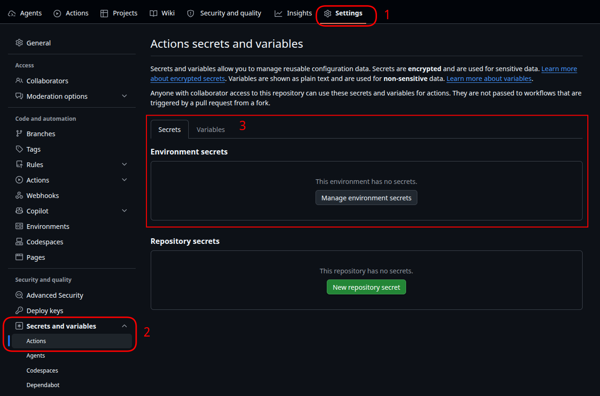

# <em>GitHub Actions and S3</em> {.unnumbered}

```{r}
#| label: common
#| include: false
source("_common.R")
```

```{r}
#| label: co_box_rev
#| echo: false
#| results: asis
#| eval: false
co_box(
  color = "o",
  look = "default",
  hsize = "1.25",
  size = "1.00",
  header = "Caution",
  fold = FALSE,
  contents = "This section is being revised. Thank you for your patience."
)
```

GitHub Actions can automatically build and publish our `vetiver` models to our S3 whenever we push changes to a specific branch (we covered these in [Lab 5](lab05.qmd) and [GitHub Actions as CI/CD](publish-r-py.qmd)). I've stored the Quarto files for building, pushing, and pulling the model data in the [`_labs/lab07/` folder](https://github.com/mjfrigaard/do4ds-labs/tree/main/_labs/lab07). 

In this  section I'll cover setting up AWS credentials as repository secrets and creating a workflow to automate the model publishing process.

```{mermaid}
%%| fig-cap: 'GitHub Actions Automated Deployment'
%%| fig-width: 7.0
%%| fig-align: 'center'
%%{init: {'theme': 'base', 'themeVariables': {'fontFamily': 'monospace'}}}%%

graph TD
    Push(["<strong>Developer</strong><br/><em>Pushes to branch</em>"]) 
    GHA{{"<strong>GitHub Actions</strong>"}}
    Push --Triggers--> GHA
    GHA --"Build Models"--> Build("<strong>Vetiver Models</strong><br/><em>(py_model.qmd, <br>r_model.qmd)</em>")
    Build --> Auth("<strong>Configure</strong><br><em>AWS Credentials</em>")
    Auth --"Upload to"--> S3("<strong>S3</strong><br/><em>(using pins)</em>")
    S3 --> Success(["Models<br/>Published"])

    style Push fill:#5B8C5A,stroke:#000000,stroke-width:1px,color:#ffffff
    style GHA fill:#E8A33D,stroke:#000000,stroke-width:1px,color:#ffffff
    style Build fill:#1B2A41,stroke:#000000,stroke-width:1px,color:#ffffff
    style Auth fill:#2A6F77,stroke:#000000,stroke-width:1px,color:#ffffff
    style S3 fill:#D2562B,stroke:#000000,stroke-width:1px,color:#ffffff
    style Success fill:#5B8C5A,stroke:#000000,stroke-width:1px,color:#ffffff
```

## Automating Model Deployment with GitHub Actions

We need to add AWS configuration to the GitHub repository (**Settings** > **Secrets and variables** > **Actions**). Sensitive credentials go in **Secrets**, while non-sensitive configuration goes in **Variables**:

{width='100%' fig-align='center'}

**Secrets**:

1. `AWS_ACCESS_KEY_ID`: AWS access key ID from the `mjfrigaard-cli` IAM user    
2. `AWS_SECRET_ACCESS_KEY`: AWS secret access key     

**Variables**:

3. `AWS_REGION`: AWS region (e.g., `us-east-1`)   

These credentials belong to the `mjfrigaard-cli` IAM user with `AmazonS3FullAccess` permissions (same user for local AWS CLI configuration).

### Setting up GitHub Secrets and Variables

```{mermaid}
%%| fig-cap: 'GitHub Secrets and Variables Flow'
%%| fig-width: 7.0
%%| fig-align: 'center'
%%{init: {'theme': 'base', 'themeVariables': {'fontFamily': 'monospace'}}}%%

graph TD
    Secrets(["GitHub Secrets<br/>(Sensitive)"])
    Vars(["GitHub Variables<br/>(Config)"])

    Secrets --> AccessKey["<strong>AWS_ACCESS_KEY_ID</strong>"]
    Secrets --> SecretKey["<strong>AWS_SECRET_ACCESS_KEY</strong>"]
    Vars --> Region["<strong>AWS_REGION</strong>"]

    AccessKey --> Workflow{{"Workflow Job<br/>(aws-actions/<br>configure-aws-<br>credentials)"}}
    SecretKey --> Workflow
    Region --> Workflow

    Workflow --> S3["Temporary AWS<br/>Credentials"]
    S3 --> Access[["Access to S3"]]

    style Secrets fill:#D2562B,stroke:#000000,stroke-width:1px,color:#ffffff
    style Vars fill:#2A6F77,stroke:#000000,stroke-width:1px,color:#ffffff
    style AccessKey fill:#1B2A41,stroke:#000000,stroke-width:1px,font-size:14px,text-align:center,font-family:monospace,color:#ffffff
    style SecretKey fill:#1B2A41,stroke:#000000,stroke-width:1px,font-size:14px,text-align:center,font-family:monospace,color:#ffffff
    style Region fill:#5B8C5A,stroke:#000000,stroke-width:1px,font-size:14px,text-align:center,font-family:monospace,color:#ffffff
    style Workflow fill:#E8A33D,stroke:#000000,stroke-width:1px,color:#ffffff
    style S3 fill:#2A6F77,stroke:#000000,stroke-width:1px,color:#ffffff
    style Access fill:#5B8C5A,stroke:#000000,stroke-width:1px,color:#ffffff

```

### GitHub Actions Workflow File

Next, we create `.github/workflows/publish.yml`[^gha-workflow] to build and publish the models to our S3 bucket. The models are automatically versioned by `vetiver` (e.g., `20260710T065220Z-91fdd`), so we're creating a new version in S3 with each workflow run.

```yaml
name: Publish Models to S3

on:
  push:
    branches: [lab07-s3] #<1>
    paths:
      - '_labs/lab07/py_model.qmd'
      - '_labs/lab07/r_model.qmd'
      - '.github/workflows/publish.yml'

jobs:
  publish-models:
    runs-on: ubuntu-latest

    steps:
      - name: Check out repository #<2>
        uses: actions/checkout@v4 #<2>

      - name: Configure AWS credentials #<3>
        uses: aws-actions/configure-aws-credentials@v4
        with:
          aws-access-key-id: ${{ secrets.AWS_ACCESS_KEY_ID }}
          aws-secret-access-key: ${{ secrets.AWS_SECRET_ACCESS_KEY }}
          aws-region: ${{ vars.AWS_REGION || 'us-east-1' }} #<3>

      - name: Set up Python #<4>
        uses: actions/setup-python@v5
        with:
          python-version: '3.12'

      - name: Set up R
        uses: r-lib/actions/setup-r@v2
        with:
          r-version: '4.4' 

      - name: Install Python dependencies
        working-directory: ./_labs/lab07
        run: |
          python -m pip install --upgrade pip
          pip install -r Python/requirements.txt pins vetiver python-dotenv

      - name: Install R dependencies
        working-directory: ./_labs/lab07
        run: |
          R -e "install.packages(c('vetiver', 'pins', 'plumber2', 'paws.storage'))" #<4>

      - name: Build and publish Python model #<5>
        working-directory: ./_labs/lab07
        env:
          USE_S3: 'true'
          AWS_REGION: ${{ vars.AWS_REGION || 'us-east-1' }}
          PINS_ALLOW_PICKLE_READ: '1'
        run: |
          python py_model.py

      - name: Build and publish R model
        working-directory: ./_labs/lab07
        env:
          USE_S3: 'true'
          AWS_REGION: ${{ vars.AWS_REGION || 'us-east-1' }}
        run: |
          Rscript r_model.R #<5>
          
```
1. **Trigger**: Runs when `py_model.qmd`, `r_model.qmd`, or this workflow file changes on the `lab07-s3` branch
2. **Checkout**: Downloads the latest code from the repository  
3. **AWS Auth**: Uses `aws-actions/configure-aws-credentials` to set up temporary AWS credentials from GitHub secrets (no long-lived keys stored in the runner)  
4. **Setup**: Installs Python 3.12 and R 4.4 with required dependencies  
5. **Build & Publish**: Runs `py_model.py` and `r_model.R` with `USE_S3=true` environment variable, which causes the model scripts to write directly to S3

Publishing with GitHub Actions automates the model deployment without any permanent AWS credentials sitting in the repository.


[^gha-workflow]: Note that file is stored in the [root directory (`.github/workflows/`)](https://github.com/mjfrigaard/do4ds-labs/tree/main/.github/workflows)--where all workflow files belong.

## Developing on the `lab07-s3` Branch

Now, I want to keep the `main` branch reserved for the Quarto book rendering, so any model changes will go in the `lab07-s3` branch (which triggers the model publishing workflow). Since I've already been developing on `main`, I'll need to create and switch to the `lab07-s3` branch:

First I'll create/check out the `lab07-s3` branch from `main`:

```{bash}
#| eval: false 
#| code-fold: false 
git checkout -b lab07-s3
```

And push the new branch to GitHub:

```{bash}
#| eval: false 
#| code-fold: false
git push -u origin lab07-s3
```

Once on the `lab07-s3` branch, I'll need to follow this process:

### Make changes 

Make changes to the model files (i.e., [`_labs/lab07/py_model.qmd`](https://github.com/mjfrigaard/do4ds-labs/blob/main/_labs/lab07/py_model.qmd) or [`_labs/lab07/r_model.qmd`](https://github.com/mjfrigaard/do4ds-labs/blob/main/_labs/lab07/r_model.qmd))

### Test changes (locally)

To test changes locally, I'll need to set the environment variables for S3 (or use local for testing):

```{bash}
#| eval: false 
#| code-fold: false
export USE_S3=false  # or true if testing S3 locally
```

Then render/run the files with the changes

```{bash}
#| eval: false 
#| code-fold: false
quarto render py_model.qmd
# or
Rscript r_model.R
```

### Commit changes 

Commit the changes (be specific about the files):

```{bash}
#| eval: false 
#| code-fold: false
git add _labs/lab07/py_model.qmd _labs/lab07/r_model.qmd
git commit -m "Update model configuration or training logic"
```

### Push changes 

Push to the `lab07-s3` branch:

```{bash}
#| eval: false 
#| code-fold: false
git push origin lab07-s3
```


GitHub Actions will automatically detects the `push` to `lab07-s3`, build the models using the latest code, and publish the versioned models to S3 with AWS credentials from secrets. 

### Verify

We can verify the models were published using:

```{bash}
#| eval: false 
#| code-fold: false
# List files in S3
aws s3 ls s3://penguin-vetiver-model-data/ --recursive --profile dev-deploy
```

### Merge to `main`

Then switch back to the `main` branch:

```{bash}
#| eval: false 
#| code-fold: false
git checkout main
```

This will merge the changes in `lab07-s3` to `main` (if the changes also belong in the book).

```{bash}
#| eval: false 
#| code-fold: false
git merge lab07-s3
```

Push changes to `main`.

```{bash}
#| eval: false 
#| code-fold: false
git push origin main
```

Then publish the book:

```{bash}
#| eval: false 
#| code-fold: false
quarto publish gh-pages
```
