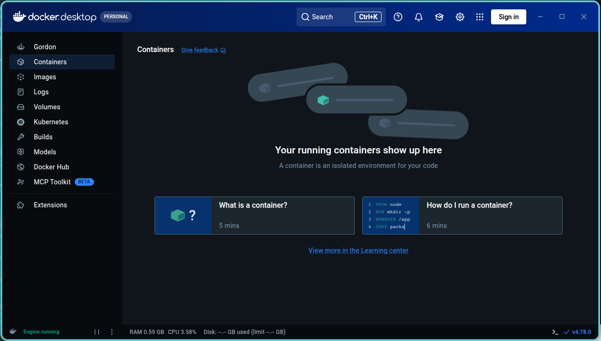

# Lab 6: Demystifying Docker {.unnumbered}

```{r}
#| label: common
#| include: false
source("_common.R")
```

```{r}
#| label: co_box_rev
#| echo: false
#| results: asis
#| eval: true
co_box(
  color = "o",
  look = "default", 
  hsize = "1.25", 
  size = "1.00", 
  header = "Caution", 
  fold = FALSE,
  contents = "This section is being revised. Thank you for your patience."
)
```

## Comprehension questions

The questions below come from the [Demystifying Docker](https://do4ds.com/chapters/sec1/1-6-docker.html) chapter.

### Docker mental map

> "*Draw a mental map of the relationship between the following: Dockerfile, Docker Image, Docker Registry, Docker Container.*"

1.  A **Dockerfile** is a plain-text recipe that describes exactly what goes into an image.
2.  Running `docker build` executes the **Dockerfile** instructions and produces a **Docker Image** (an immutable, layered snapshot of the filesystem and configuration).
3.  **Docker Images** can be pushed to a **Docker Registry** (such as Docker Hub or GitHub Container Registry) for storage and sharing.
4.  Running `docker run` on an image creates a **Docker Container**, a live, isolated process that uses the image as its read-only base.

```{mermaid}
%%| fig-cap: ‘Docker components’
%%| fig-width: 7.0
%%| fig-align: 'center'
%%{init: {‘theme’: ‘base’, ‘themeVariables’: {‘fontFamily’: ‘monospace’}}}%%

graph LR
    subgraph Build["<strong>Build</strong>"]
        DF("<strong>Dockerfile</strong>")
        Img("<strong>Docker Image</strong>")
        DF -->|"<code>docker<br>build</code>"| Img
    end

    subgraph Share["<strong>Share</strong>"]
        Reg("<strong>Docker<br>Registry<strong><br>(Docker Hub, GHCR)")
        Img -->|"<code>docker<br>push</code>"| Reg
        Reg -->|"<code>docker<br>pull</code>"| Img
    end

    subgraph Run["<strong>Run</strong>"]
        Con("<strong>Docker<br>Container</strong>")
        Img -->|"<code>docker<br>run</code>"| Con
    end

    style Build fill:#fbf7ec,stroke:#5B8C5A,color:#1B2A41
    style Share fill:#fbf7ec,stroke:#2A6F77,color:#1B2A41
    style Run fill:#fbf7ec,stroke:#2A6F77,color:#1B2A41
    style DF fill:#5B8C5A,stroke:#000000,stroke-width:1px,color:#ffffff
    style Img fill:#D2562B,stroke:#000000,stroke-width:1px,color:#ffffff
    style Reg fill:#1B2A41,stroke:#000000,stroke-width:1px,color:#ffffff
    style Con fill:#2A6F77,stroke:#000000,stroke-width:1px,color:#ffffff
```

The key distinction is that an image is **static** (it never changes after it is built) while a container is **ephemeral** (it runs, does work, and can be stopped and removed). Multiple containers can be created from the same image simultaneously, each isolated from the others.

### Docker run flags

> "*When would you want to use each of the following flags for docker run? When wouldn’t you? `-p`, `--name`, `-d`, `--rm`, `-v`*"

| Flag | Use | Don't Use |
|--------------------|--------------------------|------------------------|
| `-p <host>:<container>` | The container runs a service (API, Shiny app, database) that needs to be reachable from the host or network | The container does not expose a network service and runs entirely internally |
| `--name <name>` | You need to reference the container by name in other commands (`docker logs`, `docker stop`, `docker exec`), or when running multiple containers that need to find each other | Running a quick one-off command where the auto-generated name is fine |
| `-d` | Running a long-lived background service (a web server, an API) where you want the terminal back immediately | You need to watch live output, or the container runs a short job and you want to see when it finishes |
| `--rm` | Short-lived, disposable jobs: running a script, rendering a document, or any task where you do not need to inspect the container afterward | Long-lived services you want to restart later, or when you may need to examine the stopped container to debug a failure |
| `-v <host_path>:<container_path>` | Persisting data beyond the container’s lifetime, sharing config files or secrets, or mounting code during development so changes are reflected without rebuilding | The container should be fully self-contained and stateless; mounting volumes couples the container to the host filesystem and can undermine reproducibility |

### Dockerfile commands

> "*What are the most important Dockerfile commands?*"

Every Dockerfile starts with `FROM`, which names the base image (e.g., `FROM rocker/r-ver:4.5`). All subsequent instructions build on top of it.

| Command | Purpose |
|--------------|---------------------------------------------------|
| `FROM` | Set the base image — always the first instruction |
| `RUN` | Execute shell commands during the build (install packages, create directories) |
| `COPY` | Copy files from the build context into the image |
| `WORKDIR` | Set the working directory for all subsequent `RUN`, `COPY`, `CMD`, and `ENTRYPOINT` instructions |
| `ENV` | Set environment variables available at both build time and runtime |
| `EXPOSE` | Document which port the container listens on (informational — does not publish the port) |
| `CMD` | Default command to run when the container starts; can be overridden at `docker run` |
| `ENTRYPOINT` | Main executable for the container; `CMD` provides its default arguments |

The most important commands are `CMD` and `ENTRYPOINT`: 

* `CMD` is the default command and is easily replaced (`docker run my-image Rscript other.R`)

* `ENTRYPOINT` locks in the executable so the container always behaves like that program (`docker run my-api --port 8080` passes `--port 8080` as arguments to the entrypoint)  

For data science services, `ENTRYPOINT` is the right choice when the container should always start the API or app.

## Docker Containers & Model APIs

This lab involves creating Docker containers for the APIs we created in R and Python in [lab 2](https://do4ds.com/chapters/sec1/1-2-proj-arch.html#lab2) (see my solutions [here](https://github.com/mjfrigaard/do4ds-labs/tree/main/_labs/lab02)).

### Docker setup 

I'll cover how to install/setup Docker desktop on the `Pop!_OS 24.04` operating system because it wasn't very clear from the online documentation. 

1. Download the Docker Desktop `.deb` from [docs.docker.com/get-docker](https://docs.docker.com/get-docker/). 
    * Docker Desktop depends on `docker-ce-cli`, which is not in the default Pop!_OS repos. Add Docker's official APT repository before installing the `.deb`.

2. Install the following prerequisites    
    
    ```bash
    sudo apt install ca-certificates curl gnupg lsb-release
    ```

3. Add Docker's GPG key:

    ```bash
    sudo install -m 0755 -d /etc/apt/keyrings
    ```

    ```bash
    curl -fsSL https://download.docker.com/linux/ubuntu/gpg | sudo gpg --dearmor -o /etc/apt/keyrings/docker.gpg
    ```

    ```bash
    sudo chmod a+r /etc/apt/keyrings/docker.gpg
    ```

4. Add the Docker APT repository (use `ubuntu noble` for Pop!_OS 24.04):

    ```bash
    echo \
      "deb [arch=$(dpkg --print-architecture) signed-by=/etc/apt/keyrings/docker.gpg] \
      https://download.docker.com/linux/ubuntu noble stable" | \
      sudo tee /etc/apt/sources.list.d/docker.list > /dev/null
    ```

    ```bash
    sudo apt update
    ```

5. Install Docker Desktop. This install may print a permission warning about `_apt` — this is harmless and the install completes normally.

    ```bash
    sudo apt install ./Downloads/docker-desktop-amd64.deb
    ```


6. Verify the install and start Docker Desktop:

    ```bash
    docker --version
    # Docker version 29.6.0, build fb59821
    ```
    
    ```bash
    systemctl --user start docker-desktop
    ```

{width='100%' fig-align='center'}

#### Signing in

On Linux, Docker Desktop uses [`pass`](https://www.passwordstore.org/) (the GPG-based password store) as its credentials backend, storing your Docker ID token in GPG-encrypted files.[^docker-pass] Docker Desktop will show a warning and refuse to sign in if `pass` is not initialized first — so this setup must happen before clicking **Sign In** in the UI.

[^docker-pass]: gnome-keyring is not a supported alternative for Docker Desktop on Linux. It is available for Docker Engine via the `secretservice` D-Bus helper, but that is a separate tool from Docker Desktop. See the [credentials management documentation](https://docs.docker.com/desktop/setup/sign-in/#credentials-management-for-linux-users).

1. Install `pass` and `gpg` if they are not already present:

    ```bash
    sudo apt install pass gpg
    ```

2. Generate a GPG key. Accept the defaults (RSA, 3072-bit) and enter a name and email when prompted:

    ```bash
    gpg --generate-key
    ```

    The output includes a `pub` block — copy the long hex string on that line (the GPG key ID):

    ```bash
    pub   rsa3072 2025-10-01 [SC] [expires: 2027-10-01]
          A1B2C3D4E5F6A1B2C3D4E5F6A1B2C3D4E5F6A1B2
    ```

3. Initialize `pass` with the key ID:

    ```bash
    pass init A1B2C3D4E5F6A1B2C3D4E5F6A1B2C3D4E5F6A1B2
    ```

4. Sign in from the Docker Desktop UI (**Sign In** button in the top-right) or from the Terminal:

    ```bash
    docker login
    ```

    Docker will prompt for your Docker ID username and password/token and store the credentials via `pass`.

### Python

The Python API has been moved into [`_labs/lab06/Python/api`](https://github.com/mjfrigaard/do4ds-labs/tree/main/_labs/lab06/Python/api):

```{bash}
#| eval: false 
#| code-fold: false
lab06/Python/
└── api
    ├── api.Rproj
    ├── mod-api.py
    ├── model.py
    ├── models/
    │   └── penguin_model/
    │       └── 20251224T142035Z-c115b/
    ├── my-db.duckdb
    ├── README.md
    ├── requirements-api.txt
    └── requirements.txt

5 directories, 10 files
```

### R 

The R API has been moved into [`_labs/lab06/R/api`](https://github.com/mjfrigaard/do4ds-labs/tree/main/_labs/lab06/R/api):


```{bash}
#| eval: false 
#| code-fold: false
lab06/R/
└── api
    ├── api.Rproj
    ├── model.R
    ├── models/
    │   └── penguin_model/
    │       └── 20251218T152129Z-74445/
    ├── my-db.duckdb
    ├── plumber.R
    ├── README.md
    ├── renv
    │   ├── activate.R
    │   ├── library/
    │   ├── settings.json
    │   └── staging
    └── renv.lock

9 directories, 9 files
```


