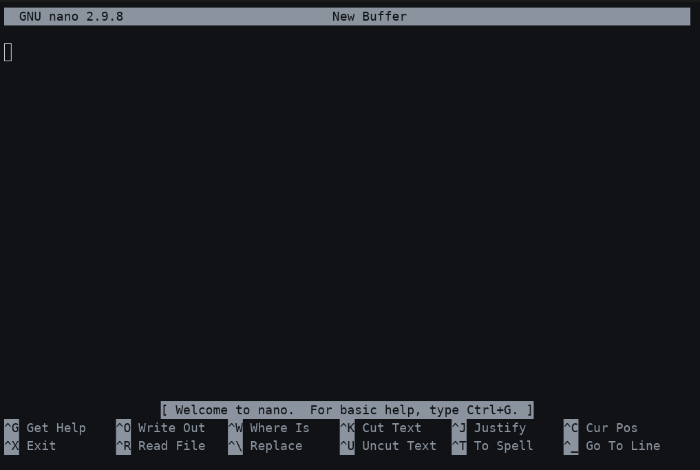
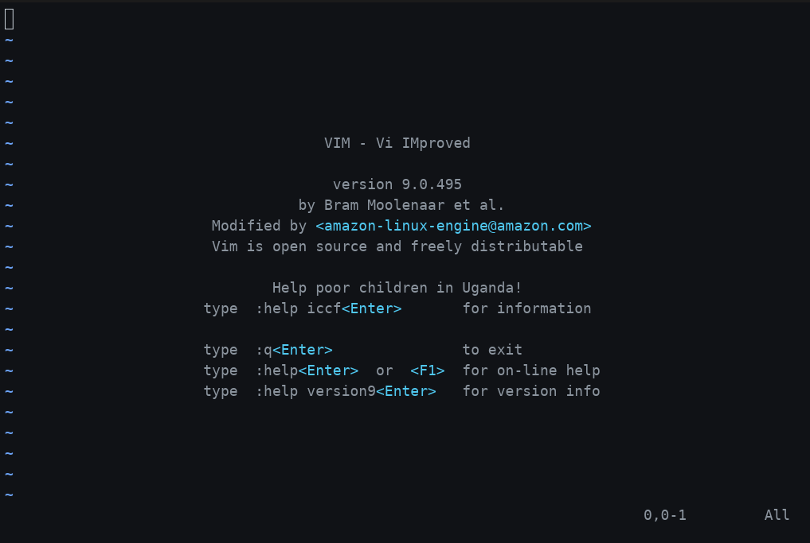

# <strong>Lab 10: App Admin</strong> {.unnumbered}

```{r}
#| label: common
#| include: false
source("_common.R")
```

```{r}
#| label: co_box_rev
#| echo: false
#| results: asis
#| eval: true
co_box(
  color = "o",
  look = "default", 
  hsize = "1.25", 
  size = "1.00", 
  header = "Caution", 
  fold = FALSE,
  contents = "This section is being revised. Thank you for your patience."
)
```

## Comprehension questions

> "*What are two different ways to install Linux applications, and what are the commands?*"

My instance is Amazon Linux 2, so the system package manager is `yum`, not Ubuntu's `apt`:

- `sudo yum install <package>` pulls a package (and its dependencies) from AL2's configured repositories.
  - `sudo yum update` keeps everything already installed current.
- For software that isn't in the repos, I download the package myself with `wget <url>` and install it directly: `sudo yum localinstall <package>.rpm` (or `sudo rpm -i <package>.rpm`).
  - No dependency resolution beyond what's already on the box, so this is my second choice, not my first.

> "*What does it mean to daemonize a Linux application? What programs and commands are used to do so?*"

Daemonizing an application means running it as a background service that starts on boot, restarts if it crashes, and keeps running independent of any login session - instead of a process that dies the moment I close my SSH connection.

On AL2, `systemd` is the program that manages this, and `systemctl` is how I talk to it:

```{mermaid}
%%| fig-cap: 'Daemonizing with systemd'
%%| fig-width: 7.0
%%| fig-align: 'center'
%%{init: {'theme': 'base', 'themeVariables': {'fontFamily': 'monospace', "fontSize":"12px"}}}}%%

graph TD
    subgraph Unit["Unit File"]
        DotService["<strong>/etc/systemd/system/*.service</strong>"]
    end
    Reload["<strong>systemctl daemon-reload</strong>"]
    Enable["<strong>systemctl enable</strong>"]
    Start["<strong>systemctl start</strong>"]
    Status["<strong>systemctl status</strong>"]

    Unit --> Reload --> Enable --"<em>starts on boot</em>"--> Start --"<em>running now</em>"--> Status

    style DotService stroke:#fff,stroke-width:1px,color:#000,font-family:monospace
    style Unit fill:#1B2A41,stroke:#fff,stroke-width:1px,color:#fff,font-family:monospace
    style Reload fill:#2A6F77,stroke:#fff,stroke-width:1px,color:#fff,font-family:monospace
    style Enable fill:#2A6F77,stroke:#fff,stroke-width:1px,color:#fff,font-family:monospace
    style Start fill:#5B8C5A,stroke:#fff,stroke-width:1px,color:#fff,font-family:monospace
    style Status fill:#E8A33D,stroke:#000,stroke-width:1px,color:#000,font-family:monospace

```

Once the unit file exists, `systemctl restart` and `systemctl stop` manage it going forward, and `systemctl disable` stops it from starting on boot.

> "*How do you know if you've opened Nano or Vim? How would you exit them if you didn’t mean to?*"

Nano tells me right away - the bottom of the screen fills with a menu of keybindings (`^X Exit`, `^O Write Out`, etc.), and I can just start typing. Vim gives no such hints: it opens in **normal mode**, the screen is otherwise blank (empty lines marked with `~`), and typing does nothing useful until I switch to **insert mode**. That silence is usually how I know I've landed in Vim by accident.

To back out without changing anything:

**Nano**: `Ctrl + X`, then answer `N` if it asks whether to save

{width='100%'}

**Vim**: press `Esc` first to make sure I'm in normal mode (not typing into the file), then type `:q!` and hit `Enter` to quit and discard any changes.

{width='100%'}

> *"What are four commands to read text files?"*

`cat`, `less`, `head`, and `tail`. I reach for `cat` on short files, `less` for anything long enough to scroll, `head` when I only need the first lines, and `tail -f` when I want to watch a log file update in real time.

> "*How would you create a file called secrets.txt, open it with Vim, write something in, close and save it, and make it so that only you can read it?*"

```{bash}
#| eval: false
#| code-fold: false
vim secrets.txt
```

From there:

1.  Press `i` to enter insert mode and type the content.
2.  Press `Esc` to return to normal mode.
3.  Type `:wq` and hit `Enter` to write (save) and quit.

Then lock it down so only I can read it:

```{bash}
#| eval: false
#| code-fold: false
chmod 600 secrets.txt
```

`600` gives the owner read/write and removes every permission for group and other - same restriction I already use on `.ssh/authorized_keys` in [Linux Users](linux-users.qmd).
