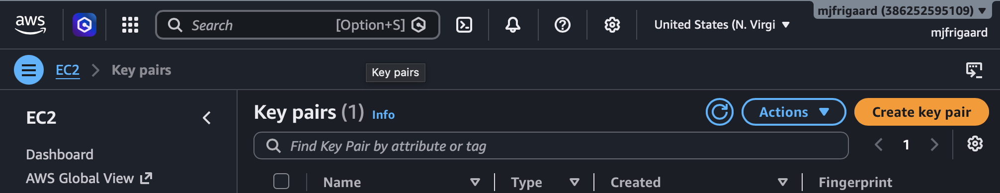

# <em>Managing SSH Key Pairs</em> {.unnumbered}

```{r}
#| label: common
#| include: false
source("_common.R")
```

```{r}
#| label: co_box_rev
#| echo: false
#| results: asis
#| eval: true
co_box(
  color = "o",
  look = "default", 
  hsize = "1.25", 
  size = "1.00", 
  header = "Caution", 
  fold = FALSE,
  contents = "This section is being revised. Thank you for your patience."
)
```

Working across multiple machines makes it easy to get sloppy with keys, so a few rules are worth stating plainly.

## Security considerations

- **Keep the AWS `.pem` key on one machine only.** It's the recovery key for the instance. There's no reason to copy it to a laptop we carry around.

- **Give each machine its own key when you can.** Per-machine keys mean a lost laptop is a one-line fix on the server, not a full key rotation.

- **Never open port 22 to the world for convenience.** In the security group, scope the SSH inbound rule to the IP addresses we actually connect from. Using `0.0.0.0/0` is fine for a quick test, but leaving it open is an invitation.

- **Rotate keys you can't account for.** If a private key might have leaked, or a machine is gone, remove its public key from `~/.ssh/authorized_keys` on the server and generate a replacement.

```{r}
#| label: co_box_least_privilege
#| echo: false
#| results: asis
#| eval: true
co_box(
  color = "g",
  look = "default",
  hsize = "1.10",
  size = "1.00",
  header = "Tip: one key per machine",
  fold = FALSE,
  contents = "Naming keys after the machine that holds them (`<your-key-name>-macbook`, `<your-key-name>-desktop`) makes the entries in `authorized_keys` self-documenting. When you need to revoke access for a single device, you know exactly which line to remove."
)
```

## Logging from other machines

So far we've connected from the same computer that created the key pair. But at some point we'll want to reach the instance from a second machine, like a MacBook Pro we use when we're away from our main desktop. The problem is that our keys live on the original computer, and the server only trusts the keys it already knows about. This section covers how to get set up on a new machine without weakening the security of the instance.

SSH authentication is based on a key pair: the private key stays on our computer, and the matching public key lives on the server in `~/.ssh/authorized_keys`. The server has no idea *which* machine we're sitting at. It only checks whether the private key we present matches a public key it trusts. This means a new machine can't connect until it holds a private key the server recognizes.

```{mermaid}
%%| fig-cap: 'SSH Key Pair Authentication'
%%| fig-width: 8.0
%%| fig-align: 'center'
%%{init: {'theme': 'base', 'themeVariables': {'fontFamily': 'monospace'}}}}%%

graph LR
    subgraph Client["Your Computer"]
        priv["Private Key<br/>~/.ssh/id_ed25519<br/>(secret)"]
    end
    subgraph Server["EC2 Instance"]
        auth["authorized_keys<br/>(trusted public keys)"]
    end
    priv -->|"presents key"| auth
    auth -.-|"match?<br/>grant / deny"| priv

    style Client fill:#E8E8E8,stroke:#333,stroke-width:2px,color:#000
    style Server fill:#1B2A41,stroke:#fff,stroke-width:2px,color:#fff
    style priv fill:#D2562B,stroke:#fff,stroke-width:1px,color:#fff
    style auth fill:#2A6F77,stroke:#fff,stroke-width:1px,color:#fff
```

We have two options:

1. Generate a fresh key pair on the new machine and add its public key to the server  

2. Copy an existing private key to the new machine.

The first option is safer, so we'll cover it below. Copying private keys around is convenient, but every copy is another file that can leak.

## Example: generate a new key on the MacBook

This is the same process we followed in [Creating a regular SSH key for routine access](aws-ssh-ec2.qmd#creating-a-regular-ssh-key-for-routine-access), just run on the new machine.

***Do I need to install aws console on my mac to SSH into the EC2 instance?***

No. To SSH into an EC2 instance, we only need:

1. SSH (built into macOS by default)    
2. A private key file (`.pem` or `.pub`)    
3. The instance's IP address

We don't need the **AWS Console** or AWS CLI installed to SSH. However, the AWS CLI is useful if we want to manage keys and instances from the command line
(e.g., `aws ec2 create-key-pair`). 

On my MacBook, I completed the following steps:

### Step 1: Create key pair

We'll start by creating/downloading a new key pair from the **AWS Console**: 

{width='100%' fig-align='center'}

Move the downloaded `.pem` file into the `.ssh/` folder and run the following:

```{bash}
#| eval: false
#| code-fold: false
ssh-keygen -t ed25519 -f ~/.ssh/<your-key-name>-macbook -C "your-email@example.com"
```

```{verbatim}
Generating public/private ed25519 key pair.
```

A `passphrase` is requested (but not required). 

```{verbatim}
Enter passphrase for "/path/to/.ssh/<your-key-name>-macbook" (empty for no passphrase):
Enter same passphrase again:
```

After clicking <kbd>Enter</kbd> twice, you'll see something like: 

```{verbatim}
Your identification has been saved in /path/to/.ssh/<your-key-name>-macbook
Your public key has been saved in /path/to/.ssh/<your-key-name>-macbook.pub
The key fingerprint is:
SHA256:XXXXXXXXXXXXXXXXXXXXXXXXXXXXXXXXXXXXXXXXXXXXXXX your-email@example.com
The key's randomart image is:
+--[ED25519 256]--+
|        + *o+=o..|
|  ...  o *.*o+*. |
|       ..oo+ + o.|
|      o S =.*.   |
| o     o o +   . |
|       .=*o o o.+|
|   =  . . . . o =|
|     ..     .  ..|
|S.    Eo   . o +o|
+----[SHA256]-----+
```

We now have the following files in the `~/.ssh/`:

```{verbatim}
~/.ssh/
├── <your-key-name>-macbook
├── <your-key-name>-macbook.pem
└── <your-key-name>-macbook.pub

```


### Step 2: Copy public key

Giving the key a machine-specific name (like `-macbook`) makes it easy to tell later which key belongs to which computer. Next, display the new public key so we can copy it:

```{bash}
#| eval: false
#| code-fold: false
cat ~/.ssh/<your-key-name>-macbook.pub
```

```{verbatim}
ssh-ed25519 XXXXXXXXXXXXXXXXXXXXXXXXXXXXXXXXXXXXXX your-email@example.com
```

**Copy this somewhere safe (like a password manager).**

### Step 3: Append public key to `authorized_keys`

From a machine that can already reach the instance (i.e., my System76/Ubuntu laptop), connect and append the MacBook's public key to `authorized_keys`:

```{bash}
#| eval: false
#| code-fold: false
ssh -i ~/.ssh/<your-key-name> ec2-user@YOUR_PUBLIC_IP_ADDRESS
```

After SSH-ing into the EC2 server, we can copy the public key to `~/.ssh/authorized_keys/`:

```{bash}
#| eval: false
#| code-fold: false
echo "MACBOOK_PUBLIC_KEY_CONTENT" >> ~/.ssh/authorized_keys
```

Replace `"MACBOOK_PUBLIC_KEY_CONTENT"` with the actual public key.

### Step 4: Test connection

Now we test the connection from our MacBook with its own key:

```{bash}
#| eval: false
#| code-fold: false
ssh -i ~/.ssh/<your-key-name>-macbook ec2-user@YOUR_PUBLIC_IP_ADDRESS
```

```{mermaid}
%%| fig-cap: 'MacBook SSH Key Setup Workflow'
%%| fig-width: 8.0
%%| fig-align: 'center'
%%{init: {'theme': 'base', 'themeVariables': {'fontFamily': 'monospace'}}}}%%

graph TD
    A(["Step 1: Generate key pair<br/>on MacBook<br/><code>ssh-keygen</code>"]) --> B["Step 2: Copy public key<br/>from MacBook<br/><code>cat ...pub</code>"]
    B --> C["Step 3: Add to server<br/>from another machine<br/>SSH + append to <code>authorized_keys</code>"]
    C --> D["Step 4: Test<br/>Connect from MacBook<br/>with new key"]
    D --> E(["✓ Access granted"])

    style A fill:#D2562B,stroke:#fff,stroke-width:2px,color:#fff
    style B fill:#D2562B,stroke:#fff,stroke-width:2px,color:#fff
    style C fill:#2A6F77,stroke:#fff,stroke-width:2px,color:#fff
    style D fill:#D2562B,stroke:#fff,stroke-width:2px,color:#fff
    style E fill:#4CAF50,stroke:#fff,stroke-width:2px,color:#fff
```

### Logging in from other machines (notes)

The advantage here is that each machine has its own key. If our MacBook is ever lost or stolen, we can remove that one public key from `authorized_keys` and the other machines keep working.

```{mermaid}
%%| fig-cap: 'Multi-Machine SSH Access After MacBook Setup'
%%| fig-width: 9.0
%%| fig-align: 'center'
%%{init: {'theme': 'base', 'themeVariables': {'fontFamily': 'monospace'}}}}%%

graph LR
    subgraph Mac["MacBook"]
        mackey["Private Key<br/><your-key-name>-macbook"]
    end
    subgraph Ubuntu["System76/Ubuntu"]
        ubuntukey["Private Key<br/><your-key-name>"]
    end
    subgraph Server["EC2 Instance<br/>authorized_keys"]
        auth["<your-key-name>.pub<br/><your-key-name>-macbook.pub"]
    end

    mackey -->|"presents"| auth
    ubuntukey -->|"presents"| auth

    style Mac fill:#A2AAAD,stroke:#333,stroke-width:2px,color:#000
    style Ubuntu fill:#FF6B35,stroke:#333,stroke-width:2px,color:#fff
    style Server fill:#1B2A41,stroke:#fff,stroke-width:2px,color:#fff
    style mackey fill:#D2562B,stroke:#fff,stroke-width:1px,color:#fff
    style ubuntukey fill:#D2562B,stroke:#fff,stroke-width:1px,color:#fff
    style auth fill:#2A6F77,stroke:#fff,stroke-width:1px,color:#fff
```

## Replacing key pairs 

Key pair names are immutable in AWS, which means they can't be renamed; we must create a new one and replace the old.

```{r}
#| label: co_box_security_group_assignment
#| echo: false
#| results: asis
#| eval: true
co_box(
  color = "b",
  look = "default", 
  hsize = "1.25", 
  size = "1.00", 
  header = "Note", 
  fold = FALSE,
  contents = " 
Key pairs are not tied to security groups. Security groups are attached to the instance separately and won't change. We're just swapping the SSH public key on the instance.
  ")
```

### Step 1. Create the new key pair

```{bash}
#| eval: false 
#| code-fold: false 
aws ec2 create-key-pair \
  --key-name <my-better-name> \
  --key-type rsa \
  --key-format pem \
  --query 'KeyMaterial' \
  --output text > ~/.ssh/<my-better-name>.pem
```


```{bash}
#| eval: false 
#| code-fold: false
chmod 400 ~/.ssh/<my-better-name>.pem
```

Or via Console: **EC2** > **Key Pairs** > **Create key pair**

### Step 2. Get the public key

```{bash}
#| eval: false 
#| code-fold: false 
ssh-keygen -y -f ~/.ssh/<my-better-name>.pem > ~/.ssh/<my-better-name>.pub
```

```{bash}
#| eval: false 
#| code-fold: false 
cat ~/.ssh/<my-better-name>.pub
```

### Step 3. Add the new public key to the instance

SSH in using the `<old-key>.pem` key:

```{bash}
#| eval: false 
#| code-fold: false 
ssh -i ~/.ssh/<old-key>.pem ec2-user@<instance-ip>
```

Then append the new public key:

```{bash}
#| eval: false 
#| code-fold: false 
echo "ssh-rsa AAAA...new-key-content..." >> ~/.ssh/authorized_keys
```

### Step 4. Test the new key in a new terminal (keep the old session open)

```{bash}
#| eval: false 
#| code-fold: false 
ssh -i ~/.ssh/<my-better-name>.pem ec2-user@<instance-ip>
```

### Step 5: Remove the old public key from `authorized_keys`

Edit `~/.ssh/authorized_keys` and delete the old key line.

### Step 6: Delete the old key pair from AWS

```{bash}
#| eval: false 
#| code-fold: false 
aws ec2 delete-key-pair --key-name <old-key>
```

Then delete the old `.pem` locally.

### Replacing key pairs (notes)

- The "Key pair name" shown in the EC2 console for an instance reflects the key used at launch and won't update, but access is controlled by `~/.ssh/authorized_keys` on the instance itself.

- Security groups, IAM roles, EBS volumes, and Elastic IP all remain unchanged.

- If you want the console to reflect the new key name too, you'd need to create an AMI and launch a new instance with the new key, which is usually overkill.

## Setting up an SSH config 

Typing the full: 

```{bash}
#| eval: false
#| code-fold: false
ssh -i ~/.ssh/<your-key-name> ec2-user@YOUR_PUBLIC_IP_ADDRESS
```

command every time gets old quickly. SSH reads a config file at `~/.ssh/config` that lets us assign a short alias to a connection. On the MacBook, we open (or create) the file:

```{bash}
#| eval: false
#| code-fold: false
touch ~/.ssh/config
```

```{bash}
#| eval: false
#| code-fold: false
chmod 600 ~/.ssh/config
```

Then add an entry describing the connection:

```{verbatim}
Host my-ec2
    HostName YOUR_PUBLIC_IP_ADDRESS
    User ec2-user
    IdentityFile ~/.ssh/<your-key-name>-macbook
```

The `Host` line is the alias we type, `HostName` is the public IP (or Public DNS name), `User` is the login user for the AMI, and `IdentityFile` points to the private key for this machine. With that saved, connecting is now a single short command:

```{bash}
#| eval: false
#| code-fold: false
ssh my-ec2
```

We can confirm the config is being used by adding `-v` to the command, which prints the identity file and hostname SSH resolved from the alias. If the public IP changes, we only have to update one line in the config rather than remember a new address.

## Recap 

1. Prefer generating a fresh key per machine over copying private keys around. It keeps revocation simple.

2. An `~/.ssh/config` entry turns a long connection command into a short alias and gives you one place to update when the instance's IP changes.
