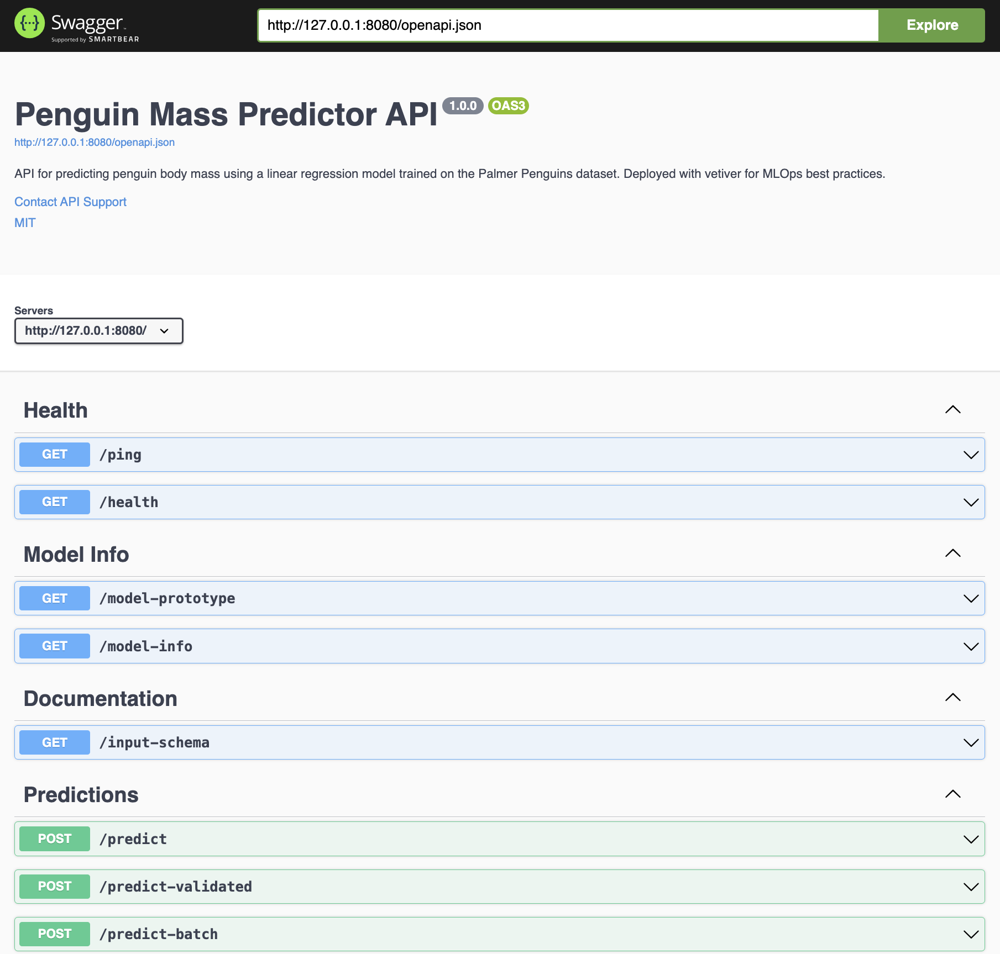

# <em>`plumber`</em> {.unnumbered}

```{r}
#| label: common
#| include: false
source("_common.R")
```

```{r}
#| label: co_box_rev
#| echo: false
#| results: asis
#| eval: true
co_box(
  color = "o",
  look = "default", 
  hsize = "1.25", 
  size = "1.00", 
  header = "Caution", 
  fold = FALSE,
  contents = "This section is being revised. Thank you for your patience."
)
```

This solution is a more robust example using the [`plumber`](https://www.rplumber.io/) package. I've summarized the changes to our original API (along with the inclusion of the [`logger` package](https://daroczig.github.io/logger/)) below. 

```{r}
#| eval: false
#| code-fold: false
install.packages('pak')
pak::pkg_install("rstudio/plumber")
```


## APIs (refresher)

We covered APIs in [lab 3](lab3.qmd). **APIs (Application Programming Interfaces)** are a little like placing an order in a restaurant:

```{=html}
<style>

.codeStyle span:not(.nodeLabel) {
  font-family: monospace;
  font-size: 1.5em;
  font-weight: bold;
  color: #d80808 !important;
  background-color: #ffffff;
  padding: 0.2em;
}
</style>
```

```{mermaid}
%%| fig-cap: 'Refresher on APIs'
%%| fig-width: 7.0
%%| fig-align: center
%%{init: {'theme': 'neutral', 'look': 'handDrawn', 'themeVariables': { 'fontFamily': 'monospace'}}}%%

sequenceDiagram
    participant Customer as Shiny App
    participant Waiter as API
    participant Kitchen as ML Model
    
    Customer->>Waiter: "I'd like a<br/>prediction for<br/>bill_length=45,<br/>species=Adelie"
    Waiter->>Kitchen: Prepare data &<br/>make prediction
    Kitchen->>Waiter: Prediction: 4180.8 grams
    Waiter->>Customer: Returns prediction
    
```

The process involves three steps:   

1. The **Shiny app** asks for predictions.   
2. The **Plumber API** takes the values selected in the UI (as requests), and returns predictions (as responses).     
3. It's the **ML Model** that does the *actual* work of calculating the predictions.  

## Overview

This architecture is comprised of three scripts:

1. `model.R` builds and stores the model used for the predictions.  
2. `plumber.R` builds and launches the `plumber` API.    
3. `mod-api.R` reads the stored model and launches a `vetiver` API.


We'll go over each file in detail in the sections below. 

### The model 

The `model.R` file contains the necessary packages and functions to build the linear model we're going to use to make the predictions from our Shiny app.[^model-location] 

[^model-location]: View this file in the [GitHub repo.](https://github.com/mjfrigaard/do4ds-labs/blob/main/_labs/lab3/R/api/model.R) 

```{r}
#| eval: false 
#| code-fold: show 
#| code-summary: 'show/hide model.R'

library(palmerpenguins) #<1>
library(duckdb)
library(DBI)
library(dplyr)
library(vetiver)
library(pins) #<1>

con <- DBI::dbConnect(duckdb::duckdb(), "my-db.duckdb") #<2>

duckdb::duckdb_register(con, "penguins_raw", palmerpenguins::penguins) #<3>

DBI::dbExecute( #<4>
  con,
  "CREATE OR REPLACE TABLE penguins AS SELECT * FROM penguins_raw"
) #<4>

df <- DBI::dbGetQuery( #<5>
  con,
  "SELECT bill_length_mm, species, sex, body_mass_g 
   FROM penguins 
   WHERE body_mass_g IS NOT NULL 
   AND bill_length_mm BETWEEN 30 AND 60
   AND sex IS NOT NULL
   AND species IS NOT NULL"
) #<5>

DBI::dbDisconnect(con) #<6>

model <- lm(body_mass_g ~ bill_length_mm + species + sex, data = df) #<7>

v <- vetiver::vetiver_model( #<8>
  model,
  model_name = "penguin_model",
  description = "Linear model predicting penguin body mass from bill length, species, and sex",
  save_prototype = TRUE  #<9>
) #<8>

model_board <- pins::board_folder("./models") #<10>
vetiver::vetiver_pin_write(model_board, v) #<10>

```
1. Load packages. 
2. Use `DBI` to connect to `duckdb`.  
3. Register the penguins data.frame directly with `duckdb`.     
4. Create persistent table.  
5. Query and filter penguins data
6. Disconnect from database   
7. Train the model. Unlike our previous example, we'll use the original categorical variables and let R handle the dummy variable creation automatically.  
8. Create `vetiver` model. 
9. Save the expected input format   
10. Write model to board

```{mermaid}
%%| fig-width: 7.0
%%| fig-align: center
%%{init: {'theme': 'neutral', 'look': 'handDrawn', 'themeVariables': { 'fontFamily': 'monospace'}}}%%

graph LR
    subgraph Training["<strong>Model Training</strong>"]
		ModelR(["<strong>model.R</strong>"])
        DuckDB[("DuckDB <br> (as <strong>my-db.duckdb</strong>)")]
        PinBoard("Pin Board<br/><strong>models/penguin_model/</strong>")
        
        ModelR -->|"<em>loads data from</em>"| DuckDB
        ModelR -->|"<em>trains lm() model</em>"| LM[/"Linear Model"/]
        LM -->|"<em>wrapped by</em>"| Vetiver[/"Vetiver Model"/]
        Vetiver -->|"<em>saved to</em>"| PinBoard
    end
    
  style ModelR fill:#d8e4ff
  style PinBoard fill:#31e981
  
```

Running `model.R` creates the `models/` directory and the `duckdb` database file:[^models-folder] 

[^models-folder]: If you run this on your machine your folder will look slightly different because of the timestamp and random ID. 

```{verbatim}
├── models #<1>
│   └── penguin_model #<3> 
│       └── 20251005T062750Z-74445 #<4>
│           ├── data.txt #<5>
│           └── penguin_model.rds #<6>
└── my-db.duckdb #<2>
```
1. `models/` directory for the model  
2. Local `duckdb` database   
3. The name of the model board (i.e., board subfolder)
4. Version timestamp + random ID    
5. The `data.txt` file contains metadata about the pin    
6. `penguin_model.rds` is the serialized vetiver model    


`models` includes a `model_name` from `vetiver_model()`, and we've add a `description` to accompany the metadata. `data.txt` stores metadata on the model: 

```{r}
#| eval: false 
#| code-fold: false
readLines("models/penguin_model/20251005T062750Z-74445/data.txt") |> 
  sprintf() |> noquote()
#  [1] file: penguin_model.rds                                                          
#  [2] file_size: 16401                                                                 
#  [3] pin_hash: 7444544ac5799626                                                       
#  [4] type: rds                                                                        
#  [5] title: 'penguin_model: a pinned list'                                            
#  [6] description: Linear model predicting penguin body mass from bill length, species,
#  [7]   and sex                                                                        
#  [8] tags: ~                                                                          
#  [9] urls: ~                                                                          
# [10] created: 20251005T062750Z                                                        
# [11] api_version: 1                                                                   
# [12] user:                                                                            
# [13]   required_pkgs: ~                                                               
# [14]   renv_lock: ~      
```

The model is stored in the `penguin_model.rds` file, and we can see it contains the `model` and `prototype`. 

```{r}
#| eval: false 
#| code-fold: false
v <- readRDS("models/penguin_model/20251005T062750Z-74445/penguin_model.rds")
str(v, max.level = 1)
# List of 2
#  $ model    :List of 13
#   ..- attr(*, "class")= chr [1:2] "butchered_lm" "lm"
#   ..- attr(*, "butcher_disabled")= chr [1:3] "print()" "summary()" "fitted()"
#  $ prototype:Classes ‘tbl_df’, ‘tbl’ and 'data.frame':	0 obs. of  3 variables:
```

#### `model`

This is our trained linear model.[^model-version]

[^model-version]: Read more about model versioning on the [`vetiver` site](https://vetiver.posit.co/get-started/version.html). 

```{r}
#| eval: false 
#| code-fold: false
v$model
# Call:
# dummy_call()
# 
# Coefficients:
#      (Intercept)    bill_length_mm  speciesChinstrap     speciesGentoo           sexmale  
#          2169.27             32.54           -298.77           1094.87            547.37 
```

If we dig a little deeper, we can see `lm()` object with coefficients, residuals, etc.

```{r}
#| eval: false 
#| code-fold: true 
#| code-summary: 'show/hide model structure'
str(v$model, max.level = 1, list.len = 12)
# List of 13
#  $ coefficients : Named num [1:5] 2169.3 32.5 -298.8 1094.9 547.4
#   ..- attr(*, "names")= chr [1:5] "(Intercept)" "bill_length_mm"  ...
#  $ residuals    : Named num [1:333] -238.8 345.5 -230.5 86.6 -345.3 ...
#   ..- attr(*, "names")= chr [1:333] "1" "2" "3" "4" ...
#  $ effects      : Named num [1:333] -76772 8648 -9251 -2929 -3901 ...
#   ..- attr(*, "names")= chr [1:333] "(Intercept)" "bill_length_mm" ...
#  $ rank         : int 5
#  $ fitted.values: num(0) 
#  $ assign       : int [1:5] 0 1 2 2 3
#  $ qr           :List of 5
#   ..- attr(*, "class")= chr "qr"
#  $ df.residual  : int 328
#  $ contrasts    :List of 2
#  $ xlevels      :List of 2
#  $ call         : language dummy_call()
#  $ terms        :Classes 'butchered_terms', 'terms', 'formula'  language body_mass_g ~ bill_length_mm + species + sex
#   .. ..- attr(*, "variables")= language list(body_mass_g, bill_length_mm, species, sex)
#   .. ..- attr(*, "factors")= int [1:4, 1:3] 0 1 0 0 0 0 1 0 0 0 ...
#   .. .. ..- attr(*, "dimnames")=List of 2
#   .. ..- attr(*, "term.labels")= chr [1:3] "bill_length_mm" "species" "sex"
#   .. ..- attr(*, "order")= int [1:3] 1 1 1
#   .. ..- attr(*, "intercept")= int 1
#   .. ..- attr(*, "response")= int 1
#   .. ..- attr(*, ".Environment")=<environment: base> 
#   .. ..- attr(*, "predvars")= language list(body_mass_g, bill_length_mm, species, sex)
#   .. ..- attr(*, "dataClasses")= Named chr [1:4] "numeric" "numeric" "factor" "factor"
#   .. .. ..- attr(*, "names")= chr [1:4] "body_mass_g" "bill_length_mm" "species" "sex"
#   [list output truncated]
#  - attr(*, "class")= chr [1:2] "butchered_lm" "lm"
#  - attr(*, "butcher_disabled")= chr [1:3] "print()" "summary()" "fitted()"
```


#### `prototype`

The `prototype` is the expected input format, including the required column names, the expected data types (numeric, factor), and the factor levels (`Adelie`, `Chinstrap`, `Gentoo` or `female`, `male`). 

```{r}
#| eval: false 
#| code-fold: false
str(v$prototype)
# Classes ‘tbl_df’, ‘tbl’ and 'data.frame':	0 obs. of  3 variables:
#  $ bill_length_mm: num 
#  $ species       : Factor w/ 3 levels "Adelie","Chinstrap",..: 
#  $ sex           : Factor w/ 2 levels "female","male": 
```


## The API

The code below is from the `plumber.R` file. I've removed some of the `print()` and `cat()` statements to focus on each step.[^pins-documentation]

[^pins-documentation]: Read ['Model cards for transparent, responsible reporting'](https://vetiver.posit.co/learn-more/model-card.html) for more information. 

### Load model

```{r}
#| eval: false 
#| code-fold: false
library(vetiver) #<1>
library(pins)
library(plumber)
library(jsonlite) #<1>

model_board <- pins::board_folder("models/") #<2>

v <- vetiver::vetiver_pin_read(model_board, "penguin_model") #<3>
```
1. Packages   
2. Connect to model board   
3. Read pinned vetiver model    


### Prepare prediction data 

When R builds a linear model using categorical variables, it will convert these values to factors. However, JSON doesn't have factors -- only strings. The `prep_pred_data()` function bridges the gap by converting `species` and `sex` to factors. 

```{r}
#| eval: false 
#| code-fold: false
prep_pred_data <- function(input_data) {
  
  species_levels <- levels(v$prototype$species)
  sex_levels <- levels(v$prototype$sex)
  
  data.frame(
    bill_length_mm = as.numeric(input_data$bill_length_mm),
    species = factor(input_data$species, levels = species_levels),
    sex = factor(input_data$sex, levels = sex_levels),
    stringsAsFactors = FALSE
  )
  
}
```

This function uses the prototype stored in the `vetiver` model to get the correct factor levels for species and sex.

```{mermaid}
%%| fig-width: 7.0
%%| fig-align: center
%%{init: {'theme': 'neutral', 'look': 'handDrawn', 'themeVariables': { 'fontFamily': 'monospace'}}}%%

graph TB
    subgraph JSON["JSON from Shiny"]
        J1[/"species: 'Adelie'<br/>(string)"/]
        J2[/"sex: 'male'<br/>(string)"/]
    end
    
    subgraph Model["Model Expects"]
        M1[\"species: factor<br/>(with levels)"\]
        M2[\"sex: factor<br/>(with levels)"\]
    end
    
    subgraph Helper["Helper Function"]
        H("prep_pred_data()")
    end
    
    J1 & J2 --> Helper
    Helper --> M1 & M2
    
    style J1 fill:#d8e4ff 
    style J2 fill:#d8e4ff

    style M1 fill:#31e981
    style M2 fill:#31e981
```

### Handler functions 

Each handler specializes in different types of requests. We're going to break these into four categories: health, model info, documentation, and predictions. 

#### Health

The first two plumber functions in our `plumber.R` file are for checking the health of the API.  

##### **`/ping`**

The first function is simple health check--it sends a `ping` to see if the API is running: 

```{r}
#| eval: false 
#| code-fold: show 
#| code-summary: 'show/hide handle_ping()'
#* Basic health check
#*
#* Simple endpoint to verify the API is running. Returns a minimal response
#* with status and timestamp.
#*
#* @get /ping
#* 
#* @serializer json
#* 
handle_ping <- function() {
  list(
    status = "alive", 
    timestamp = Sys.time()
  )
}
```

This can be used to ensure API is up. We can test this from the Terminal with `curl`:

```{verbatim}
curl http://127.0.0.1:8080/ping
```

```json
{
  "status": [
    "alive"
  ],
  "timestamp": [
    "2025-10-08 08:31:51"
  ]
}
```

##### **`/health`**

The `handle_health()` function will check the model version, R version, etc. 

```{r}
#| eval: false 
#| code-fold: show 
#| code-summary: 'show/hide handle_health()'
#* Detailed health check
#*
#* Extended health check that includes model metadata, version 
#* information, and R version. 
#*
#* @get /health
#* 
#* @serializer json
#* 
handle_health <- function() {
  list(
    status = "healthy",
    timestamp = Sys.time(),
    model_name = v$model_name,
    model_version = v$metadata$version,
    r_version = R.version.string
  )
}
```

This is useful for monitoring and debugging. Below is an example using `curl`.

```{verbatim}
curl http://127.0.0.1:8080/health
```

```json
{
  "status": [
    "healthy"
  ],
  "timestamp": [
    "2025-10-08 08:38:29"
  ],
  "model_name": [
    "penguin_model"
  ],
  "model_version": [
    "20251005T062750Z-74445"
  ],
  "r_version": [
    "R version 4.5.1 (2025-06-13)"
  ]
}
```

#### Model Info

The functions below return the information on what to send in API requests.  

##### **`/model-prototype`**

`handle_model_prototype()` will return the expected format for all requests. 

```{r}
#| eval: false 
#| code-fold: show 
#| code-summary: 'show/hide handle_model_prototype()'
#* Get model prototype information
#*
#* Returns the expected input format for the model, including
#* data types and factor levels.
#*
#* @get /model-prototype
#* 
#* @serializer json
#* 
handle_model_prototype <- function() {
  list(
    prototype = list(
      bill_length_mm = "numeric",
      species = list(
        type = "factor",
        levels = levels(v$prototype$species)
      ),
      sex = list(
        type = "factor", 
        levels = levels(v$prototype$sex)
      )
    ),
    model_class = class(v$model)
  )
}
```

This is useful for clients to understand what data to send. Below is an example of `handle_model_prototype()` using `curl`:

```{verbatim}
curl http://127.0.0.1:8080/model-prototype
```

We can see the response includes `prototype` and `model_class`:

<details open>
<summary>show/hide JSON response from model-prototype</summary>

```json
{
  "prototype": {
    "bill_length_mm": [
      "numeric"
    ],
    "species": {
      "type": [
        "factor"
      ],
      "levels": [
        "Adelie",
        "Chinstrap",
        "Gentoo"
      ]
    },
    "sex": {
      "type": [
        "factor"
      ],
      "levels": [
        "female",
        "male"
      ]
    }
  },
  "model_class": [
    "butchered_lm",
    "lm"
  ]
}
```

</details>

##### **`/model-info`**

We can get information about the model with `handle_model_info()`. This endpoint returns the metadata on our model. 

```{r}
#| eval: false 
#| code-fold: true 
#| code-summary: 'show/hide handle_model_info()'
#* Get model information and metadata
#*
#* Returns comprehensive information about the deployed model including
#* name, version, creation date, and required packages.
#*
#* @get /model-info
#* 
#* @serializer json
#* 
handle_model_info <- function() {
  list(
    model_name = v$model_name,
    model_class = class(v$model)[1],
    version = v$metadata$version,
    created = v$metadata$created,
    required_pkgs = v$metadata$required_pkgs,
    description = v$description %||% "No description available"
  )
}
```

Below is an example using `curl`: 

```{verbatim}
curl http://127.0.0.1:8080/model-info
```

We can see this returns the model name, class, version, and description. 

<details>
<summary>show/hide JSON response from model-info</summary>

```json
{
  "model_name": [
    "penguin_model"
  ],
  "model_class": [
    "butchered_lm"
  ],
  "version": [
    "20251005T062750Z-74445"
  ],
  "created": {},
  "required_pkgs": {},
  "description": [
    "Linear model predicting penguin body mass from bill length, species, and sex"
  ]
}
```

</details>

#### Documentation 

We will include specifications for the API endpoint and an example of a prediction. 

##### **`/input-schema`**

The `handle_input_schema()` function returns the model schema and example prediction values (properly formatted).  

```{r}
#| eval: false 
#| code-fold: show
#* Get input schema and example
#*
#* Returns documentation about the expected input fields, including
#* types, descriptions, valid values, and an example request.
#*
#* @get /input-schema
#* 
#* @serializer json
#* 
handle_input_schema <- function() {
  list(
    required_fields = list(
      bill_length_mm = list(
        type = "numeric",
        description = "Bill length in millimeters",
        range = c(30, 60)
      ),
      species = list(
        type = "string (converted to factor)",
        description = "Penguin species",
        valid_values = levels(v$prototype$species)
      ),
      sex = list(
        type = "string (converted to factor)",
        description = "Penguin sex",
        valid_values = levels(v$prototype$sex)
      )
    ),
    example = list(
      bill_length_mm = 45.5,
      species = "Gentoo",
      sex = "male"
    )
  )
}
```

When we use `curl`, we can see the response includes `required_fields` and the `example`:

```{verbatim}
curl http://127.0.0.1:8080/input-schema
```

<details>
<summary>show/hide JSON response from input-schema</summary>

```json
{
  "required_fields": {
    "bill_length_mm": {
      "type": [
        "numeric"
      ],
      "description": [
        "Bill length in millimeters"
      ],
      "range": [
        30,
        60
      ]
    },
    "species": {
      "type": [
        "string (converted to factor)"
      ],
      "description": [
        "Penguin species"
      ],
      "valid_values": [
        "Adelie",
        "Chinstrap",
        "Gentoo"
      ]
    },
    "sex": {
      "type": [
        "string (converted to factor)"
      ],
      "description": [
        "Penguin sex"
      ],
      "valid_values": [
        "female",
        "male"
      ]
    }
  },
  "example": {
    "bill_length_mm": [
      45.5
    ],
    "species": [
      "Gentoo"
    ],
    "sex": [
      "male"
    ]
  }
}
```

</details>

#### Predictions

The primary prediction endpoint is stored in the `handle_predict()`. I've also included functions performing predictions with input validation and more than one prediction at a time. 

##### **`/predict`**

The main prediction endpoint is stored in `handle_predict()`. I've removed the `cat()`, `print()`, and `str()` function calls to focus on each step.   

```{r}
#| eval: false 
#| code-fold: show 
#| code-summary: 'show/hide handle_predict()'
#* Predict penguin body mass
#*
#* Main prediction endpoint that accepts penguin characteristics and returns
#* predicted body mass in grams. Supports both single predictions and batch
#* predictions (multiple penguins in one request).
#*
#* @post /predict
#* 
#* @serializer json
#* 
handle_predict <- function(req, res) {
  
  result <- tryCatch({
    
    body <- jsonlite::fromJSON(req$postBody) #<1>
    
    if (is.list(body) && !is.data.frame(body)) { #<2>
      body <- as.data.frame(body)
    } #<2>
    
    pred_data <- prep_pred_data(body) #<3>
    
    prediction <- predict(v, pred_data) #<4>
    
    if (is.data.frame(prediction) && ".pred" %in% names(prediction)) { #<5>
      response <- list(.pred = prediction$.pred)
    } else if (is.numeric(prediction)) {
      response <- list(.pred = as.numeric(prediction))
    } else {
      response <- list(.pred = as.numeric(prediction))
    } #<5>
    
    return(response) #<6>
    
  }, error = function(e) { #<7>
    
    cat("Error message:", conditionMessage(e), "\n")
    print(e)
    res$status <- 500 
    
    return(
      list(
        error = conditionMessage(e),
        timestamp = as.character(Sys.time())
        )
      )
    
  }) #<7>
  
  return(result)
}
```
1. Parse JSON.   
2. Handle both single prediction and batch. 
3. Prep data (convert strings to factors).  
4. Make prediction.   
5. Handle different return types from vetiver. 
6. Return response.   
7. Error handling.    

The diagram below illustrates how data is transformed between requests and responses. 

```{mermaid}
%%| fig-width: 7.0
%%| fig-align: center
%%{init: {'theme': 'neutral', 'look': 'handDrawn', 'themeVariables': { 'fontFamily': 'monospace'}}}%%

graph TB
    JSON(["JSON String:<br/>'{'bill_length_mm':45,...}'"])
    
    JSON -->|"<em>fromJSON()</em>"| List("R List:<br/>list(bill_length_mm=45,...)")
    
    List -->|"<em>as.data.frame()</em>"| DF("Data Frame:<br/>1 row × 3 columns")
    
    DF -->|"<em>prep_pred_data()</em>"| Factors("Proper Types:<br/>numeric + factors")
    
    Factors -->|"<em>predict</em>"| Result("Number:<br/>4180.797")
    
    Result -->|"<em>list</em>"| Response(["JSON Response:<br/>{'.pred':[4180.797]}"])
    
    style JSON fill:#d8e4ff 
    style Response fill:#31e981
    
```

In the Terminal, we can send values for bill length, species, and sex using `curl`:

```{verbatim}
curl -X POST http://127.0.0.1:8080/predict \
  -H "Content-Type: application/json" \
  -d '{"bill_length_mm": 45, "species": "Adelie", "sex": "male"}'
```

This returns a simple JSON list with the prediction: 

```json
{
  ".pred": [
    4180.7965
  ]
}
```

In the R console, we see the output with all the `cat()`, `print()`, and `str()` function calls:

<details open>
  <summary>show/hide the R Console prediction summary</summary>

```{verbatim}
=== /predict called ===
Raw body: {"bill_length_mm": 45, "species": "Adelie", "sex": "male"} 
Parsed body:
$bill_length_mm
[1] 45

$species
[1] "Adelie"

$sex
[1] "male"

Prepared data:
  bill_length_mm species  sex
1             45  Adelie male
'data.frame':	1 obs. of  3 variables:
 $ bill_length_mm: num 45
 $ species       : Factor w/ 3 levels "Adelie","Chinstrap",..: 1
 $ sex           : Factor w/ 2 levels "female","male": 2
Calling predict...
Prediction result:
       1 
4180.797 
Prediction class: numeric 
Response:
$.pred
[1] 4180.797

=== /predict complete ===
```

</details>

##### **`/predict-validated`**

`handle_predict_validated()` performs the same action as `handle_predict()`, but all of the input values are validated before the prediction is performed.  

```{r}
#| eval: false 
#| code-fold: true 
#| code-summary: 'show/hide handle_predict_validated()'
#* Predict with input validation
#*
#* Enhanced prediction endpoint that validates all inputs before making
#* predictions. Returns detailed error messages if validation fails.
#* Checks for:
#* - Required fields present
#* - Valid species (Adelie, Chinstrap, or Gentoo)
#* - Valid sex (male or female)
#* - Bill length in valid range (30-60mm)
#*
#* @post /predict-validated
#* 
#* @serializer json
#* 
handle_predict_validated <- function(req, res) {
  
  result <- tryCatch({
    
    body <- jsonlite::fromJSON(req$postBody) #<1>
    
    required_fields <- c("bill_length_mm", "species", "sex")#<2>
    missing_fields <- setdiff(required_fields, names(body))#<2>
    
    if (length(missing_fields) > 0) { #<3>
      res$status <- 400
      return(list(
        error = "Missing required fields",
        missing = missing_fields,
        hint = "Required fields: bill_length_mm, species, sex"
      ))
    } #<3>
    
    valid_species <- levels(v$prototype$species) #<4>
    if (!body$species %in% valid_species) {
      res$status <- 400
      return(list(
        error = "Invalid species",
        provided = body$species,
        valid_options = valid_species
      ))
    } #<4>
    
    valid_sex <- levels(v$prototype$sex) #<5>
    if (!body$sex %in% valid_sex) {
      res$status <- 400
      return(list(
        error = "Invalid sex",
        provided = body$sex,
        valid_options = valid_sex
      ))
    } #<5>
    
    if (!is.numeric(body$bill_length_mm) || #<6>
        body$bill_length_mm < 30 || 
        body$bill_length_mm > 60) {
      res$status <- 400
      return(list(
        error = "bill_length_mm must be numeric between 30 and 60",
        provided = body$bill_length_mm,
        valid_range = c(30, 60)
      ))
    } #<6>
    
    pred_data <- prep_pred_data(body) #<7>
    
    prediction <- predict(v, pred_data) #<8>
    
    list( #<9>
      prediction = as.numeric(prediction),
      input = body,
      model_version = v$metadata$version,
      timestamp = Sys.time()
    ) #<9>
    
  }, error = function(e) { #<10>
    
    cat("Error:", conditionMessage(e), "\n")
    res$status <- 500
    return(
      list(
        error = conditionMessage(e),
        timestamp = as.character(Sys.time())
        )
      )
  }) #<10>
  
  return(result)
}
```
1. Collect response in JSON   
2. Validate required fields     
3. Check for missing fields  
4. Validate species   
5. Validate sex   
6. Validate bill length   
7. Prepare data   
8. Make prediction    
9. Prepare list  
10. Error handling  

```{mermaid}
%%| fig-width: 7.0
%%| fig-align: center
%%{init: {'theme': 'neutral', 'look': 'handDrawn', 'themeVariables': { 'fontFamily': 'monospace'}}}%%

graph TD
    Start(["Request<br>Received"])
    
    Start --> Check1{All fields<br/>present?}
    Check1 -->|No| Error1("❌ Return:<br/>Missing fields error")
    Check1 -->|Yes| Check2{Species<br/>valid?}
    
    Check2 -->|No| Error2("❌ Return:<br/>Invalid species error")
    Check2 -->|Yes| Check3{Sex<br/>valid?}
    
    Check3 -->|No| Error3("❌ Return:<br/>Invalid sex error")
    Check3 -->|Yes| Check4{Bill length<br/>30-60mm?}
    
    Check4 -->|No| Error4("❌ Return:<br/>Out of range error")
    Check4 -->|Yes| Predict("Make Prediction")
    
    Predict --> Success(["Return prediction<br/>with metadata"])
    
    style Start fill:#d8e4ff 
    
    style Error1 fill:#FFB6C1
    style Error2 fill:#FFB6C1
    style Error3 fill:#FFB6C1
    style Error4 fill:#FFB6C1
    
    style Success fill:#31e981
    
```

Below is an example of a valid request using the input validation: 

```{verbatim}
curl -X POST http://127.0.0.1:8080/predict-validated \
  -H "Content-Type: application/json" \
  -d '{"bill_length_mm": 45, "species": "Adelie", "sex": "male"}'
```

Below is the validated prediction response. 

```json
{
  "prediction": [
    4180.7965
  ],
  "input": {
    "bill_length_mm": [
      45
    ],
    "species": [
      "Adelie"
    ],
    "sex": [
      "male"
    ]
  },
  "model_version": [
    "20251005T062750Z-74445"
  ],
  "timestamp": [
    "2025-10-08 14:04:44"
  ]
}
```

If we send an invalid `species`, the API will return error:

```{verbatim}
curl -X POST http://127.0.0.1:8080/predict-validated \
   -H "Content-Type: application/json" \
   -d '{"bill_length_mm": 45, "species": "Emperor", "sex": "male"}'
```

We can see the error includes the `provided` incorrect value. 

```json
{
  "error": [
    "Invalid species"
  ],
  "provided": [
    "Emperor"
  ],
  "valid_options": [
    "Adelie",
    "Chinstrap",
    "Gentoo"
  ]
}
```

##### **`/predict-batch`**

`handle_predict_batch()` lets us send more than one request to the API and receive multiple predictions. This request is slightly different because they must be arrays of the same length. 

```{r}
#| eval: false 
#| code-fold: true 
#| code-summary: 'show/hide handle_predict_batch()'
#* Batch predictions
#*
#* Predict body mass for multiple penguins in a single request.
#* Send arrays of values for each field. 
#*
#* @post /predict-batch
#* 
#* @serializer json
#* 
handle_predict_batch <- function(req, res) {
  result <- tryCatch({
    
    body <- jsonlite::fromJSON(req$postBody) #<1>
    
    if (!is.data.frame(body)) { #<2>
      body <- as.data.frame(body)
    } #<2>
    
    pred_data <- prep_pred_data(body) #<3>
    
    predictions <- predict(v, pred_data) #<4>
    
    list( #<5>
      predictions = as.numeric(predictions),
      count = nrow(pred_data),
      timestamp = Sys.time()
    ) #<5>
    
  }, error = function(e) { #<6>
    res$status <- 500
    return(list(
      error = conditionMessage(e),
      timestamp = as.character(Sys.time())
    ))
  }) #<6>
  
  return(result) #<7>
}
```
1. Request body.  
2. Ensure we have a `data.frame`.   
3. Prepare data.     
4. Make predictions.       
5. Create list with predictions, number of predictions, and a timestamp.  
6. Error handling.  
7. Return prediction.  

Below are three predictions:  
1. `bill_length_mm` = `45`, `species` = `"Adelie"`, `sex` = `"male"`    
2. `bill_length_mm` = `39`, `species` = `"Adelie"`, `sex` = `"female"`      
3. `bill_length_mm` = `50`, `species` = `"Gentoo"`, `sex` = `"male"`         

```{verbatim}
curl -X POST http://127.0.0.1:8080/predict-batch \
   -H "Content-Type: application/json" \
   -d '{
     "bill_length_mm": [45, 39, 50],
     "species": ["Adelie", "Adelie", "Gentoo"],
     "sex": ["male", "female", "male"]
   }'
```

The response contains the predictions, along the number of predictions sent/returned and the timestamp. 

```json
{
  "predictions": [
    4180.7965,
    3438.2083,
    5438.3484
  ],
  "count": [
    3
  ],
  "timestamp": [
    "2025-10-08 13:45:41"
  ]
}
```

## The Router

The last bit of code in `plumber.R` builds a router object by registering HTTP endpoint handlers with a functional pipeline. The pipeline starts with `pr()`, which returns a plumber router object. 

The router object is passed to  [`pr_set_api_spec()`](https://www.rplumber.io/reference/pr_set_api_spec.html), which is used to create machine-readable API documentation following the [OpenAPI standard](https://swagger.io/specification/). 


```{r}
#| eval: false 
#| code-fold: show 
#| code-summary: 'show/hide plumber router'
app <- plumber::pr() |>
  # openapi specification
  pr_set_api_spec(function(spec) {
    spec$info$title <- "Penguin Mass Predictor API"
    spec$info$description <- "API for predicting penguin body mass using a linear regression model trained on the Palmer Penguins dataset. Deployed with vetiver for MLOps best practices."
    spec$info$version <- "1.0.0"
    spec$info$contact <- list(
      name = "API Support",
      email = "mjfrigaard@pm.me"
    )
    spec$info$license <- list(
      name = "MIT",
      url = "https://opensource.org/licenses/MIT"
    )
    spec
  }) 
```

```{mermaid}
%%| fig-width: 7.0
%%| fig-align: center
%%{init: {'theme': 'neutral', 'look': 'handDrawn', 'themeVariables': { 'fontFamily': 'monospace'}}}%%

graph LR
    
    Function(["<strong>pr_set_api_spec()</strong>"])
    
    Function --> Title("<code>title</code>:<br/><em>'Penguin Mass Predictor API'</em>")
    Function --> Desc("<code>description</code>:<br/><em>'API for predicting...'</em>")
    Function --> Version("<code>version</code>:<br/><em>'1.0.0'</em>")
    Function --> Contact("<code>contact</code>:<br/>name, email")
    Function --> License("<code>license</code>:<br/>MIT")
    
    Title & Desc & Version & Contact & License --> Swagger(["<strong>Generates Interactive Docs<br/>at /__docs__/</strong>"])
    
    style Function fill:#d8e4ff
    style Swagger fill:#31e981
    
```

Now that we have a router object with specifications, we can add the endpoints. 

### Endpoints

Each `pr_get()` or `pr_post()` call adds a route mapping (URL pattern + HTTP method → handler function) to the router's internal dispatch table. The pipe operator enables a fluent interface for sequential configuration.

The `GET` and `POST` endpoints are created with `pr_get()` and `pr_post()` and have the following arguments: 

1. `path`: is the endpoint path in the API.

2. `handler`: the handler function we wrote above. 

3. `serializer`: this function '*translating a generated R value into output that a remote user can understand.*"[^serializer]

4. `tags`: these are the labels/headers our endpoints are organized under in the API. 

[^serializer]: From the `plumber` documentation on [registered serializers](https://www.rplumber.io/reference/register_serializer.html). 

#### `GET` Endpoints

The `GET` endpoints are linked to their function couterparts via the `@get` and `@serializer` tags:

```{r}
#| eval: false 
#| code-fold: show 
#| code-summary: 'show/hide plumber GET endpoints'
  # GET endpoints 
  pr_get(
    path = "/ping",
    handler = handle_ping,
    serializer = plumber::serializer_json(),
    tags = "Health"
  ) |>
  pr_get(
    path = "/health",
    handler = handle_health,
    serializer = plumber::serializer_json(),
    tags = "Health"
  ) |>
  pr_get(
    path = "/model-prototype",
    handler = handle_model_prototype,
    serializer = plumber::serializer_json(),
    tags = "Model Info"
  ) |>
  pr_get(
    path = "/model-info",
    handler = handle_model_info,
    serializer = plumber::serializer_json(),
    tags = "Model Info"
  ) |>
  pr_get(
    path = "/input-schema",
    handler = handle_input_schema,
    serializer = plumber::serializer_json(),
    tags = "Documentation"
  )
```

**Route table after `GET` registrations:**

| Path | Method | Handler | Purpose |
|------|--------|---------|---------|
| `/ping` | GET | `handle_ping()` | Quick health check |
| `/health` | GET | `handle_health()` | Detailed status |
| `/model-prototype` | GET | `handle_model_prototype()` | Input format specification |
| `/model-info` | GET | `handle_model_info()` | Model metadata |
| `/input-schema` | GET | `handle_input_schema()` | Field documentation |


#### `POST` Endpoints

The `POST` endpoints are linked to their function couterparts via the `@post` and `@serializer` tags:

```{r}
#| eval: false 
#| code-fold: show 
#| code-summary: 'show/hide plumber POST endpoints'
  pr_post(
    path = "/predict",
    handler = handle_predict,
    serializer = plumber::serializer_json(),
    tags = "Predictions"
  ) |>
  pr_post(
    path = "/predict-validated",
    handler = handle_predict_validated,
    serializer = plumber::serializer_json(),
    tags = "Predictions"
  ) |>
  pr_post(
    path = "/predict-batch",
    handler = handle_predict_batch,
    serializer = plumber::serializer_json(),
    tags = "Predictions"
  )
```

**Updated route table:**

| Path | Method | Handler | Purpose |
|------|--------|---------|---------|
| `/predict` | POST | `handle_predict()` | Basic prediction |
| `/predict-validated` | POST | `handle_predict_validated()` | Prediction with validation |
| `/predict-batch` | POST | `handle_predict_batch()` | Multiple predictions |


## The Server

The code above only configures and builds the `plumber` router. It remains dormant until we activate it with `pr_run()`:

```{r}
#| eval: false 
#| code-fold: false 
app |> plumber::pr_run(port = 8080, host = "127.0.0.1")
```

{width='100%' fig-align='center'}

Now that the API is running, we can use a Shiny application to send values for penguin bill length, species, and sex and receive predictions. 

```{mermaid}
%%| fig-width: 7.0
%%| fig-align: center
%%{init: {'theme': 'neutral', 'look': 'handDrawn', 'themeVariables': { 'fontFamily': 'monospace'}}}%%

sequenceDiagram
    participant Shiny as Shiny App
    participant Handler as handle_predict()
    participant Helper as prep_pred_data()
    participant Model as Linear Model
    
    Shiny->>Handler: POST /predict<br/>{"bill_length_mm": 45,<br/>"species": "Adelie",<br/>"sex": "male"}
    
    Note over Handler: 1) Parse<br>JSON
    Handler->>Handler: jsonlite::fromJSON()
    
    Note over Handler: 2) Validate<br>& Convert
    Handler->>Helper: prep_pred_data()
    Helper-->>Handler: data.frame with factors
    
    Note over Handler: 3) Predict
    Handler->>Model: predict(v, data)
    Note over Model: y = β₀ + β₁×bill_length +<br>β₂×species + β₃×sex
    Model-->>Handler: 4180.797
    
    Note over Handler: 4) Format<br>response
    Handler->>Handler: list(.pred = 4180.797)
    
    Handler-->>Shiny: {"pred": [4180.797]}
```

We'll cover this more in [R App Logging](app-log-r.qmd).