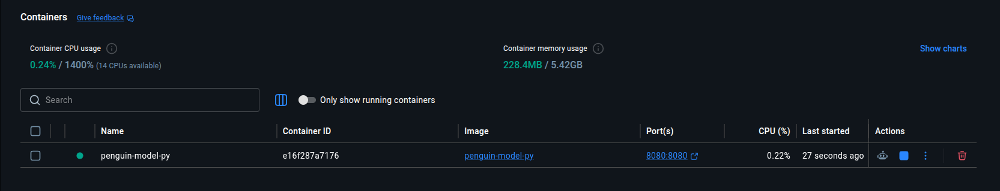

# <em>Python API in a container</em> {.unnumbered}

```{r}
#| label: common
#| include: false
source("_common.R")
```

```{r}
#| label: co_box_rev
#| echo: false
#| results: asis
#| eval: false
co_box(
  color = "o",
  look = "default", 
  hsize = "1.25", 
  size = "1.00", 
  header = "Caution", 
  fold = FALSE,
  contents = "This section is being revised. Thank you for your patience."
)
```


## Set up

Review the original lab 6 files [here](https://github.com/alexkgold/do4ds/tree/main/_labs/lab6). I've created both Python and R versions, and you can access and run the API from the [`Python/api/` folder](https://github.com/mjfrigaard/do4ds-labs/tree/main/_labs/lab06/Python/api).

First, check the Python version:

```{bash}
#| eval: false 
#| code-fold: false
which python3
```

```{verbatim}
/usr/bin/python3
```


```{bash}
#| eval: false 
#| code-fold: false
python3 --version
```

```{verbatim}
Python 3.12.3
```

Create virtual environment using `venv`:

```{bash}
#| eval: false 
#| code-fold: false
/usr/bin/python3 -m venv .venv 
```

```{bash}
#| eval: false 
#| code-fold: false
source .venv/bin/activate  
```

Install libraries in the `requirements.txt`:

```{bash}
#| eval: false 
#| code-fold: false
pip install -r requirements.txt
```

## Build model (optional)

We don't have to, but if we want to run `model.py`, we'll also need `palmerpenguins` and `duckdb`.

```{bash}
#| eval: false 
#| code-fold: false
pip install palmerpenguins
```


```{bash}
#| eval: false 
#| code-fold: false
pip install duckdb
```

Now we can run the `model.py` script:

```{bash}
#| eval: false 
#| code-fold: false
python3 model.py
```

This will create a new model in `models/` (if something changed).

```{bash}
#| eval: false 
#| code-fold: false
  species     island  bill_length_mm  bill_depth_mm  flipper_length_mm  body_mass_g     sex  year
0  Adelie  Torgersen            39.1           18.7              181.0       3750.0    male  2007
1  Adelie  Torgersen            39.5           17.4              186.0       3800.0  female  2007
2  Adelie  Torgersen            40.3           18.0              195.0       3250.0  female  2007
R^2 0.8555368759537614
Intercept 2169.2697209393996
prototype_data      bill_length_mm  species_Chinstrap  species_Gentoo  sex_male
0              39.1              False           False      True
1              39.5              False           False     False
2              40.3              False           False     False
4              36.7              False           False     False
5              39.3              False           False      True
..              ...                ...             ...       ...
339            55.8               True           False      True
340            43.5               True           False     False
341            49.6               True           False      True
342            50.8               True           False      True
343            50.2               True           False     False

[333 rows x 4 columns]
Columns Index(['bill_length_mm', 'species_Chinstrap', 'species_Gentoo', 'sex_male'], dtype='object')
Coefficients [  32.53688677 -298.76553447 1094.86739145  547.36692408]
Model Cards provide a framework for transparent, responsible reporting. 
 Use the vetiver `.qmd` Quarto template as a place to start, 
 with vetiver.model_card()
Writing pin:
Name: 'penguin_model'
Version: 20260618T104900Z-91fdd
```

## Run the API

We're going to make a small change to `mod-api.py` in this lab, and its because we need the  `os.environ['PINS_ALLOW_PICKLE_READ']` at the top (before any imports). 


```{python}
#| eval: false 
#| code-fold: false
# UPDATED mod-api.py

import os #<1>
os.environ['PINS_ALLOW_PICKLE_READ'] = '1' #<1>

import warnings #<2>
warnings.filterwarnings("ignore", message=".*urllib3 v2 only supports OpenSSL.*")

import vetiver
import pins
import uvicorn
import pandas as pd #<2>


model_path = os.environ.get("MODEL_PATH", "models/") #<3>
model_board = pins.board_folder(model_path) #<3>

sklearn_model = model_board.pin_read("penguin_model") #<4>
print(f":-] Successfully loaded model: {type(sklearn_model)}") #<4>

if hasattr(sklearn_model, 'feature_names_in_'): #<5>
    feature_names = sklearn_model.feature_names_in_
    print(f"Model expects features: {list(feature_names)}") #<5>
    
    def get_prototype_value(column_name): #<6>
        """Get appropriate default value for each column type"""
        if 'bill_length' in column_name:
            return 45.0  
        elif 'species_Gentoo' in column_name:
            return 1     
        elif 'sex_male' in column_name:
            return 1     
        else:
            return 0  #<6>
    
    prototype_data = pd.DataFrame({ #<7>
        name: [get_prototype_value(name)] for name in feature_names
    }) #<7>
    
else:
    
    print("Model doesn't have feature_names_in_, using estimated prototype") #<8>
    prototype_data = pd.DataFrame({
        "bill_length_mm": [45.0],
        "species_Chinstrap": [0],
        "species_Gentoo": [1], 
        "sex_male": [1]
    }) #<8>

print("Prototype data shape:", prototype_data.shape)
print("Prototype columns:", list(prototype_data.columns))
print("Sample data:")
print(prototype_data)

v = vetiver.VetiverModel( #<9>
    model=sklearn_model, 
    model_name="penguin_model",
    prototype_data=prototype_data
) #<9>
print(f":-] Created VetiverModel: {type(v)}")

vetiver_api = vetiver.VetiverAPI(v, check_prototype=True) #<10>
# can run with:
# vetiver_api.run(port = 8080)

# actual FastAPI application
app = vetiver_api.app  #<10>

print(f"FastAPI app type: {type(app)}") #<11>

if __name__ == "__main__":
    print(":-] Starting Penguin Model API...")
    print(":-] API Documentation: http://127.0.0.1:8080/docs")
    print(":-] Health Check: http://127.0.0.1:8080/ping")
    print(":-] Model Info: http://127.0.0.1:8080/metadata")
    uvicorn.run(app, host="0.0.0.0", port=8080) #<11>

```
1. Set environment variable **BEFORE** importing pins  
2. Install packages     
3. load model from `MODEL_PATH` environment variable (default: local `models/` for dev)    
4. Read pinned model      
5. Check model for the features it expects 
6. Define prototype value logic (realistic penguin bill length, default to Gentoo species, default to male, default for other dummy variables) 
7. Create prototype data directly   
8. Fallback when model doesn't have feature names   
9. Wrap as `VetiverModel`    
10. Create `VetiverAPI` and extract `FastAPI` app
11. Print API info

Finally, run the API using:

```{bash}
#| eval: false 
#| code-fold: false
python3 mod-api.py
```

View the API using the following URLS:

<http://127.0.0.1:8080/>

<http://127.0.0.1:8080/docs>

{width='100%'}

### Testing API (optional)

We can perform  some terminal testing, too (in a new terminal).

Test health check:

```{bash}
#| eval: false 
#| code-fold: false
curl http://127.0.0.1:8080/ping
```


Test prediction using the following:

```{bash}
#| eval: false 
#| code-fold: false
curl -X POST "http://localhost:8080/predict" \
  -H "Content-Type: application/json" \
  -d '[{"bill_length_mm": 45.0, "species_Chinstrap": 0, "species_Gentoo": 1, "sex_male": 1}]'
```

`vetiver` typically expects data as a list of observation records. The `[0]` index wraps a single prediction so it becomes one row in the `DataFrame`.


Make sure to quit (<kbd>Ctrl</kbd> + <kbd>c</kbd>) the API before building the Docker image and running the model in the container. 

## Docker

Start docker: 

```{bash}
#| eval: false 
#| code-fold: false
systemctl --user start docker-desktop
```

Create a `Dockerfile` and enter the following: 

```Dockerfile

FROM python:3.11-slim #<1>

WORKDIR /app #<2>

COPY requirements-api.txt . #<3>
RUN pip install --no-cache-dir -r requirements-api.txt #<4>

COPY mod-api.py . #<5>

ENV MODEL_PATH=/data/model #<6>
ENV PINS_ALLOW_PICKLE_READ=1 #<7>

EXPOSE 8080 #<8>

CMD ["python3", "mod-api.py"] #<9>
```
1. official Python 3.11 slim image as the base   
2. working directory inside the container to /app  
3. copies the API requirements file from the host into the container  
4. installs Python dependencies
5. copies the `FastAPI` application script into the container  
6. sets an environment variable pointing to where the model will be mounted  
7. enables Vetiver to read pickle model files  
8. exposes port 8080 so the API can be accessed externally  
9. runs the FastAPI application when the container starts  


The `python:3.11-slim` minimizes container size. The `--no-cache-dir -r` will perform a `pip` install without caching to reduce image size. The `ENV` lines are environment variables (path to data and pickle files), and `EXPOSE` will allow us to use a port (similar to `mod-api.py`).

### Build the image

Build the image (run from `Python/api/`):

```{bash}
#| eval: false 
#| code-fold: false
docker build -t penguin-model-py .
```

In the Terminal, you should see something like: 

{width='100%'}

When the image is built, we can see it under **Builds** in Docker Desktop: 

{width='100%'}

### Run the container 

Run the container, mounting the model directory from the host:

```{bash}
#| eval: false 
#| code-fold: false
docker run --rm -d \
  -p 8080:8080 \
  --name penguin-model-py \
  -v "$(pwd)/models":/data/model \
  penguin-model-py
```


The `-v` flag mounts the local `models/` folder into the container at `/data/model`, which is where `MODEL_PATH` points by default. This keeps the model outside the image so it can be updated without a rebuild.

In Docker Desktop, click on the **Containers** tab and you'll see the container running:

{width='100%'}


Test the running container:

```{bash}
#| eval: false 
#| code-fold: false
curl http://localhost:8080/ping
```

The response should be: 

```{verbatim}
{"ping":"pong"}
```

To stop the container, run the following: 

```{bash}
#| eval: false 
#| code-fold: false
docker stop penguin-model-py
```

Since we used `--rm` in the `run` command, the container will be automatically removed when it stops.

If the graceful stop doesn't work, you can force kill it:

```{bash}
#| eval: false 
#| code-fold: false
docker kill penguin-model-py
```

## Final project files 


```{bash}
#| eval: false 
#| code-fold: false
├── api.Rproj
├── Dockerfile #<1> 
├── mod-api.py #<2>
├── model.py #<3>
├── models/ #<4>
├── my-db.duckdb #<5>
├── README.md #<6>
├── requirements-api.txt #<7>
└── requirements.txt #<8>

5 directories, 12 files
```
1. Container definition to build and run the API in Docker.
2. `FastAPI` application that loads the ML model and exposes `REST` endpoints (`ping`, `metadata`, `predict`).
3. Script that trains a linear regression model on Palmer penguin data and saves it using `Vetiver` pins.  
4. Directory containing timestamped model versions with `.joblib` model files and `data.txt` metadata.  
5. DuckDB database file storing the Palmer penguins dataset.  
6. Setup and usage instructions for running the API locally and in Docker.
7. Python dependencies for the `FastAPI` application.  
8. Python dependencies for both model training and the API.  

In the next lab, we'll run the R api in a Docker container. 

