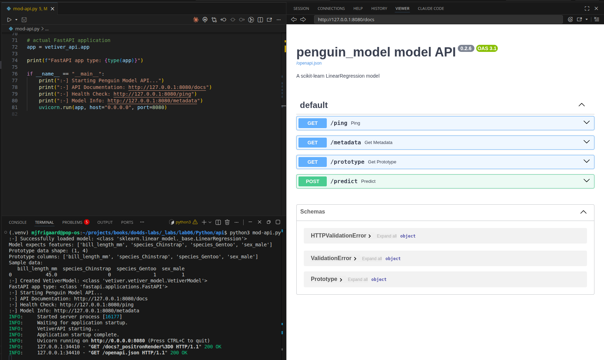
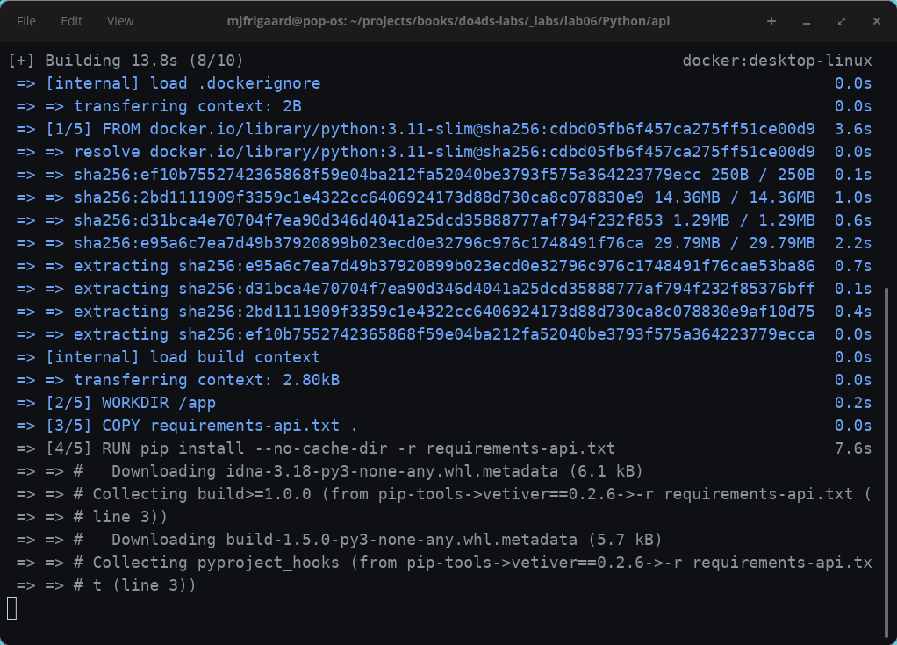
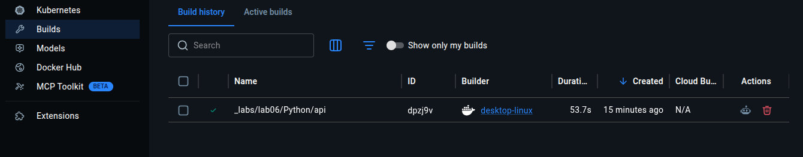
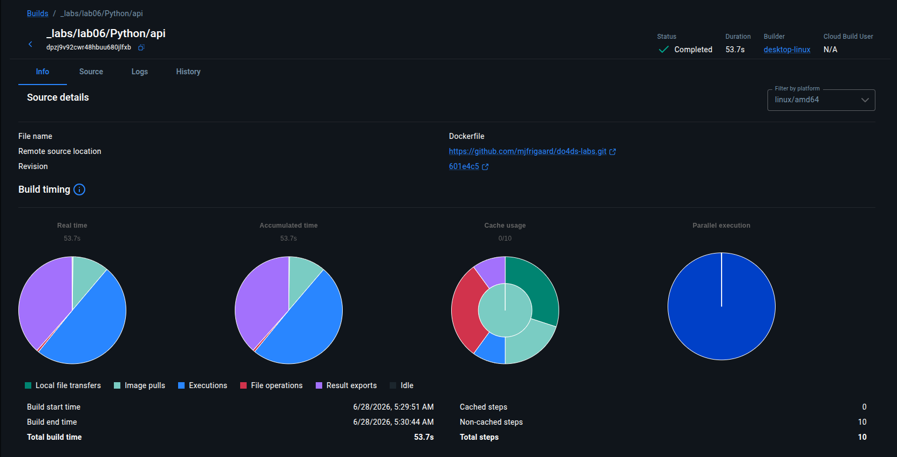

# <em>Python API in a container</em> {.unnumbered}

```{r}
#| label: common
#| include: false
source("_common.R")
```

```{r}
#| label: co_box_rev
#| echo: false
#| results: asis
#| eval: false
co_box(
  color = "o",
  look = "default", 
  hsize = "1.25", 
  size = "1.00", 
  header = "Caution", 
  fold = FALSE,
  contents = "This section is being revised. Thank you for your patience."
)
```


## Set up

Review the original lab 6 files [here](https://github.com/alexkgold/do4ds/tree/main/_labs/lab6). I've created both Python and R versions, and you can access and run the API from the [`Python/api/` folder.](https://github.com/mjfrigaard/do4ds-labs/tree/main/_labs/lab06/Python/api)

First, check the Python version:

```{bash}
#| eval: false 
#| code-fold: false
which python3
```

```{verbatim}
/usr/bin/python3
```


```{bash}
#| eval: false 
#| code-fold: false
python3 --version
```

```{verbatim}
Python 3.12.3
```

Create virtual environment using `venv`:

```{bash}
#| eval: false 
#| code-fold: false
/usr/bin/python3 -m venv .venv 
```

```{bash}
#| eval: false 
#| code-fold: false
source .venv/bin/activate  
```

Install libraries in the `requirements.txt`:

```{bash}
#| eval: false 
#| code-fold: false
pip install -r requirements.txt
```

## Build model (optional)

We don't have to, but if we want to run `model.py`, we'll also need `palmerpenguins` and `duckdb`.

```{bash}
#| eval: false 
#| code-fold: false
pip install palmerpenguins
```


```{bash}
#| eval: false 
#| code-fold: false
pip install duckdb
```

Now we can run the `model.py` script:

```{bash}
#| eval: false 
#| code-fold: false
python3 model.py
```

This will create a new model in `models/` (if something changed).

```{bash}
#| eval: false 
#| code-fold: false
  species     island  bill_length_mm  bill_depth_mm  flipper_length_mm  body_mass_g     sex  year
0  Adelie  Torgersen            39.1           18.7              181.0       3750.0    male  2007
1  Adelie  Torgersen            39.5           17.4              186.0       3800.0  female  2007
2  Adelie  Torgersen            40.3           18.0              195.0       3250.0  female  2007
R^2 0.8555368759537614
Intercept 2169.2697209393996
prototype_data      bill_length_mm  species_Chinstrap  species_Gentoo  sex_male
0              39.1              False           False      True
1              39.5              False           False     False
2              40.3              False           False     False
4              36.7              False           False     False
5              39.3              False           False      True
..              ...                ...             ...       ...
339            55.8               True           False      True
340            43.5               True           False     False
341            49.6               True           False      True
342            50.8               True           False      True
343            50.2               True           False     False

[333 rows x 4 columns]
Columns Index(['bill_length_mm', 'species_Chinstrap', 'species_Gentoo', 'sex_male'], dtype='object')
Coefficients [  32.53688677 -298.76553447 1094.86739145  547.36692408]
Model Cards provide a framework for transparent, responsible reporting. 
 Use the vetiver `.qmd` Quarto template as a place to start, 
 with vetiver.model_card()
Writing pin:
Name: 'penguin_model'
Version: 20260618T104900Z-91fdd
```

Finally, run the API using:

```{bash}
#| eval: false 
#| code-fold: false
python3 mod-api.py
```

View the API using the following URLS:

<http://127.0.0.1:8080/>

<http://127.0.0.1:8080/docs>

{width='100%'}

## Testing API


We can perform  some terminal testing, too (in a new terminal).

Test health check:

```{bash}
#| eval: false 
#| code-fold: false
curl http://127.0.0.1:8080/ping
```


Test prediction using the following:

```{bash}
#| eval: false 
#| code-fold: false
curl -X POST "http://localhost:8080/predict" \
  -H "Content-Type: application/json" \
  -d '[{"bill_length_mm": 45.0, "species_Chinstrap": 0, "species_Gentoo": 1, "sex_male": 1}]'
```

`vetiver` typically expects data as a list of observation records. The `[0]` index wraps a single prediction so it becomes one row in the `DataFrame`.


Make sure to quit (<kbd>Ctrl</kbd> + <kbd>c</kbd>) the API before building the Docker image and running the model in the container. 

## Docker

Build the image (run from `Python/api/`):

```{bash}
#| eval: false 
#| code-fold: false
docker build -t penguin-model-py .
```

In the Terminal, you should see something like: 

{width='100%'}

Run the container, mounting the model directory from the host:

```{bash}
#| eval: false 
#| code-fold: false
docker run --rm -d \
  -p 8080:8080 \
  --name penguin-model-py \
  -v "$(pwd)/models":/data/model \
  penguin-model-py
```


The `-v` flag mounts the local `models/` folder into the container at `/data/model`, which is where `MODEL_PATH` points by default. This keeps the model outside the image so it can be updated without a rebuild.

In the Desktop, you'll see the following:

{width='100%'}

You can view the details of the build by clicking on it: 

{width='100%'}

Test the running container:

```{bash}
#| eval: false 
#| code-fold: false
curl http://localhost:8080/ping
```

The response should be: 

```{verbatim}
{"ping":"pong"}
```

To stop the container, run the following: 

```{bash}
#| eval: false 
#| code-fold: false
docker stop penguin-model-py
```

Since we used `--rm` in the `run` command, the container will be automatically removed when it stops.

If the graceful stop doesn't work, you can force kill it:

```{bash}
#| eval: false 
#| code-fold: false
docker kill penguin-model-py
```

In the next lab, we'll run the R api in a Docker container. 

