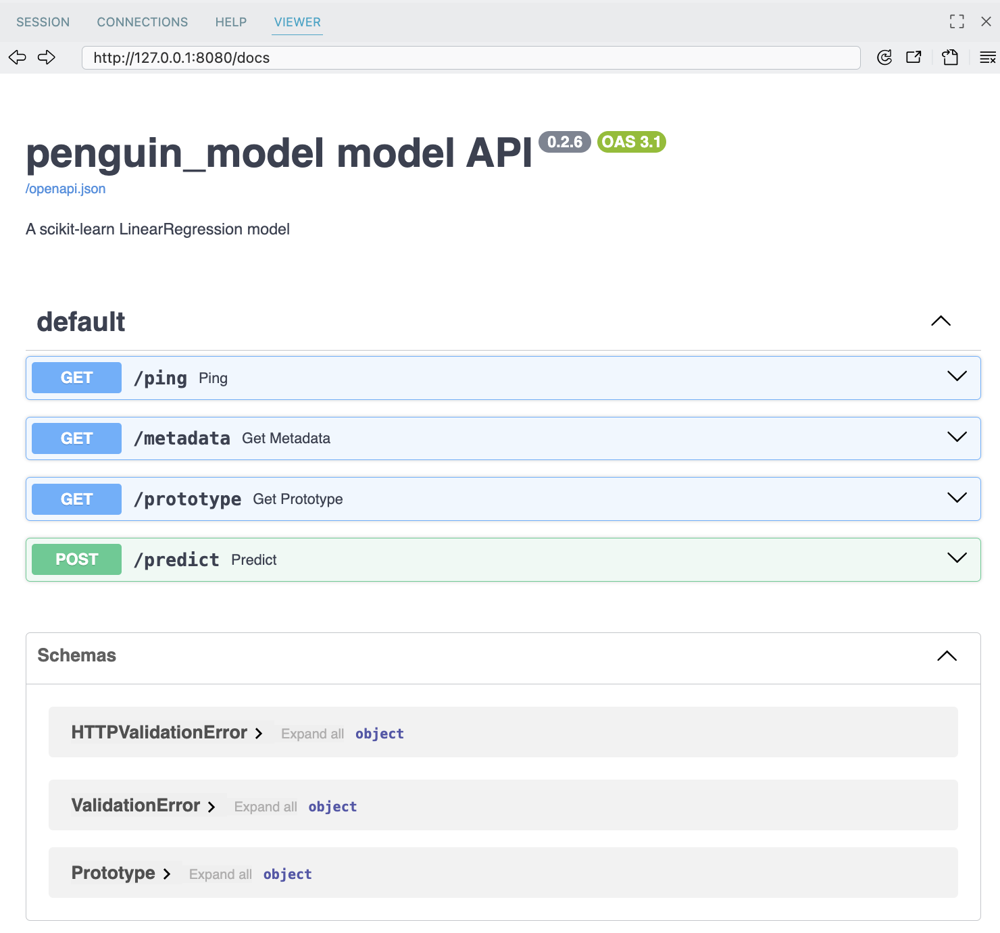

# <em>Python App API</em> {.unnumbered}

```{r}
#| label: common
#| include: false
source("_common.R")
```

```{r}
#| label: co_box_rev
#| echo: false
#| results: asis
#| eval: true
co_box(
  color = "o",
  look = "default", 
  hsize = "1.25", 
  size = "1.00", 
  header = "Caution", 
  fold = FALSE,
  contents = "This section is being revised. Thank you for your patience."
)
```

In [lab 2](lab2.qmd), we created a Python model with `scikit-learn`, converted it into a `VetiverModel`, saved it in a `pins` board folder, then created a `VetiverAPI`:

## Initial launch

In this lab, I'll be using Positron to develop the Shiny for Python app and API. I'm still new to programming in Python, so it took a bit longer to get the Vetiver model and Shiny app working. Below are some quick tips so you don't make the same mistakes I made: 

1. Set up the API and app in different folders  
2. Create and activate a Python virtual environment (`venv`) in each project    
3. Create prototype data for API 

```{mermaid}
%%| fig-cap: 'Our Python model pipeline'
%%| fig-align: center
%%{init: {'theme': 'neutral', 'look': 'handDrawn', 'themeVariables': { 'fontFamily': 'monospace', "fontSize":"16px"}}}%%
graph TB
    subgraph T1["<strong>Term 1: API Server</strong>"]
        RunApi["Run mod-api.py"] --> VetMod["Vetiver Model"]
        VetMod --> FastAPI["FastAPI on :8080"]
    end
    
    subgraph T2["<strong>Term 2: API Testing</strong>"]
        Curl["curl command"] --> ManPostReq["Manual POST request"]
        ManPostReq --> FastAPI
        FastAPI --> JSONReq["JSON Response Test"]
        JSONReq --> VerAPI["Verify API Works"]
    end
    
    subgraph T3["<strong>Term 3: Shiny App</strong>"]
        RunApp["Run app-api.py"] --> UI["User Interface"]
        UI --> HttpPostReq["HTTP POST Request"]
        HttpPostReq --> FastAPI
        FastAPI --> JSONResp["JSON Response"]
        JSONResp --> DispPred["Display Prediction"]
    end
    
    subgraph Browse["<strong>Browser Tests</strong>"]
        Http["Got to <code>http://</code>"] --> Docs["API Docs<br><code>127.0.0.1:8080/docs/<code>"]
        Http --> Health["Health Check:<br><code>127.0.0.1:8080/ping</code>"]
        Http --> Info["Model Info:<br><code>127.0.0.1:8080/metadata</code>"]
        Docs & Health & Info --> FastAPI
    end
    
    style Http fill:#FFF,color:#000,rx:20,ry:20,font-size:18px
    style RunApi fill:#FFF,color:#000,rx:20,ry:20,font-size:18px
    
    style FastAPI fill:#e8f5e8
    style HttpPostReq fill:#e1f5fe
    style ManPostReq fill:#fff3e0
    style DispPred fill:#f3e5f5
    style VerAPI fill:#ffebee
```

## API

The `mod-api.py` code below creates our Vetiver API in a dedicated Positron/Terminal session. 

First we'll load the necessary libraries:

```{python}
#| eval: false 
#| code-fold: false
# pkgs
import warnings
warnings.filterwarnings("ignore", message=".*urllib3 v2 only supports OpenSSL.*")

import os
os.environ['PINS_ALLOW_PICKLE_READ'] = '1'

import vetiver
import pins
import uvicorn
import pandas as pd
```

Note that I've added `warnings`, `os`, `uvicorn` and `pandas` along with the core libraries for ML serving, and model storage.

`warnings.filterwarnings()` silences the SSL compatibility warnings between LibreSSL (macOS) and `urllib3` (this is probably specific to my machine).


The `os.environ['PINS_ALLOW_PICKLE_READ'] = '1'` sets environment variable to allow reading `pickle`/`joblib` files (security override).


```{python}
#| eval: false 
#| code-fold: false
model_board = pins.board_folder("../../../lab2/model-vetiver/models/") #<1>

sklearn_model = model_board.pin_read("penguin_model") #<2>
print(f":-] Successfully loaded model: {type(sklearn_model)}") #<3>
```
1. connect to model board from lab2 
2. read pinned model    
3. print model type for confirmation 

[`pins.board_folder()`](https://rstudio.github.io/pins-python/reference/board_folder.html#pins.board_folder) creates a connection to the file-based model registry from lab 2. It will locate the specific model version (timestamp-based folder). 

[`model_board.pin_read()`](https://rstudio.github.io/pins-python/reference/pin_read.html#pins.boards.BaseBoard.pin_read) deserializes the `joblib` file back into a live Python object and returns the raw `scikit-learn` model (NOT a vetiver object yet).

```{python}
#| eval: false 
#| code-fold: false

if hasattr(sklearn_model, 'feature_names_in_'): #<1>
    feature_names = sklearn_model.feature_names_in_
    print(f"Model expects features: {list(feature_names)}")  #<1>
    
    prototype_data = pd.DataFrame({name: [0.0] for name in feature_names}) #<2>
    
    for col in prototype_data.columns: #<3>
        if 'bill_length' in col:
            prototype_data[col] = [45.0]
        elif 'species_Gentoo' in col:
            prototype_data[col] = [1]  
        elif 'sex_male' in col:
            prototype_data[col] = [1]  
            
else:
    print("Model doesn't have feature_names_in_, using estimated prototype")
    
    prototype_data = pd.DataFrame({ #<4>
        "bill_length_mm": [45.0],
        "species_Chinstrap": [0],
        "species_Gentoo": [1], 
        "sex_male": [1]
    }) #<4>
    #<3>
    
print("Prototype data shape:", prototype_data.shape)
print("Prototype columns:", list(prototype_data.columns))
print("Sample data:")
print(prototype_data)
```
1. check what features model expects    
2. create prototype data using model's expected features    
3. set reasonable defaults (based on penguin data)    
4. original R model structure   

**What's happening:**

- **Schema Discovery**: `sklearn` models trained with pandas DataFrames retain column names   
- **Prototype Generation**: Creates a sample input that matches the model's expected format   
- **Default Values**: Sets realistic values (45mm bill length, Gentoo penguin, male)    
- **Purpose**: This prototype will be used for API input validation and documentation   

```{python}
#| eval: false 
#| code-fold: false
# wrap as VetiverModel
v = vetiver.VetiverModel(
    model=sklearn_model, 
    model_name="penguin_model",
    prototype_data=prototype_data
)
print(f":-] Created VetiverModel: {type(v)}")
```

**What's happening:**

- **Wraps** the raw model with MLOps metadata 
- **Adds** input validation schema based on prototype   
- **Enables** automatic API generation      
- **Provides** standardized prediction interface        


```{python}
#| eval: false 
#| code-fold: false
# create VetiverAPI and extract FastAPI app
vetiver_api = vetiver.VetiverAPI(v, check_prototype=True)
# actual FastAPI application
app = vetiver_api.app  # should be the FastAPI instance
print(f"FastAPI app type: {type(app)}")
```

**What's happening:**

- **VetiverAPI**: Automatically generates REST API endpoints around the model     
- **Route Generation**: Creates standard ML serving endpoints     
- **Input Validation**: `check_prototype=True` ensures requests match training data format    
- **FastAPI Extraction**: Retrieves the actual web application object for serving     

```{python}
#| eval: false 
#| code-fold: false
if __name__ == "__main__":
    print(":-] Starting Penguin Model API...")
    print(":-] API Documentation: http://127.0.0.1:8080/docs")
    print(":-] Health Check: http://127.0.0.1:8080/ping")
    print(":-] Model Info: http://127.0.0.1:8080/metadata")
    uvicorn.run(app, host="127.0.0.1", port=8080)
```


```{mermaid}
%%| fig-cap: 'mod-api.py'
%%| fig-align: center
%%{init: {'theme': 'neutral', 'look': 'handDrawn', 'themeVariables': { 'fontFamily': 'monospace', "fontSize":"16px"}}}%%
graph TB
    Mod["<code>VetiverModel</code>"] --> VApiCon["<code>VetiverAPI</code><br>Constructor"]
    VApiCon --"generates"--> FastAPI["<code>FastAPI</code><br>Routes"]
    
    FastAPI --> Post("POST /predict")
    FastAPI --> GetPing("GET /ping") 
    FastAPI --> GetMeta("GET /metadata")
    FastAPI --> GetDocs("GET /docs")
    
    CheckProt["<code>check_prototype=True</code>"] --> Input["Enable Input<br>Validation"]
    
    VApiCon --"creates"--> VApiObj["<code>VetiverAPI</code><br>object"]
    VApiObj --"with"--> AppAttr["<code>.app</code> attribute"]
    AppAttr --"contains"--> FastAPIApp["<code>FastAPI</code> application"]
    
    style VApiCon fill:#e8f5e8,stroke:#000,color:#000,stroke-width:1px,rx:10,ry:10,font-size:16px
    style FastAPIApp fill:#c8e6c9,stroke:#000,color:#000,stroke-width:1px,rx:10,ry:10,font-size:16px
```

### Start the API

{fig-align='center' width='100%'}

## App 

### Reactive values 

### Predictions

## Verify

### Back in the API 

