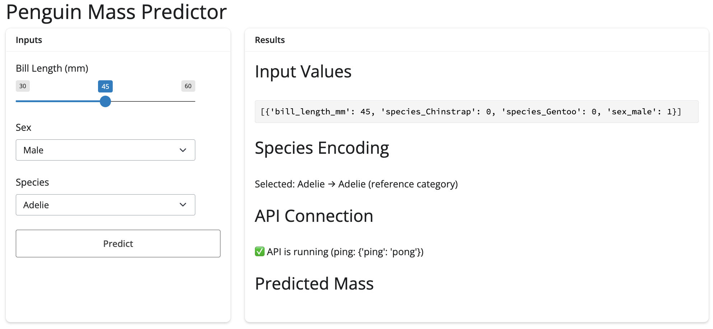
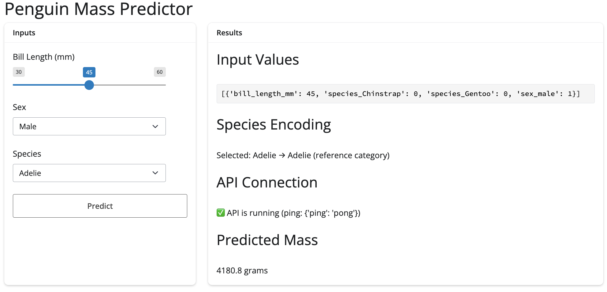

# <em>Python App & API</em> {.unnumbered}

```{r}
#| label: common
#| include: false
source("_common.R")
```

```{r}
#| label: co_box_rev
#| echo: false
#| results: asis
#| eval: true
co_box(
  color = "o",
  look = "default", 
  hsize = "1.25", 
  size = "1.00", 
  header = "Caution", 
  fold = FALSE,
  contents = "This section is being revised. Thank you for your patience."
)
```

In [lab 2](lab2.qmd), we created a Python model with `scikit-learn`, converted it into a `VetiverModel`, saved it in a `pins` board folder, then created a `VetiverAPI`:

## Set up

In this lab, I'll be using Positron to develop the Vetiver API amd Shiny for Python app. I'm still new to programming in Python, so it took a bit longer to get the Vetiver API and Shiny app working together.

Below are a few pointers to help you avoid making some of the mistakes I made:

1.  Set up the API and app in different folders\
2.  Create and activate Python virtual environments (`venv`) in each project\
3.  Create prototype data for API\
4.  Run the API (`mod-api.py`) and confirm API is working\
5.  Launch app and confirm API requests

## API

[`Python/api/mod-api.py`](https://github.com/mjfrigaard/do4ds-labs/blob/main/_labs/lab3/Python/api/mod-api.py) will run the `Vetiver`/`FastAPI` in a dedicated Positron/Terminal session. This version deviates quite a bit from the original Quarto document, but it's essentially creating the same thing.

```{mermaid}
%%| fig-cap: 'Vetiver API creation'
%%| fig-align: center
%%{init: {'theme': 'neutral', 'look': 'handDrawn', 'themeVariables': { 'fontFamily': 'monospace'}}}%%

graph TD
    subgraph T1["<strong>API Server</strong>"]
        RunApi(["Run<br>mod-api.py"]) --"create"--> VetMod["<strong>VetiverModel</strong>"]
        VetMod --"convert to"--> VetAPI["<strong>VetiverAPI</strong>"]
        VetAPI --"extract"--> FastAPI(["<strong>FastAPI</strong>"])
    end
    
    style RunApi fill:#d8e4ff,color:#000,stroke:#000,stroke-width:1px,rx:20,ry:20,font-size:16px 
    
   subgraph Browse["<strong>Browser</strong>"]
        Http(["`Got to <strong>http://</strong><strong>127.0.0.1:8080/</strong>`"]) --"<strong>/docs</strong>"--> Docs(["API Docs"])
        Http --"<strong>/ping</strong>"--> Health(["Health Check"])
        Http --"<strong>/metadata</strong>"--> Info(["Model Info"])
        Docs & Health & Info --> FastAPI
    end

    style Http fill:#d8e4ff,color:#000,stroke:#000,stroke-width:1px,rx:20,ry:20,font-size:16px 
    
    style FastAPI fill:#31e981,stroke:#000,stroke-width:1px,rx:20,ry:20,font-size:16px 
    style Docs fill:#31e981,stroke:#000,stroke-width:1px,rx:20,ry:20,font-size:16px 
    style Health fill:#31e981,stroke:#000,stroke-width:1px,rx:20,ry:20,font-size:16px 
    style Info fill:#31e981,stroke:#000,stroke-width:1px,rx:20,ry:20,font-size:16px 


```

### Libraries, warnings, and environment variables

First, we'll import `warnings` use `warnings.filterwarnings()` to silence the SSL compatibility warnings between LibreSSL (macOS) and `urllib3` (this is probably specific to my machine).

Then we'll include `os.environ['PINS_ALLOW_PICKLE_READ'] = '1'` to set an environment variable that allows reading `pickle`/`joblib` files (this is like a 'security override').

```{r}
#| label: co_box_pickle
#| echo: false
#| results: asis
#| eval: true
co_box(
  color = "g",
  look = "default", 
  hsize = "1.25", 
  size = "1.10", 
  header = "What is this `pickle` all about?", 
  fold = TRUE,
  contents = "
<br>
  
***In the previous lab we set the `allow_pickle_read` to `True` when we created the `board_folder`, and now we're specifying an environment variable (`['PINS_ALLOW_PICKLE_READ'] = '1'`).***

***Why?***

[Pickle](https://docs.python.org/3/library/pickle.html) is Python's way of saving complex objects to files (it can save almost ANY Python object - functions, classes, even entire programs). But this also means `pickle` can save malicious code. 

Because of this, the Python `pins` package blocks `pickle` files. However, the R `vetiver` package saves files in the `pickle`/`joblib` format (for cross-language compatibility). 

We can use the code below because we know the file came from our previous lab (i.e., a trusted source).

\`\`\`python
# our model in lab 2
model_board = board_folder('./my_models', allow_pickle_read=True)

# reading from a known (trusted) source in lab 3
os.environ['PINS_ALLOW_PICKLE_READ'] = '1'  # For development
\`\`\`


  ")
```

Third, we'll also add `uvicorn` and `pandas` to the core libraries for ML serving, and model storage.

```{python}
#| eval: false 
#| code-fold: false
# pkgs
import warnings
warnings.filterwarnings("ignore", message=".*urllib3 v2 only supports OpenSSL.*")

import os
os.environ['PINS_ALLOW_PICKLE_READ'] = '1'

import vetiver
import pins
import uvicorn
import pandas as pd
```

### Read 'pinned' model

[`pins.board_folder()`](https://rstudio.github.io/pins-python/reference/board_folder.html#pins.board_folder) creates a connection to the file-based model registry from lab 2. It will locate the specific model version (using the timestamp-based folders).

[`model_board.pin_read()`](https://rstudio.github.io/pins-python/reference/pin_read.html#pins.boards.BaseBoard.pin_read) deserializes the `joblib` file back into a live Python object and returns the raw `scikit-learn` model (NOT a vetiver object yet).

```{python}
#| eval: false 
#| code-fold: false
model_board = pins.board_folder("../../../lab2/model-vetiver/models/") #<1>

sklearn_model = model_board.pin_read("penguin_model") #<2>

print(f":-] Successfully loaded model: {type(sklearn_model)}") #<3>
```

1.  connect to model board from lab2
2.  read pinned model\
3.  print model type for confirmation

`print()` gives us a message (or some debugging info) after the model is read from the `pins` board:

```{verbatim}
:-] Successfully loaded model: <class 'sklearn.linear_model._base.LinearRegression'>
```

### Model schema

The `if` condition below will check if the model remembers the names of the input columns (`feature_names_in_`) it was trained with.[^py-app-api-1]

[^py-app-api-1]: `sklearn` models trained with `pandas` `DataFrames` retain column names.

```{python}
#| eval: false 
#| code-fold: false
if hasattr(sklearn_model, 'feature_names_in_'): #<1>
    feature_names = sklearn_model.feature_names_in_
    print(f"Model expects features: {list(feature_names)}")  #<1>
```

1.  check what features model expects

If so, it will store these columns we expect in `feature_names` and we'll see:

```{verbatim}
Model expects features: ['bill_length_mm', 'species_Chinstrap', 'species_Gentoo', 'sex_male']
```

### Create `prototype` data

Now we'll create `prototype_data` with `pandas.DataFrame()` and the fill it in the with realistic example values:

```{python}
#| eval: false 
#| code-fold: false
    # ... continued from above...
    
    def get_prototype_value(column_name): #<1>
        """Get appropriate default value for each column type"""
        if 'bill_length' in column_name: #<2>
            return 45.0  
        elif 'species_Gentoo' in column_name:
            return 1     
        elif 'sex_male' in column_name:
            return 1     
        else:
            return 0     #<2>
    
    prototype_data = pd.DataFrame({ #<3>
        name: [get_prototype_value(name)] for name in feature_names #<4>
    }) #<3>
```

1.  Define prototype value logic\
2.  set reasonable defaults (based on penguin data)\
3.  Create prototype data directly\
4.  Create `prototype_data` using model's expected features

However, if our model *doesn't* have the `feature_names_in_`, we'll create a 'best guess' `prototype_data` (based on what we know about the `penguins` dataset).

```{python}
#| eval: false 
#| code-fold: false
    # ... continued from above...
else:
    print("Model doesn't have feature_names_in_, using estimated prototype")
    prototype_data = pd.DataFrame({ #<1>
        "bill_length_mm": [45.0],
        "species_Chinstrap": [0],
        "species_Gentoo": [1], 
        "sex_male": [1]
    }) #<1>
```

1.  original R model structure

### Print outputs

I've written four `print()` statements below to provide confirmation (or debugging info) for `prototype_data`'s 1) shape (dimensions), 2) column names, and 3) the full structure:

```{python}
#| eval: false 
#| code-fold: false
print("Prototype data shape:", prototype_data.shape)
```

```{verbatim}
Prototype data shape: (1, 4)
```

```{python}
#| eval: false 
#| code-fold: false
print("Prototype columns:", list(prototype_data.columns))
```

```{verbatim}
Prototype columns: ['bill_length_mm', 'species_Chinstrap', 'species_Gentoo', 'sex_male']
```

```{python}
#| eval: false 
#| code-fold: false
print("Sample data:")
print(prototype_data)
```

```{verbatim}
Sample data:
   bill_length_mm  species_Chinstrap  species_Gentoo  sex_male
0            45.0                0.0               1         1
```

The `prototype_data` can be used for API input validation and documentation.

### Create `VetiverModel`

The code below will convert the `scikit-learn` model (`sklearn_model`) into a Vetiver Model again, using the `prototype_data`.

```{python}
#| eval: false 
#| code-fold: false
# wrap as VetiverModel
v = vetiver.VetiverModel(
    model=sklearn_model, 
    model_name="penguin_model",
    prototype_data=prototype_data
)
print(f":-] Created VetiverModel: {type(v)}")
```

If successful, we'll see the output below list `vetiver.vetiver_model.VetiverModel` as the class of `type(v)`:

```{verbatim}
:-] Created VetiverModel: <class 'vetiver.vetiver_model.VetiverModel'>
```

Recall that `vetiver.VetiverModel()` wraps the raw model with MLOps metadata and adds the input validation schema based on `prototype_data`. This enables automatic API generation and provides a standardized prediction interface.

### Create API

Below we create `vetiver_api` and `app`:

-   `vetiver.VetiverAPI()` automatically generates REST API endpoints around the model, generating routes with standard ML serving endpoints\

-   `check_prototype=True` ensures requests match training data format.

-   We can extract the `FastAPI` instance with `.app`

```{python}
#| eval: false 
#| code-fold: false

vetiver_api = vetiver.VetiverAPI(v, check_prototype=True) #<1>

app = vetiver_api.app #<2>
```

1.  `VetiverAPI` converts our Vetiver model (`v`) to an API\
2.  `.app` is the actual web application object for serving the API

The `print()` statement below will tell us if the `.app` extracted the `FastAPI app`:

```{python}
#| eval: false 
#| code-fold: false
print(f"FastAPI app type: {type(app)}")
```

```{verbatim}
FastAPI app type: <class 'fastapi.applications.FastAPI'>
```

The diagram below gives an overview of how the `VetivierModel()` is converted into an API, then the `FastAPI` web application is extracted.

```{mermaid}
%%| fig-cap: 'mod-api.py'
%%| fig-align: center
%%{init: {'theme': 'neutral', 'look': 'handDrawn', 'themeVariables': { 'fontFamily': 'monospace', "fontSize":"16px"}}}%%

graph TB
    Mod(["<strong>VetiverModel</strong>"]) --> VApiCon["<strong>VetiverAPI</strong><br>Wrapper"]
    VApiCon --"generates"--> FastAPI["<strong>FastAPI</strong><br>Routes"]
    
    FastAPI --> Post(["POST /predict"])
    FastAPI --> GetPing(["GET /ping"]) 
    FastAPI --> GetMeta(["GET /metadata"])
    FastAPI --> GetDocs(["GET /docs"])
    
    CheckProt(["<strong>check_prototype=True</strong>"]) --> Input["Enable Input<br>Validation"]
    
    VApiCon --"creates"--> VApiObj("<strong>VetiverAPI</strong><br>object")
    VApiObj --"with"--> AppAttr("<strong>.app</strong> attribute")
    
    AppAttr --"contains"--> FastAPIApp(["<strong>FastAPI</strong> application"])

    style CheckProt fill:#d8e4ff,stroke:#000,color:#000,stroke-width:2px,rx:12,ry:12,font-size:16px
    style Mod fill:#d8e4ff,stroke:#000,color:#000,stroke-width:2px,rx:12,ry:12,font-size:16px

    style Post fill:#31e981,stroke:#000,color:#000,stroke-width:2px,rx:12,ry:12,font-size:16px
    style GetPing fill:#31e981,stroke:#000,color:#000,stroke-width:2px,rx:12,ry:12,font-size:16px
    style GetMeta fill:#31e981,stroke:#000,color:#000,stroke-width:2px,rx:12,ry:12,font-size:16px
    style GetDocs fill:#31e981,stroke:#000,color:#000,stroke-width:2px,rx:12,ry:12,font-size:16px
    style FastAPIApp fill:#31e981,stroke:#000,color:#000,stroke-width:2px,rx:12,ry:12,font-size:16px
```

### Print outputs

The print statements below will provide messages/debugging information and links to the documents/health check/metadata.

```{python}
#| eval: false 
#| code-fold: false
if __name__ == "__main__":
    print(":-] Starting Penguin Model API...")
    print(":-] API Documentation: http://127.0.0.1:8080/docs")
    print(":-] Health Check: http://127.0.0.1:8080/ping")
    print(":-] Model Info: http://127.0.0.1:8080/metadata")
    uvicorn.run(app, host="127.0.0.1", port=8080)
```

### Launch the API

In a new Terminal, run the following:

```{bash}
#| eval: false 
#| code-fold: false
python3 mod-api.py
```

Then click on the link for the API Documentation: <http://127.0.0.1:8080/docs>

{fig-align="center" width="100%"}

The `FastAPI` UI is automatically generated and provides interactive API documentation. It can also be useful for developing the Shiny for Python app.

### FastAPI Interface

The UI shows four automatically created endpoints:

+----------------------+------------------+-------------------------------------------+-------------------------------------------------+------------------------------------------+
| Endpoint             | Description      | Purpose                                   | Return/Input                                    | Shiny Use                                |
+======================+==================+===========================================+=================================================+==========================================+
| **GET `/ping`**      | Health check     | Verify API is running                     | **Returns**: Simple OK status                   | Connection validation before predictions |
+----------------------+------------------+-------------------------------------------+-------------------------------------------------+------------------------------------------+
| **GET `/metadata`**  | Model info       | Get model details, version, training info | **Returns**: Model metadata                     | Display model info to users, debugging   |
+----------------------+------------------+-------------------------------------------+-------------------------------------------------+------------------------------------------+
| **GET `/prototype`** | Input schema     | Shows expected input format               | **Returns**: Example of required data structure | Validate the app sends correct format    |
+----------------------+------------------+-------------------------------------------+-------------------------------------------------+------------------------------------------+
| **POST `/predict`**  | Make predictions | The main endpoint for predictions         | **Input**: List of penguin feature records      | Core functionality of the app            |
|                      |                  |                                           |                                                 |                                          |
|                      |                  |                                           | **Returns**: Prediction results                 |                                          |
+----------------------+------------------+-------------------------------------------+-------------------------------------------------+------------------------------------------+

: API Endpoints

The bottom three sections of the FastAPI UI shows the **Schema Information**:

-   **HTTPValidationError**: What error responses look like   
-   **ValidationError**: Specific field validation failures   
-   **Prototype**: Exact input schema expected    

## Test the API

To test, create multiple Terminal sessions: one to run the API and a second for API testing (and a third to run the Shiny App). Also, preview the API links in the browser.

```{mermaid}
%%| fig-cap: 'Vetiver API creation & testing'
%%| fig-align: center
%%{init: {'theme': 'neutral', 'look': 'handDrawn', 'themeVariables': { 'fontFamily': 'monospace', "fontSize":"16px"}}}%%

graph TD
    subgraph T1["<strong>API</strong>"]
        RunApi(["Run<br>mod-api.py"]) --"create"--> VetMod["<strong>VetiverModel</strong>"]
        VetMod --"convert to"--> VetAPI["<strong>VetiverAPI</strong>"]
        VetAPI --"extract"--> FastAPI(["<strong>FastAPI</strong>"])
    end

    style T1 font-size:14px
    
    subgraph T2["<strong>Test</strong>"]
        Curl(["<strong>curl</strong><br>commands"]) --> ManPostReq["Manual<br>POST<br>request"]
        ManPostReq --> FastAPI
        FastAPI --> JSONReq["JSON<br>Response<br>Test"]
        JSONReq --> VerAPI(["Verify<br>API Works"])
    end

    style T2 font-size:14px
    
   subgraph Browse["<strong>Browser</strong>"]
        Http(["`Got to <strong>http://</strong><strong>127.0.0.1:8080/</strong>`"]) --"<strong>/docs</strong>"--> Docs(["API Docs"])
        Http --"<strong>/ping</strong>"--> Health(["Health Check"])
        Http --"<strong>/metadata</strong>"--> Info(["Model Info"])
        Docs & Health & Info --> FastAPI
    end

    style RunApi fill:#d8e4ff,stroke:#000,color:#000,stroke-width:2px,rx:12,ry:12,font-size:14px
    style Curl fill:#d8e4ff,stroke:#000,color:#000,stroke-width:2px,rx:12,ry:12,font-size:14px
    style Http fill:#d8e4ff,stroke:#000,color:#000,stroke-width:2px,rx:12,ry:12,font-size:14px

    style VerAPI fill:#31e981,stroke:#000,color:#000,stroke-width:2px,rx:12,ry:12,font-size:14px
    style Info fill:#31e981,stroke:#000,color:#000,stroke-width:2px,rx:12,ry:12,font-size:14px
    style Health fill:#31e981,stroke:#000,color:#000,stroke-width:2px,rx:12,ry:12,font-size:14px
    style Docs fill:#31e981,stroke:#000,color:#000,stroke-width:2px,rx:12,ry:12,font-size:14px
    style FastAPI fill:#31e981,stroke:#000,color:#000,stroke-width:2px,rx:12,ry:12,font-size:14px

```

### `ping` (health check)

Test if API is running with a simple `ping`:

```{bash}
#| eval: false 
#| code-fold: false
curl http://127.0.0.1:8080/ping
```

Expected response:

``` json
{'ping': 'pong'}
```

### Model metadata

Get information about the model (version, feature names, etc.) from the API `metadata`:

```{bash}
#| eval: false 
#| code-fold: false
curl http://127.0.0.1:8080/metadata
```

Expected response:

``` json
{
  "user":{},
  "version":null,
  "url":null,
  "required_pkgs":["scikit-learn"],
  "python_version":[3,9,6,"final",0]
}
```

### Prediction requests

To make a prediction, we can click on the UI POST/predict section and view the **Request body: Example Value**

```json
[
  {
    "bill_length_mm": 45,
    "species_Chinstrap": 0,
    "species_Gentoo": 1,
    "sex_male": 1
  }
]
```

Let's make a prediction for a male Adelie penguin, with a 45mm bill:

```{bash}
#| eval: false 
#| code-fold: false
curl -X POST "http://127.0.0.1:8080/predict" \
  -H "Content-Type: application/json" \
  -d '[{
    "bill_length_mm": 45,
    "species_Chinstrap": 0,
    "species_Gentoo": 0,
    "sex_male": 1
  }]'
```

Expected response:

``` json
{"predict":[4180.796549720755]}
```

## App

Now that we've confirmed our API is running, we can launch our Shiny (for Python) app from it's own Terminal (or RStudio/Positron session). 

```{mermaid}
%%| fig-cap: 'Shiny App, Vetiver API Server, & API testing'
%%| fig-align: center
%%{init: {'theme': 'neutral', 'look': 'handDrawn', 'themeVariables': { 'fontFamily': 'monospace'}}}%%

graph TD
    subgraph T1["<strong>API Server</strong>"]
        RunApi(["Run<br>mod-api.py"]) --"create"--> VetMod["<strong>VetiverModel</strong>"]
        VetMod --"convert to"--> VetAPI["<strong>VetiverAPI</strong>"]
        VetAPI --"extract"--> FastAPI(["<strong>FastAPI</strong>"])
    end

    style RunApi fill:#d8e4ff,color:#000,rx:20,ry:20,font-size:14px
    
    subgraph T2["<strong>API Testing</strong>"]
        Curl(["<strong>curl</strong><br>command"]) --> ManPostReq["Manual<br>POST<br>request"]
        ManPostReq --> FastAPI
        FastAPI --> JSONReq["JSON<br>Response<br>Test"]
        JSONReq --> VerAPI(["Verify<br>API Works"])
    end

    style Curl fill:#d8e4ff,color:#000,rx:20,ry:20,font-size:14px

    subgraph T3["<strong>Shiny App</strong>"]
       RunApp(["Run<br>app-api.py"]) --> UI["User<br>Interface"]
       UI --> HttpPostReq["HTTP<br>POST<br>Request"]
       HttpPostReq --> FastAPI
       FastAPI --> JSONResp["JSON<br>Response"]
       JSONResp --> DispPred(["Display<br>Prediction"])
    end

    style RunApp fill:#d8e4ff,color:#000,rx:20,ry:20,font-size:14px
    
   subgraph Browse["<strong>Browser</strong>"]
        Http(["`Got to <strong>http://</strong><strong>127.0.0.1:8080/</strong>`"]) --"<strong>/docs</strong>"--> Docs(["API Docs"])
        Http --"<strong>/ping</strong>"--> Health(["Health Check"])
        Http --"<strong>/metadata</strong>"--> Info(["Model Info"])
        Docs & Health & Info --> FastAPI
    end

    style Http fill:#d8e4ff,color:#000,rx:20,ry:20,font-size:14px

    style FastAPI fill:#31e981,font-size:14px
    style VerAPI fill:#31e981,font-size:14px
    style Docs fill:#31e981,font-size:14px
    style Health fill:#31e981,font-size:14px
    style Info fill:#31e981,font-size:14px
    style DispPred fill:#31e981,font-size:14px
```

I'm going to dive a little into the [syntax differences](https://shiny.posit.co/py/docs/comp-r-shiny.html#syntax-differences) between Shiny (R) and Shiny for Python. The application in this lab uses the Shiny for Python Core syntax mode[^core-vs-express], which looks more like Shiny for R. 

[^core-vs-express]: Read more about Shiny's two syntax modes: [express vs. core](https://shiny.posit.co/py/docs/express-vs-core.html). 

At the top of the `app-api.py` script, we import the libraries and provide the `api_url`:

```{python}
#| eval: false 
#| code-fold: show 
from shiny import App, render, ui, reactive
import requests

api_url = 'http://127.0.0.1:8080/predict'
```

| **Component** | **Python**                 | **R**            |
| ------------- | -------------------------- | ---------------- |
| Assignment    | `=`                        | `<-`             |


### UI 

In the UI, the syntax for layout and inputs look similar to R, but have a few key differences: 

| **Component** | **Python**                 | **R**            |
| ------------- | -------------------------- | ---------------- |
| Text input    | `ui.input_text()`          | `textInput()`    |
| Slider        | `ui.input_slider()`        | `sliderInput()`  |
| Select box    | `ui.input_select()`        | `selectInput()`  |
| Action button | `ui.input_action_button()` | `actionButton()` |
| Text output   | `ui.output_text()`         | `textOutput()`   |

Python uses module prefix (`ui.`), while R uses function suffix (`Input`, `Output`).


```{python}
#| eval: false 
#| code-fold: show 
#| code-summary: 'show/hide UI inputs'
app_ui = ui.page_fluid(
    ui.h1("Penguin Mass Predictor"),
    ui.layout_columns(
        ui.card(
            ui.card_header("Inputs"),
            ui.input_slider(id="bill_length", label="Bill Length (mm)", min=30, max=60, value=45, step=0.1),
            ui.input_select(id="sex", label="Sex", choices=["Male", "Female"]),
            ui.input_select(id="species", label="Species", choices=["Adelie", "Chinstrap", "Gentoo"]),
            ui.input_action_button(id="predict", label="Predict")
        ),
        ui.card(
            ui.card_header("Results"),
            ui.h3("Input Values"),
            ui.output_text_verbatim(id="vals_out"),
            ui.h3("Species Encoding"),
            ui.output_text(id="species_debug"),
            ui.h3("API Connection"),
            ui.output_text(id="api_status"),
            ui.h3("Predicted Mass"),
            ui.output_text(id="pred_out")
        ),
        col_widths=[4, 8]
    )
)
```

### Server

The server code looks much different than R, but the documentation provides excellent explanations for [creating reactives](https://shiny.posit.co/py/docs/comp-r-shiny.html#reactive-programming) and [rendering outputs](https://shiny.posit.co/py/docs/comp-r-shiny.html#connecting-outputs). I've included mermaid diagrams for the sections below because I'm still learning the Python for Shiny syntax and it's reactive model. 

#### Reactive values

The reactive calculations (*expressions*) and reactive effects (*observers*) are indicated with function [decorators](https://shiny.posit.co/py/docs/comp-r-shiny.html#decorators) (`@reactive.calc` and `@reactive.event`). The inputs are accessed in the server with `input.` (not `input$`).

```{python}
#| eval: false 
#| code-fold: show 
#| code-summary: 'show/hide Python syntax'
# UI code 
  ui.output_text_verbatim(id="vals_out"),
# server code
    @reactive.calc #<1>
    def vals(): #<2>
        d = [{
            "bill_length_mm": int(input.bill_length()),
            "species_Chinstrap": int(input.species() == "Chinstrap"),
            "species_Gentoo": int(input.species() == "Gentoo"),
            "sex_male": int(input.sex() == "Male")
        }]
        return d #<2>
      
    @render.text #<3>
    def vals_out(): #<4>
        data = vals() 
        return f"{data}"  #<5>
```
1. Equivalent to `reactive()`     
2. Equivalent to `vals() <-`  
3. Equivalent to `renderPrint()`  and assigning it to `output$vals`  
4. Function name (`vals_out()`) = output ID (`"vals_out"`)    
5. f-string interpolation   

Shiny for Python outputs also use decorators (i.e., `@render.text`), and instead of using R's `*Output(outputId)` + `output$outputId <- render*()` syntax, Python matches the output ID (`id="vals_out"`) with the function name (`def vals_out():`).

Expand the R code below to compare:

```{r}
#| eval: false 
#| code-fold: true 
#| code-summary: 'show/hide R syntax'
# UI code 
  verbatimTextOutput(outputId = "vals")
# server code
  vals <- reactive({
    data.frame(
      bill_length_mm = input$bill_length,
      species_Chinstrap = as.numeric(input$species == "Chinstrap"),
      species_Gentoo = as.numeric(input$species == "Gentoo"),
      sex_male = as.numeric(input$sex == "Male")
    )
  })
  
  output$vals <- renderPrint({
    vals()
    })
```

```{mermaid}
%%{init: {'theme': 'neutral', 'look': 'handDrawn', 'themeVariables': { 'fontFamily': 'monospace'}}}%%

graph TD
    subgraph "Python Decorators"
        A("<strong>@reactive.calc</strong>") --> B[Function<br>definition]
        C("<strong>@reactive.event</strong>") --> D["Event-driven<br>reactives"]
        E("<strong>@render.text</strong>") --> F["Output<br>rendering"]
    end
    
    %% style A fill:#e1f5fe
    style A fill:#d8e4ff,color:#000
    style C fill:#d8e4ff,color:#000
    style E fill:#d8e4ff,color:#000
```

### Predictions

The predictions in the server are handled by `requests.post()`, which attempts to send `vals()` (as `data_to_send`) with the following error handling:    

* Python stacks the decorators vertically, with each decorator adding behavior. In this case, `@reactive.event()` listens to changes to `input.predict`.      
    * *`def pred()` is a standard Python function definition*.    

* The debugging strategy uses explicit logging at each step, with `print()` and F-string formatting for readable outputs.   
    * *This manual instrumentation uses the console output for development debugging.*  

* `try` and the initial `if` are used to check the status code explicitly. The following logic handles different response formats.     
    * *These provide granular control over each error condition and returns a different message based on the specific error.*   
    

```{python}
#| eval: false 
#| code-fold: show 
#| code-summary: 'show/hide outputs'
def server(input, output, session):
  
    @reactive.calc #<1>
    @reactive.event(input.predict) #<2>
    def pred():
        try:
            data_to_send = vals()
            print(f"\n=== PREDICTION REQUEST ===") #<3>
            print(f"Sending data to API: {data_to_send}") #<3>
            
            r = requests.post(api_url, json=data_to_send, timeout=30)
            print(f"HTTP Status Code: {r.status_code}") #<3>
            print(f"Raw response text: {r.text}") #<3>
            
            if r.status_code == 200: # <4>
                result = r.json()
                print(f"✅ Success! Parsed response: {result}")
                
                
                if '.pred' in result: 
                    prediction = result['.pred'][0]
                    return prediction
                elif 'predict' in result:
                    prediction = result['predict'][0]
                    return prediction
                else:
                    return f"Unexpected response format: {result}"
            else:
                return f"API Error {r.status_code}: {r.text}" # <4>
```
1. Stacked decorators   
2. Function executes when `input.predict` changes   
3. Explicit print statements   
4. Handle different possible responses 

The request itself is handled by `requests.post()`, which takes our URL, the data, and a timeout value. To contrast this with R, the `httr2` package performs the request with a series of function calls, then handles the errors with `tryCatch()` and pattern matching (`grepl()`): 

```{r}
#| eval: false 
#| code-fold: true 
#| code-summary: 'show/hide httr2 function calls'
pred <- reactive({
    tryCatch({
    showNotification("Predicting penguin mass...", 
                     type = "default", duration = 10)
        
    request_data <- vals()
    response <- httr2::request(api_url) |>
      httr2::req_method("POST") |>
      httr2::req_body_json(request_data, auto_unbox = FALSE) |>  
      httr2::req_perform() |>
      httr2::resp_body_json()
        
    showNotification("✅ Prediction successful!", 
                     type = "default", duration = 10)
        
    response$.pred[1]
        
    }, error = function(e) {
      error_msg <- conditionMessage(e)
      
      if (grepl("Connection refused|couldn't connect", error_msg, ignore.case = TRUE)) {
        user_msg <- "API not available - is the server running on port 8080?"
      } else if (grepl("timeout|timed out", error_msg, ignore.case = TRUE)) {
        user_msg <- "Request timed out - API may be overloaded"
      } else {
        user_msg <- paste("API Error:", substr(error_msg, 1, 50))
      }
      
      showNotification(paste("❌", user_msg), type = "warn", duration = 10)
      
      paste("❌", user_msg)
      })
    }) |> 
    bindEvent(input$predict, ignoreInit = TRUE)
```

I've tried to summarize Python's general reactive philosophy in the diagram below:

```{mermaid}
%%{init: {'theme': 'neutral', 'look': 'handDrawn', 'themeVariables': { 'fontFamily': 'monospace'}}}%%

graph TB
    subgraph Py["Python Philosophy"]
        A("<strong>Explicit over<br>Implicit</strong>") --> A1("Decorators to make<br>behavior clear")
        A --> A2("Type conversion<br>is explicit")
        A --> A3("Error handling<br>is explicit")
        A --> A4("Method calls<br>with parentheses")
    end
    
    style A fill:#d8e4ff,color:#000,font-size:16px
    
```

## Verify

Now when we launch the app, a preview of the parameters are in the list/JSON format we created them in: 

{fig-align="center" width="100%"}

When we click **Predict**, we see notifications and the value is returned:

{fig-align="center" width="100%"}

### Back in the API

If we return to the FastAPI UI, we can click on **POST / predict**, **Try it out**, then change the JSON values to match our parameters in the app, and click **Execute**:

{fig-align="center" width="100%"}

And we can compare the response to the value we saw in the app:

{fig-align="center" width="100%"}


A diagram of the user inputs (i.e., the **Predict** button), reactives, and the API request is below:

```{mermaid}
%%{init: {'theme': 'neutral', 'look': 'handDrawn', 'themeVariables': { 'fontFamily': 'monospace', "fontSize":"16px"}}}%%

flowchart TD
 subgraph Inputs["<strong>User Inputs</strong>"]
        I1[/"input.bill_length()"/]
        I2[/"input.species()"/]
        I3[/"input.sex()"/]
        I4[/"<strong>input.predict()</strong>"/]
  end
    style I1 fill:#d8e4ff
    style I2 fill:#d8e4ff
    style I3 fill:#d8e4ff
    style I4 fill:#d8e4ff

 subgraph Pred["<strong>Predict</strong>"]
        PredR("<strong>pred()</strong>")
        Req("<strong>request.post()</strong>")
  end
 subgraph PredOutReact["<strong>pred_out()</strong>"]
        Res(["<strong>result</strong>"])
  end
    Req -- Sends HTTP request to server API, waits for response, returns --> PredR
    PredR -- Checks format,<br>round, add<br> string --> PredOutReact
    I1 --> ValsReact(["<strong>vals()</strong>"])
    I2 --> ValsReact
    I3 --> ValsReact
    I4 -- "<strong>@reactive.event()</strong>" --> Req
    ValsReact -- as <strong>data_to_send</strong> --> Req
    ValsReact --> ValsOut("<strong>vals_out()</strong>")
    ValsOut -- "<strong>data = vals()</strong>" --> RenPrnt[\"<strong>@render.text()</strong><br><strong>data</strong>"\]
    PredOutReact --> RenTxt[\"<strong>@render.text()</strong><br><strong>result</strong>"\]
    
    style PredR fill:#35605a,color:#fff
    style ValsReact fill:#35605a,color:#fff

    style RenTxt fill:#31e981
    style RenPrnt fill:#31e981
```

## Finishing touches

To keep the Python environments in each directory self-contained and reproducible, we will 'freeze' the dependencies in a `requirements.txt` in each folder.

```bash
pip freeze > requirements.txt
cat requirements.txt
```

### `Python/api/` files

```{verbatim}
├── .env
│   ├── bin
│   ├── include
│   ├── lib
│   ├── pyvenv.cfg
│   └── share
├── .gitignore
├── .Rhistory
├── api.Rproj
├── mod-api.py
├── README.md
└── requirements.txt

6 directories, 7 files
```

### `Python/app/` files

```{verbatim}
├── .env
│   ├── bin
│   ├── include
│   ├── lib
│   ├── pyvenv.cfg
│   └── share
├── .gitignore
├── .Rhistory
├── app-api.py
├── app.Rproj
├── README.md
└── requirements.txt

6 directories, 7 files
```