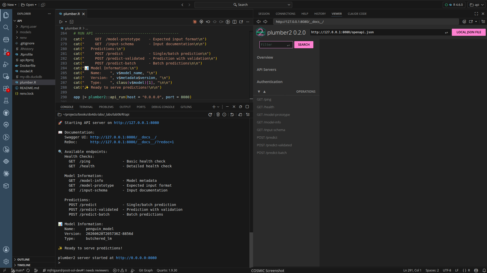
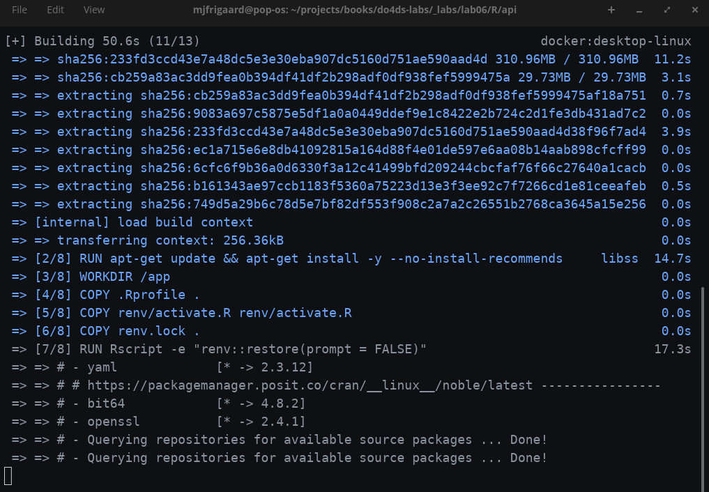
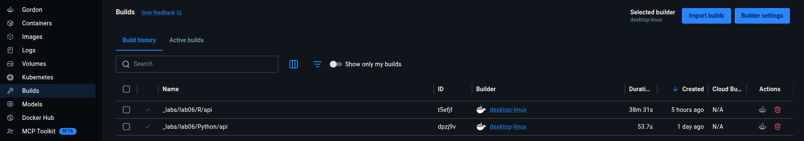
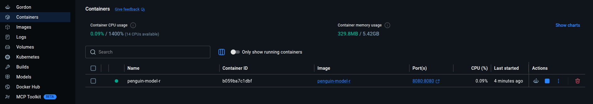

# <em>R API in a container</em> {.unnumbered}

```{r}
#| label: common
#| include: false
source("_common.R")
```

```{r}
#| label: co_box_rev
#| echo: false
#| results: asis
#| eval: true
co_box(
  color = "o",
  look = "default", 
  hsize = "1.25", 
  size = "1.00", 
  header = "Caution", 
  fold = FALSE,
  contents = "This section is being revised. Thank you for your patience."
)
```

## Set up

The original [lab 6 files](https://github.com/alexkgold/do4ds/tree/main/_labs/lab6) are only available for the Python API, butI've created both Python and R versions, and you can access and run the API from the [`R/api/` folder.](https://github.com/mjfrigaard/do4ds-labs/tree/main/_labs/lab06/R/api):

With R, we don't have to confirm the R version (or create a virtual environment), because `renv` is handling our project-level dependencies. 

## Build model (optional)

We can run the scripts/commands to build the model, but it's not required. 

```{r}
#| eval: false 
#| code-fold: false
source("model.R")
```

We should see something like this:

```{bash}
#| eval: false 
#| code-fold: false 
=== Model Training Complete ===
Formula:
body_mass_g ~ bill_length_mm + species + sex

Coefficients:
     (Intercept)   bill_length_mm speciesChinstrap    speciesGentoo          sexmale 
      2169.26972         32.53689       -298.76553       1094.86739        547.36692 
===============================

Registered S3 method overwritten by 'butcher':
  method                 from    
  as.character.dev_topic generics
Vetiver prototype (API will expect this format):
# A tibble: 0 × 3
# ℹ 3 variables: bill_length_mm <dbl>, species <fct>, sex <fct>

Replacing version '20251218T152129Z-74445' with '20260628T205736Z-8856d'
Writing to pin 'penguin_model'

Create a Model Card for your published model
• Model Cards provide a framework for transparent, responsible reporting
• Use the vetiver `.Rmd` template as a place to start
This message is displayed once per session.
✓ Model trained and pinned successfully
  Model name: penguin_model 
  Version: 
  Pin location: ./models/penguin_model
```

We can run the API with the `plumber.R` file: 

```{r}
#| eval: false 
#| code-fold: false
source("plumber.R")
```

The API is now running on <http://127.0.0.1:8080>: 

{width='100%' fig-align='center'}

## Testing the API

We can perform some terminal testing, too (in a new terminal).

Test health check:

```{bash}
#| eval: false 
#| code-fold: false
curl http://127.0.0.1:8080/ping
```

```json
{
  "status": [
    "alive"
  ],
  "timestamp": [
    "2026-06-28 14:15:15"
  ]
}
```

Test detailed health:

```{bash}
#| eval: false 
#| code-fold: false
curl http://127.0.0.1:8080/health
```


```json
{
  "status": [
    "healthy"
  ],
  "timestamp": [
    "2026-06-28 14:16:04"
  ],
  "model_name": [
    "penguin_model"
  ],
  "model_version": [
    "20260628T205736Z-8856d"
  ],
  "r_version": [
    "R version 4.6.0 (2026-04-24)"
  ]
}
```

Test prediction using the following:

```{bash}
#| eval: false 
#| code-fold: false
curl -X POST "http://localhost:8080/predict-validated" \
  -H "Content-Type: application/json" \
  -d '{"bill_length_mm": 45.0, "species": "Gentoo", "sex": "male"}'
```

```json
{
  "prediction": [
    5275.6639
  ],
  "input": {
    "bill_length_mm": [
      45
    ],
    "species": [
      "Gentoo"
    ],
    "sex": [
      "male"
    ]
  },
  "model_version": [
    "20260628T205736Z-8856d"
  ],
  "timestamp": [
    "2026-06-28 14:16:33"
  ]
}
```

`plumber2` provides a validated endpoint (`/predict-validated`) that checks for required fields and valid factor levels, ensuring the input matches the model's expectations.

Make sure to quit the API before building the Docker image and running the model in the container. 

```{r}
#| eval: false 
#| code-fold: false
app$stop()
```

## Docker 

Start docker: 

```{bash}
#| eval: false 
#| code-fold: false
systemctl --user start docker-desktop
```

Create a `Dockerfile` with the following: 

```Dockerfile

FROM rocker/r-ver:4.6.0 #<1>

RUN apt-get update && apt-get install -y --no-install-recommends \ #<2>
    libssl-dev \ #<3>
    libcurl4-openssl-dev \ #<3>
    libxml2-dev \ #<4> 
    libfontconfig1-dev \ #<5> 
    libharfbuzz-dev \
    libfribidi-dev \
    libfreetype6-dev \
    libpng-dev \
    libtiff5-dev \
    libjpeg-dev \ #<5>
    cmake \ #<6>
    libsodium-dev \ #<7>
    libx11-dev \ #<8> 
    pandoc \ #<9>
    xz-utils \ #<10>
    libuv1-dev \ # <11>
    && rm -rf /var/lib/apt/lists/* #<11>

WORKDIR /app #<12>

COPY .Rprofile . #<13>
COPY renv/activate.R renv/activate.R
COPY renv.lock . #<13>

RUN Rscript -e "renv::restore(prompt = FALSE)" #<14>

COPY plumber.R . #<15>

ENV MODEL_PATH=/data/model #<16>

EXPOSE 8080 #<17>

CMD ["Rscript", "plumber.R"] #<18>
```
1. Base image: R 4.6.0 from Rocker project (Debian/Ubuntu-based)   
2. Install system-level build dependencies required by R packages. 
3. OpenSSL and crypto libraries for `httr`, `curl`, `openssl` R packages  
4. XML parsing for `xml2` package    
5. Font rendering libraries for `ragg`, `svglite`, `systemfonts` packages
6. Build tools for native compilation of R packages  
7. Cryptography library for `sodium` package  
8. X11 libraries for `clipr` package  
9. Document conversion for `knitr` package   
10. Compression utilities for `duckdb` package extraction   
11. `libuv` library for `fs` package      
12. Set working directory for the application  
13. Copy `renv` bootstrap files first (before application code) to leverage Docker's layer caching      
14. Restore R package dependencies from `renv.lock`.      
15. Copy the application code after dependencies are installed  
16. Set environment variable for model path (application-specific)  
17. Expose port where Plumber API will listen     
18. Start the Plumber API when container runs     

Using `--no-install-recommends` minimizes the image size. We're copying `.Rprofile` and `renv` so the R package installation layer won't rebuild unless `renv.lock` or bootstrap files change (the `.Rprofile` automatically sources `renv/activate.R`, which bootstraps `renv` and configures `.libPaths()` to use the project-local library before `restore()` runs). `COPY plumber.R .` prevents re-running the long package installation if only app code changes.  

### Build the image

Build the image (run this from new Terminal in `_labs/lab06/R/api/` directory):

```{bash}
#| eval: false 
#| code-fold: false
docker build --no-cache -t penguin-model-r .
```

Adding `--no-cache` will re-run the `apt-get install` step and pick up all the system dependencies before attempting `renv::restore()`.

In the Terminal, you should see something like: 

{width='100%'}

Just like with the Python API, docker is installing the dependencies and setting up the image.[^install-time]

[^install-time]: I noticed the install time for the `plumber2` API was quite a bit longer than the Python/`FastAPI`. For example, `duckdb` took quite a bit of time to install, and some additional dependencies were required.   

When the build is complete, you'll see it in the **Builds** tab (along with the previous Python image):

{width='100%'}

### Run the container

To run the container, mount the model directory from the host:

```{bash}
#| eval: false 
#| code-fold: false
docker run --rm -d \
  -p 8080:8080 \
  --name penguin-model-r \
  -v "$(pwd)/models":/data/model \
  penguin-model-r
```

The `-v` flag mounts the local `models/` folder into the container at `/data/model`, which is where `MODEL_PATH` points by default in `plumber.R`. This keeps the model outside the image so it can be updated without a rebuild.

In the Desktop, we'll see R container running:

{width='100%'}

Test the running container:

```{bash}
#| eval: false 
#| code-fold: false
curl http://localhost:8080/ping
```

The response should be: 

```json
{
  "status": [
  "alive"
  ],
  "timestamp": [
  "2026-06-28 14:15:00"
  ]
}
```

To stop the container, run the following: 

```{bash}
#| eval: false 
#| code-fold: false
docker stop penguin-model-r
```

Since we used `--rm` in the `run` command, the container will be automatically removed when it stops.

If the graceful stop doesn't work, you can force kill it: 

```{bash}
#| eval: false 
#| code-fold: false
docker kill penguin-model-r
```

## Final project files 


```{bash}
#| eval: false 
#| code-fold: false 
├── api.Rproj
├── Dockerfile #<1>
├── model.R #<2> 
├── models/ #<3>
├── my-db.duckdb #<4> 
├── plumber.R #<5>
├── README.md #<6>
├── renv/ 
│   ├── activate.R #<7>
│   ├── library/ # <8>
│   │   └── linux-pop-noble/ 
│   ├── settings.json #<9>
│   └── staging/ #<10>
└── renv.lock #<11>

```
1. Defines the container image to deploy this API (base image, dependencies, startup command)   
2. Script that trains and serializes the penguin classification model  
3. Versioned, saved model artifact (the timestamp-named directory is a `vetiver` model board pin)
4. Local DuckDB database file, likely storing penguin data used for training or logging predictions.  
5. The main API definition — declares endpoints using `plumber` decorators (`#* @get`, `#* @post`, etc.) 
6. Project documentation  
7. Bootstrap script that initializes `renv` when the project is opened
8. Project-local R package library managed by `renv`  
9. `renv` configuration options (e.g., snapshot type, ignored packages)  
10. Temporary directory `renv` uses when installing packages  
11. Lockfile recording exact package versions for reproducibility  


