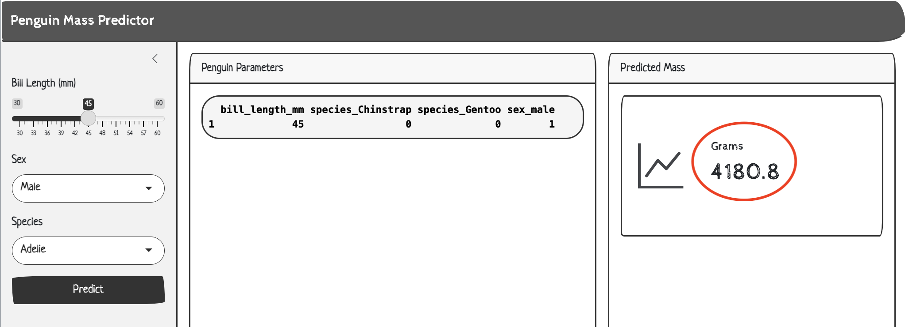

# <em>R App & API</em> {.unnumbered}

```{r}
#| label: common
#| include: false
source("_common.R")
```

```{r}
#| label: co_box_rev
#| echo: false
#| results: asis
#| eval: true
co_box(
  color = "o",
  look = "default", 
  hsize = "1.25", 
  size = "1.00", 
  header = "Caution", 
  fold = FALSE,
  contents = "This section is being revised. Thank you for your patience."
)
```

## Initial launch

The application and API need a little attention to get working. If you try to run the app without the model API running, you'll see something like the following error:

```{verbatim}
Warning: Error in httr2::req_perform: Failed to perform HTTP request.
Caused by error in `curl::curl_fetch_memory()`:
! Could not connect to server [127.0.0.1]:
Failed to connect to 127.0.0.1 port 8080 after 0 ms: Could not connect to server
  163: <Anonymous>
  162: signalCondition
  161: signal_abort
  160: cnd_signal
  159: handle_resp
  158: httr2::req_perform
  154: eventReactiveValueFunc
  102: pred
  101: renderText
  100: func
   87: renderFunc
   86: output$pred
    1: runApp
```

To separate my development workflows, I've organizing the API and app files into separate directories.

```{r}
#| eval: false 
#| echo: false
fs::dir_tree("_labs/lab3/R", recurse = 1)
```

```{verbatim}
_labs/lab3/R
├── R.Rproj
├── api #<1>
│   ├── api.Rproj
│   └── mod-api.R #<1>
├── app #<2>
│   ├── app-api.R
│   └── app.Rproj #<2>
├── eda-db.qmd #<3>
└── r-data-load.R #<4>
```

1.  `vetiver` model API\
2.  `shiny` application\
3.  EDA of `palmerpenguins` data using `dplyr` and `ggplot2`\
4.  Load `palmerpenguins` data into `duckdb`

## API

The [`labs/lab3/R/api/mod-api.R` file](https://github.com/mjfrigaard/do4ds-labs/blob/main/_labs/lab3/R/api/mod-api.R) contains the following:

```{r}
#| eval: false
# pkgs
library(vetiver)
library(pins)

# connect to model board
model_board <- pins::board_folder("../../../lab2/R/models/")

# read pinned vetiver model
v <- vetiver::vetiver_pin_read(model_board, "penguin_model")

# use plumber/vetiver to create router/create API
app <- plumber::pr() |> vetiver::vetiver_api(v)
```

### Start the API

The API will keep running when you run the app.

```{r}
#| eval: false
app |> plumber::pr_run(port = 8080, host = "127.0.0.1")
```

{fig-align="center" width="100%"}

Now we have a working API! We'll explore the UI in the sections below. Let's launch the app.

## App

I've made a few changes to the UI layout in `app-api.R`, so when I launched the app in a new RStudio session I see the following:

{fig-align="center" width="100%"}

View the UI changes below:

```{r}
#| eval: false 
#| code-fold: true 
#| code-summary: 'show/hide UI changes to app-api.R'

api_url <- "http://127.0.0.1:8080/predict"

ui <- page_sidebar(
  title = "Penguin Mass Predictor",
  theme = bs_theme(bootswatch = "sketchy"),
  sidebar = sidebar(
    sliderInput(inputId = "bill_length", 
      label = "Bill Length (mm)",
      min = 30, 
      max = 60, 
      value = 45, 
      step = 1),
    selectInput(inputId = "sex", 
      label = "Sex", 
      choices = c("Male", "Female"), 
      selected = "Male"),
    selectInput(
      inputId = "species",
      label = "Species",
      choices = c("Adelie", "Chinstrap", "Gentoo"),
      selected = "Adelie"),
    actionButton(
      inputId = "predict", 
      label = "Predict", 
      class = "btn-primary")
  ),
  
  layout_columns(
    card(
      card_header("Penguin Parameters"),
      card_body(
      verbatimTextOutput("vals")
      )
    ),
    card(
      card_header("Predicted Mass"),
      card_body(
        value_box(
          showcase_layout = "left center",
          title = "Grams",
          value = textOutput("pred"),
          showcase = bs_icon("graph-up"),
          max_height = "200px",
          min_height = "200px",
        )
      )
    ),
    col_widths = c(7, 5)
  )
)
```

But clicking **Predict** originally produced the following error:

```{verbatim}
Warning: Error in httr2::req_perform: 
HTTP 500 Internal Server Error.
```

In the API session, we also see an error:

```{verbatim}
<error/rlang_error>
Error in `hardhat::validate_column_names()`:
! `data` must be a data frame or a matrix, not a list.
```

These errors are pretty clear: The `httr2::req_body_json()` function is sending the data as a JSON list, but the `vetiver` API expects a data frame or a matrix structure.

We can fix this in the application server by changing the format of the values sent to the API.

### Reactive values

Our error tells us `'data' should be a data frame or a matrix`, so we'll convert `vals()` to a single-row `data.frame` and format the categorical values as numeric (not logical).

```{r}
#| eval: false
  vals <- reactive({
    data.frame(
      bill_length_mm = input$bill_length,
      species_Chinstrap = as.numeric(input$species == "Chinstrap"),
      species_Gentoo = as.numeric(input$species == "Gentoo"),
      sex_male = as.numeric(input$sex == "Male")
    )
  })
```

### Predictions

The predictions in the server creates a `response` object and returns `response$.pred[1]` (i.e., only the predictions).

```{r}
#| eval: false
#| code-fold: false
 pred <- reactive({
    tryCatch({
    showNotification("Predicting penguin mass...", 
                     type = "default", duration = 10)
        
    request_data <- vals()
    response <- httr2::request(api_url) |> #<1>
      httr2::req_method("POST") |>
      httr2::req_body_json(request_data, auto_unbox = FALSE) |>  #<2>
      httr2::req_perform() |>
      httr2::resp_body_json()
        
    showNotification("✅ Prediction successful!", 
                     type = "default", duration = 10)
        
    response$.pred[1]
        
    }, error = function(e) {
      error_msg <- conditionMessage(e)
      
      if (grepl("Connection refused|couldn't connect", error_msg, ignore.case = TRUE)) {
        user_msg <- "API not available - is the server running on port 8080?"
      } else if (grepl("timeout|timed out", error_msg, ignore.case = TRUE)) {
        user_msg <- "Request timed out - API may be overloaded"
      } else {
        user_msg <- paste("API Error:", substr(error_msg, 1, 50))
      }
      
      showNotification(paste("❌", user_msg), type = "warn", duration = 10)
      
      paste("❌", user_msg)
      })
    }) |> 
    bindEvent(input$predict, ignoreInit = TRUE)
```
1. `app_url` is "http://127.0.0.1:8080/predict"   
2. Converts `vals()/request_data` into a JSON array structure instead of a flat object (which is the format `vetiver` expects)   


### R API Request/Response Flow

The sections below cover the `httr2` functions used in the Shiny API app. 

#### The `request()`

`httr2::request()` creates the initial request (`response`) object that all other functions will modify:

-   Stores the base URL

-   Sets default HTTP method (`GET`)

-   Initializes empty headers, query parameters, and body

-   Returns a modifiable request object

```{r}
#| eval: false
#| code-fold: false
# creates a base request with URL
response <- httr2::request(api_url)
```

```{mermaid}
%%| fig-width: 6.5
%%| fig-align: center
%%{init: {'theme': 'neutral', 'look': 'handDrawn', 'themeVariables': { 'fontFamily': 'monospace'}}}%%

graph TD
	A("<code>request()</code> URL") --> B["Creates base<br>request object"]
	B --> C["Contains URL and<br>default settings"]

style A fill:#e1f5fe

```

#### `req_method()` 

*verb specification*

`httr2::req_method()` specifies which HTTP method to use for the request.

-   **`GET`**: Retrieve data (no body allowed)

-   **`POST`**: Send new data (body allowed)

-   **`PUT`**: Update existing data (body allowed)

-   **`DELETE`**: Remove data (usually no body)

```{mermaid}
%%| fig-width: 6.5
%%| fig-align: center
%%{init: {'theme': 'neutral', 'look': 'handDrawn', 'themeVariables': { 'fontFamily': 'monospace'}}}%%

graph TD
	A[Request Object] --> B["<code>req_method()</code>"]
	B --> C[Sets HTTP verb]
	C --> D[GET/POST/PUT/DELETE/PATCH]

style B fill:#fff3e0
```

```{r}
#| eval: false
#| code-fold: false
response <- httr2::request(api_url) |>
  httr2::req_method("POST") # sending data
```

#### `req_body_json()`

*request body*

`httr2::req_body_json()` converts R objects to JSON and includes them in the request body.

-   Converts R `list`s/`data.frame`s to JSON format

-   Sets `Content-Type: application/json` header automatically

-   Includes the JSON in the HTTP request body

-   Used primarily with `POST`/`PUT` requests

```{mermaid}
%%| fig-width: 6.5
%%| fig-align: center
%%{init: {'theme': 'neutral', 'look': 'handDrawn', 'themeVariables': { 'fontFamily': 'monospace'}}}%%

graph TD
	A[R Object] --> B["<code>req_body_json()</code>"]
	B --> C["Converts to JSON"]
	C --> D["Adds to request body"]

style B fill:#ffecb3

```

```{r}
#| eval: false
#| code-fold: false
vals <- reactive({
  data.frame(
    bill_length_mm = input$bill_length,
    species_Chinstrap = as.numeric(input$species == "Chinstrap"),
    species_Gentoo = as.numeric(input$species == "Gentoo"),
    sex_male = as.numeric(input$sex == "Male")
  )
})

response <- httr2::request(api_url) |>
  httr2::req_method("POST") |> # sending data
  httr2::req_body_json(request_data, auto_unbox = FALSE)
```

#### `req_perform()`

*execute request*

`httr2::req_perform()` actually sends the HTTP request to the server and returns a response:

What happens:\
1. Combines all request components (method, headers, query, body)\
2. Opens network connection to server\
3. Sends HTTP request\
4. Waits for server response\
5. Returns response object for processing

```{mermaid}
%%| fig-width: 6.5
%%| fig-align: center
%%{init: {'theme': 'neutral', 'look': 'handDrawn', 'themeVariables': { 'fontFamily': 'monospace'}}}%%

graph TD
	A["Complete Request<br>Object"] --> B["<code>req_perform()</code>"]
	B --> C["Sends HTTP request"]
	C --> D["Returns response<br>object"]

style B fill:#ff9800

```

```{r}
#| eval: false
#| code-fold: false
response <- httr2::request(api_url) |>
  httr2::req_method("POST") |> # sending data
  httr2::req_body_json(request_data, auto_unbox = FALSE) |> 
  httr2::req_perform()
```


#### `resp_body_json()`

*JSON response parsing*

`httr2::resp_body_json()` parses JSON response body into R objects.

- Converts JSON arrays to R vectors/lists

- Converts JSON objects to R named lists

- Handles nested JSON structures

- Automatically converts data types (numbers, booleans, strings)

```{mermaid}
%%| fig-width: 6.5
%%| fig-align: center
%%{init: {'theme': 'neutral', 'look': 'handDrawn', 'themeVariables': { 'fontFamily': 'monospace'}}}%%

graph TD

A[JSON Response Body] --> B["<code>resp_body_json</code>"]
B --> C[Parses JSON to R objects]
C --> D[Lists, data.frames, etc.]

style B fill:#9c27b0

```

```{r}
#| eval: false
#| code-fold: false
response <- httr2::request(api_url) |>
  httr2::req_method("POST") |> # sending data
  httr2::req_body_json(request_data, auto_unbox = FALSE) |> 
  httr2::req_perform() |> 
  httr2::resp_body_json()
```

## Verify

Now when we launch the app, the preview of the parameters are in a `data.frame` (not a list):

{fig-align="center" width="100%"}

When we click **Predict**, we see notifications and the value is returned:

{fig-align="center" width="100%"}

### Back in the API

If we return to the plumber UI, we can click on **Return predictions from model using 4 features**, change the JSON values to match our parameters in the app, and click **TRY**:

{fig-align="center" width="100%"}

And we can compare the response to the value we saw in the app:

{fig-align="center" width="100%"}

A diagram of the user inputs (i.e., the **Predict** button), reactives, and the API request is below:

```{=html}
<style>

.codeStyle span:not(.nodeLabel) {
  font-family: monospace;
  font-size: 1.5em;
  font-weight: bold;
  color: #d80808 !important;
  background-color: #ffffff;
  padding: 0.2em;
}
</style>
```

```{mermaid}
%%| fig-cap: 'Input Dependencies'
%%| fig-align: center
%%{init: {'theme': 'neutral', 'look': 'handDrawn', 'themeVariables': { 'fontFamily': 'monospace', "fontSize":"16px"}}}%%
graph TD
    subgraph Inputs["<strong>User Inputs</strong>"]
    I1[/"input$bill_length"/]
    I2[/"input$species"/]
    I3[/"input$sex"/]
    I4[/"input$predict"/]
    end

    subgraph Pred["<strong>Predict</strong>"]
        Req("<code>request()</code>") --"Creates HTTP<br>request object"--> Meth("<code>req_method()</code>")
        Meth --"Changes HTTP<br>method from<br>GET to POST"--> BodyJson1("<code>req_body_json()</code>")
        BodyJson1 --"Converts data.frame<br>to JSON & sets<br>request body"--> Perform("<code>req_perform()</code>")
        Perform --"Sends HTTP<br>request to<br>server &<br>waits for<br>response"--> BodyJson2("<code>resp_body_json()</code>")
    end

    subgraph PredReact["<strong>pred()</strong>"]
        Res(["<strong>response$.pred[1]</strong>"])
    end
    
    ValsReact(["<strong>vals()</strong><br>(in <code>data.frame</code>)"])
    BodyJson2 --"Extracts JSON<br>response body<br>& converts to<br>R object"--> PredReact
    
    I1 --> ValsReact
    I2 --> ValsReact
    I3 --> ValsReact
    I4 --"<code>reactive()</code> & <br><code>bindEvent()</code>"---> Pred
    
    ValsReact --"as<br><code>request_data</code>"--> BodyJson1
    ValsReact --> RenPrnt[\"<strong>renderPrint()</strong><br><code>vals()</code>"\]
    PredReact -.-> RenTxt[\"<strong>renderText()</strong><br><code>pred()</code>"\]

    %% Style for functions %%
    style Req fill:#FFF,color:#000,rx:20,ry:20,font-size:18px
    style Meth fill:#FFF,color:#000,rx:20,ry:20,font-size:18px
    style BodyJson1 fill:#FFF,color:#000,rx:20,ry:20,font-size:18px
    style Perform fill:#FFF,color:#000,rx:20,ry:20,font-size:18px
    style BodyJson2 fill:#FFF,color:#000,rx:20,ry:20,font-size:18px
    
    %% Style for reactives %%
    style ValsReact fill:#e1f5fe,stroke:#000,color:#000,stroke-width:1px,rx:10,ry:10,font-size:16px
    style PredReact fill:#fff3e0,stroke:#000,color:#000,stroke-width:1px,rx:10,ry:10,font-size:16px
    
    %% Style for result %%
    style Res fill:#e8f5e8,stroke:#000,color:#000
```

## Finishing touches

To keep the R environment in each directory self-contained and reproducible, we should initiate a `renv` repo in each folder.

```{r}
#| eval: false 
renv::init()
```

This results in the following files:

### `R/api/` files

```{verbatim}
├── api.Rproj
├── mod-api.R
├── renv
│   ├── activate.R
│   ├── library
│   └── settings.json
└── renv.lock

3 directories, 5 files
```

### `R/app/` files

```{verbatim}
├── app-api.R
├── app.Rproj
├── renv
│   ├── activate.R
│   ├── library
│   └── settings.json
└── renv.lock

3 directories, 5 files
```

To view the original code in `app-api.R`, expand the section below:

<details>

<summary>Expand to view the original app-api.R</summary>

```{r}
#| label: print-app-api-R
#| echo: false
library(readr)
readr::read_lines("_labs/lab3/app-api.R") |> 
  base::noquote() |> 
  writeLines()
```

</details>

## More `httr2` functions

Below are more `httr2` functions for communicating with APIs.  

### HTTP headers

`httr2::req_headers()` adds HTTP headers that provide metadata about the request:

-   **`Content-Type`**: Tells server what format we're sending

-   **`Authorization`**: Provides authentication credentials

-   **`Accept`**: Tells server what response format we prefer

-   **`User-Agent`**: Identifies our client application

```{mermaid}
%%| fig-width: 6.5
%%| fig-align: center
%%{init: {'theme': 'neutral', 'look': 'handDrawn', 'themeVariables': { 'fontFamily': 'monospace'}}}%%

graph TD
	A[Request Object] --> B["<code>req_headers()</code>"]
	B --> C["Adds metadata<br>to request"]
	C --> D["Authentication,<br>Content-Type, etc."]

style B fill:#e8f5e8

```

```{r}
#| eval: false
#| code-fold: false
req |> req_headers(
    "Content-Type" = "application/json", # what format is the data?
    "Authorization" = "Bearer abc123", # auth token
    "User-Agent" = "R-httr2-client/1.0", # client identification
    "Accept" = "application/json" # what format to return?
)
```


### Query parameters

`httr2::req_url_query()` adds query parameters to the URL (the part after `?`):

-   **`GET` requests**: Primary way to send parameters

-   **Filtering data**: `?category=electronics&price_max=100`

-   **Pagination**: `?page=2&per_page=50`

-   **API options**: `?format=json&verbose=true`

```{mermaid}
%%| fig-width: 6.5
%%| fig-align: center
%%{init: {'theme': 'neutral', 'look': 'handDrawn', 'themeVariables': { 'fontFamily': 'monospace'}}}%%

graph TD
	A[Base URL] --> B["<code>req_url_query()</code>"]
	B --> C["Adds<br><code>?param=value&key=data</code>"]
	C --> D["<code>https://</code><code>api.com/data?species=Adelie&limit=10</code>"]

style B fill:#c8e6c9
```

```{r}
#| eval: false
#| code-fold: false
req |> req_url_query(
    species = "Adelie", # filter by species
    limit = 10, # limit results
    include_na = "false" # drop missing values
)
# result: https://api.com/penguins?species=Adelie&limit=10&include_na=false
```

### Status codes

`httr2::resp_status()` extracts the HTTP status code to determine if request succeeded.

- **200**: OK (success)

- **201**: Created (successful POST)

- **400**: Bad Request (client error)

- **401**: Unauthorized (authentication failed)

- **404**: Not Found (resource doesn't exist)

- **500**: Internal Server Error (server problem)

```{mermaid}
%%| fig-width: 6.5
%%| fig-align: center
%%{init: {'theme': 'neutral', 'look': 'handDrawn', 'themeVariables': { 'fontFamily': 'monospace'}}}%%

graph TD
	A[Response Object] --> B["<code>resp_status()</code>"]
	B --> C["Extracts status<br>code"]
	C --> D["200, 404, 500, etc."]

style B fill:#4caf50

```

```{r}
#| eval: false
#| code-fold: false
status <- resp_status(response)
if (status == 200) {
    print("Success!")
} else if (status == 404) {
    print("Not found")
} else if (status >= 500) {
    print("Server error")
}
```

### Response headers

`httr2::resp_headers()` extracts HTTP headers from the response for metadata. Useful response headers include:

- **Content-Type**: Format of response body

- **Content-Length**: Size of response

- **Cache-Control**: Caching instructions

- **Set-Cookie**: Cookies to store

```{mermaid}
%%| fig-width: 6.5
%%| fig-align: center
%%{init: {'theme': 'neutral', 'look': 'handDrawn', 'themeVariables': { 'fontFamily': 'monospace'}}}%%

graph TD
	A[Response Object] --> B["<code>resp_headers()</code>"]
	B --> C["Extracts response<br>metadata"]
	C --> D["Content-Type,<br>Content-Length, etc."]

style B fill:#2196f3
```

```{r}
#| eval: false
#| code-fold: false
headers <- resp_headers(response)
content_type <- headers$`content-type` # "application/json"
content_length <- headers$`content-length` # "1234"
server_info <- headers$server # "nginx/1.18.0"
```


