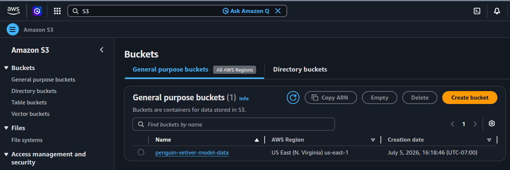
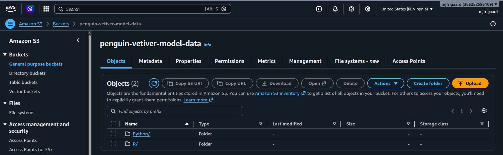

# <em>Put the penguins data and model in S3</em> {.unnumbered}

```{r}
#| label: common
#| include: false
source("_common.R")
```

```{r}
#| label: co_box_rev
#| echo: false
#| results: asis
#| eval: false
co_box(
  color = "o",
  look = "default", 
  hsize = "1.25", 
  size = "1.00", 
  header = "Caution", 
  fold = FALSE,
  contents = "This section is being revised. Thank you for your patience."
)
```

## Preface 

This is the second part of lab 7. It assumes you've set up your AWS user, group, and configured your CLI. 

## Create S3 bucket 

We can use the `s3api` command to create the S3 bucket for the `penguin-vetiver-model-data`:

```{bash}
#| eval: false 
#| code-fold: false
aws s3api create-bucket \
  --bucket penguin-vetiver-model-data \
  --region us-east-1 \
  --profile dev-deploy
```

These commands are pretty straightforward, but you can also read more in the documentation. Note that bucket names must be globally unique. The response from the API should be something like the following: 

```json
{
    "Location": "/penguin-vetiver-model-data",
    "BucketArn": "arn:aws:s3:::penguin-vetiver-model-data"
}
```

We can also see this in the dashboard by looking up **S3** resources: 

{width='100%' fig-align='center'}

## Pushing the models to S3

Now that we've created an S3 bucket, we can push the respective Python/R model data into their locations. 

### R model 

From the `do4ds-labs/_labs/lab07` folder: 

```{bash}
#| eval: false 
#| code-fold: false
aws s3 cp R/api/models/ s3://penguin-vetiver-model-data/R/models/ \
  --recursive \
  --profile dev-deploy
```

### Python model

From the `do4ds-labs/_labs/lab07` folder: 

```{bash}
#| eval: false 
#| code-fold: false
aws s3 cp Python/api/models/ s3://penguin-vetiver-model-data/Python/models/ \
  --recursive \
  --profile dev-deploy
```

We can see this in the dashboard under **Amazon S3** > **Buckets**

{width='100%' fig-align='center'}

#### Note on `vetiver` convention

If using `pins` with an S3 board, `vetiver`/`pins` manages the folder structure automatically (versioned by timestamp/hash, like we already have locally). In that case we'd use:

```{r}
#| eval: false 
#| code-fold: false
board <- pins::board_s3(bucket = "penguin-vetiver-model-data", prefix = "R/")
vetiver::vetiver_pin_write(board, model)
```

This is preferred over manual `cp`/`sync` if we want `vetiver`'s versioning and metadata to work correctly when later reading the model back with `vetiver_pin_read()`.

## Launch EC2 instance

Console is easiest for first setup: EC2 \> Launch instance \> choose AMI, instance type, key pair, security group (allow SSH port 22, and any app ports you need).

CLI equivalent:

``` bash
aws ec2 run-instances \
  --image-id ami-xxxxxxxx \
  --instance-type t3.medium \
  --key-name your-key-pair \
  --security-group-ids sg-xxxxxxxx \
  --subnet-id subnet-xxxxxxxx \
  --profile dev-deploy
```

## Start/stop instance

``` bash
aws ec2 start-instances --instance-ids i-xxxxxxxxxxxx --profile dev-deploy
aws ec2 stop-instances --instance-ids i-xxxxxxxxxxxx --profile dev-deploy
```

## Create a separate IAM user for GitHub Actions

Do not reuse your personal credentials. Create a dedicated user with only S3 access.

IAM \> User groups \> Create group: `github-actions-s3`

Attach a scoped custom policy instead of full access. Example policy JSON, limited to one bucket:

``` json
{
  "Version": "2012-10-17",
  "Statement": [
    {
      "Effect": "Allow",
      "Action": [
        "s3:GetObject",
        "s3:PutObject",
        "s3:ListBucket"
      ],
      "Resource": [
        "arn:aws:s3:::your-vetiver-bucket-name",
        "arn:aws:s3:::your-vetiver-bucket-name/*"
      ]
    }
  ]
}
```

IAM \> Policies \> Create policy \> JSON tab \> paste above \> name it `github-actions-s3-policy`.

Attach this policy to the `github-actions-s3` group.

Create user: `github-actions-bot` \> add to `github-actions-s3` group \> no console access needed.

Create access key for this user (CLI use case), same as before.

## Add credentials to GitHub

Repo \> Settings \> Secrets and variables \> Actions \> New repository secret.

Add:

- `AWS_ACCESS_KEY_ID`
- `AWS_SECRET_ACCESS_KEY`
- `AWS_REGION`

## Example GitHub Actions step using these secrets

``` yaml
- name: Configure AWS credentials
  uses: aws-actions/configure-aws-credentials@v4
  with:
    aws-access-key-id: ${{ secrets.AWS_ACCESS_KEY_ID }}
    aws-secret-access-key: ${{ secrets.AWS_SECRET_ACCESS_KEY }}
    aws-region: ${{ secrets.AWS_REGION }}

- name: Push to S3
  run: aws s3 cp ./model.rds s3://your-vetiver-bucket-name/model.rds
```

