# <em>Getting started with AWS</em> {.unnumbered}

```{r}
#| label: common
#| include: false
source("_common.R")
```

```{r}
#| label: co_box_rev
#| echo: false
#| results: asis
#| eval: false
co_box(
  color = "o",
  look = "default", 
  hsize = "1.25", 
  size = "1.00", 
  header = "Caution", 
  fold = FALSE,
  contents = "This section is being revised. Thank you for your patience."
)
```

This lab will cover creating AWS users, groups, attaching policies, creating access keys, and configuring the AWS command line interface (CLI).

## AWS set up

First, you'll need to log into AWS. This is separate from your regular Amazon account, and comes with different tiers. I highly recommend turning on the MFA and using something like the [Microsoft Authenticator app](https://www.microsoft.com/en-us/security/mobile-authenticator-app) to login.

When you first access AWS, your landing page will look something like this:

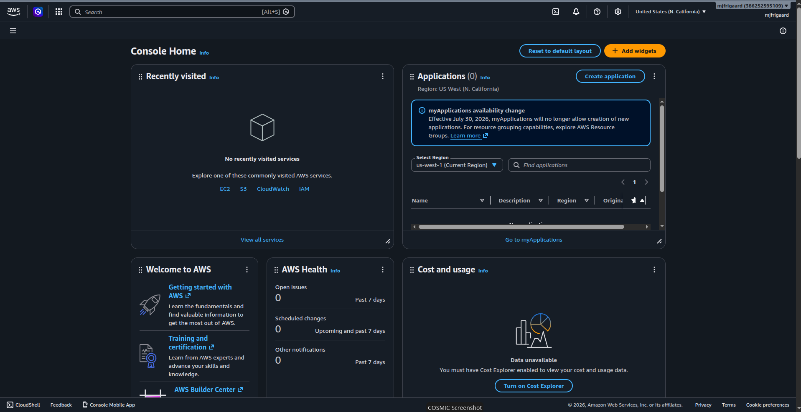{width="100%" fig-align="center"}

This is your **AWS Console**--where you'll launch new instances, select storage devices, containers, etc. In the first part of this lab I'll cover

## Identity and Access Management (IAM)

Back in the **AWS Console**, we need to create a group, attach policies to this group, then create user.

### Creating Groups

In the **AWS Console**, we'll navigate to:

**IAM** \> **IAM User groups** \> **Create group**

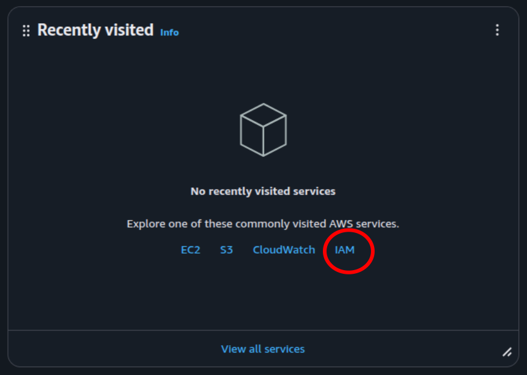{width="80%" fig-align="center"}

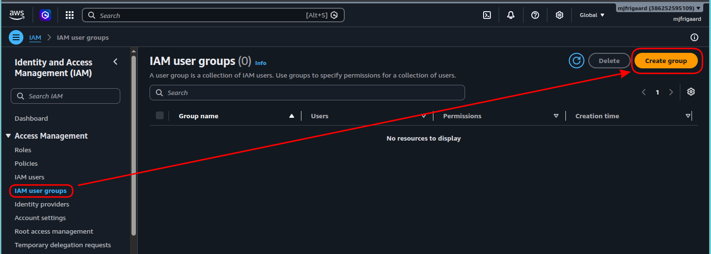{width="100%" fig-align="center"}

Give the group a meaningful name: `dev-deploy-group`

Under **Attach permissions policies**, search and select the following:

- `AmazonEC2FullAccess`
- `AmazonS3FullAccess`

Down the road, we should replace these with scoped custom policies later, but for now it will get us up and running.

Click **Create Group** and you should see something like:

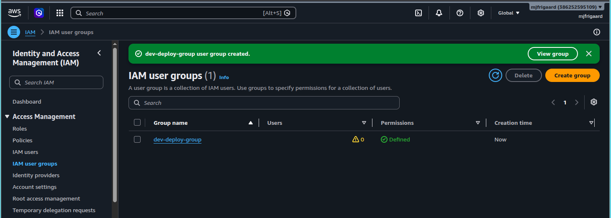{width="100%" fig-align="center"}

As we can see, this group doesn't have any users, so we'll create and add them next.

### Creating Users

Back in **AWS Console**, we'll to navigate to:

**IAM Users** \> **Create User**

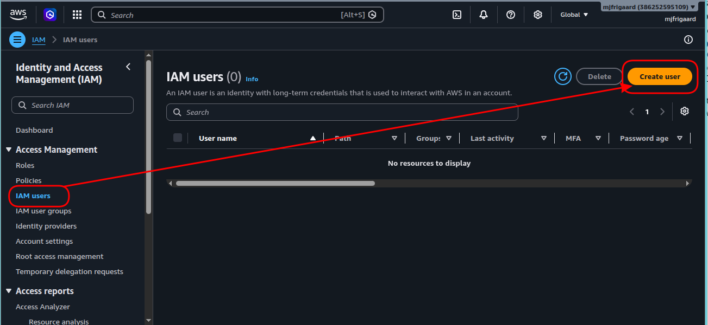{width="100%" fig-align="center"}

We'll give the user a meaningful username: `mjfrigaard-cli`

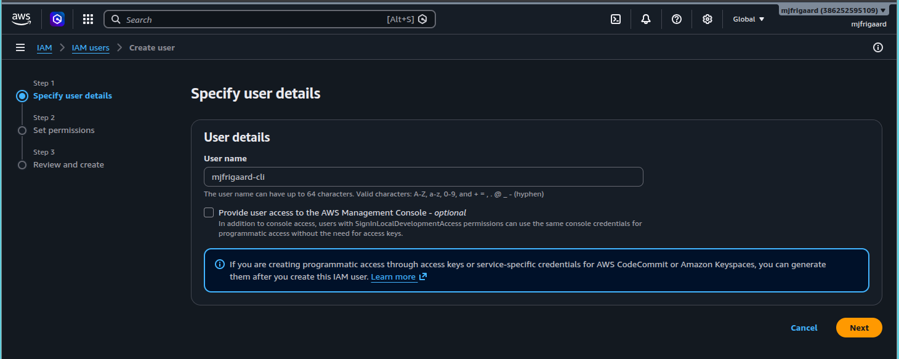{width="100%" fig-align="center"}

We have to option to check "*Provide user access to the AWS Management Console*", but we should only do this if we need this user to log into the **Console**. Because `mjfrigaard-cli` will only access the CLI, we can skip this.

Now, under **Add user to group**, we select `dev-deploy-group` and click **Next**

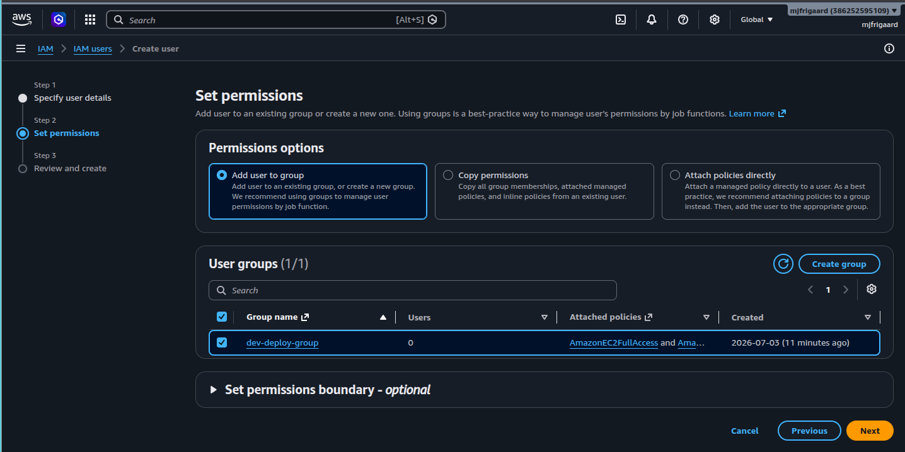{width="100%" fig-align="center"}

At this point, we're given a chance to review our selections before confirming, which is also a great opportunity to quickly cover AWS IAM users and groups.

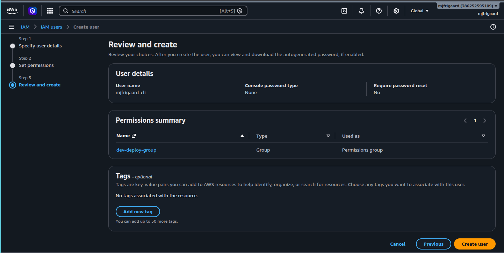{width="100%" fig-align="center"}

### IAM: Core concepts

AWS IAM is somewhat like like Linux users and groups, but instead of file permissions, IAM uses *policies* to control who can do what, and where. Three core concepts to know about AWS IAM:

1.  A **`user`** is an identity (a person or a service).[^iam-users]      
2.  A **`group`** is a collection of `users` that share permissions.[^iam-groups]     
3.  A **`policy`** is a JSON document that says what actions are allowed on what resources[^iam-policies]   


[^iam-users]: Read more about [AWS IAM users](https://docs.aws.amazon.com/IAM/latest/UserGuide/id_users.html)

[^iam-groups]: Read more about [AWS IAM user groups](https://docs.aws.amazon.com/IAM/latest/UserGuide/id_groups.html)

[^iam-policies]: Read more about [AWS IAM policies](https://docs.aws.amazon.com/IAM/latest/UserGuide/access_policies.html)

Users don't get permissions directly, they inherit permissions from the groups they belong to. If you've worked with Linux groups and file permissions before, the table below might be helpful for mapping the AWS IAM concepts.

| AWS IAM concept                                 | Linux user/groups analog |
|----------------------------------|--------------------------------------|
| IAM User                                        | User                     |
| IAM Group                                       | Group                    |
| IAM Policy (JSON file)                          | File permissions (`rwx`) |
| IAM Users list                                  | `/etc/passwd`            |
| Elevated permissions granted by attached policy | `sudo`                   |
| Access vis access key ID + secret access key    | SSH keys                 |

So far, we've created/logged into our AWS account, then from the **AWS Console**, we 1) created an IAM group, 2) attached IAM policies to the IAM group, 3) created an IAM user, and 4) assigned that user to the IAM group.

```{mermaid}
%%| fig-cap: ‘IAM users, groups and policies’
%%| fig-width: 7.0
%%| fig-align: 'center'
%%{init: {‘theme’: ‘base’, ‘themeVariables’: {‘fontFamily’: ‘monospace’}}}%%

graph TD
    AWS(["AWS<br>Account"]) --"create"--> Groups("IAM Groups")
    AWS --"create"--> Users("IAM Users")
    Policy[/"IAM Policies"/]

    Policy --"attach"--> Groups
    Groups --"inherit"--> Users
    
    style Policy fill:#5B8C5A,stroke:#000000,stroke-width:1px,color:#ffffff
    style AWS fill:#E8A33D,stroke:#000000,stroke-width:1px,color:#ffffff
    style Groups fill:#1B2A41,stroke:#000000,stroke-width:1px,color:#ffffff
    style Users fill:#2A6F77,stroke:#000000,stroke-width:1px,color:#ffffff
    
```

#### Policies determine permissions

For example, say we have a new developer, Alice (`alice`). Alice wouldn't get any permissions herself, but she'd be a member of the `devs` group, which has a `S3ReadWrite` policy attached, which allows Alice access to the `my-data` bucket.

```{mermaid}
%%| fig-cap: ‘Policies and permissions’
%%| fig-width: 7.0
%%| fig-align: 'center'
%%{init: {‘theme’: ‘base’, ‘themeVariables’: {‘fontFamily’: ‘monospace’}}}%%

graph LR

    Policy[/"Policy:<br><code>S3ReadWrite</code>"/]
    Groups("IAM Group:<br><code>devs</code>")
    Users("IAM User:<br><code>alice</code>")
    Resource[("S3 Bucket:<br><code>my-data"</code>)]
    
    Policy --> Groups --> Users --> Resource
    
    style Policy fill:#5B8C5A,stroke:#000000,stroke-width:1px,color:#ffffff
    style Resource fill:#D2562B,stroke:#000000,stroke-width:1px,color:#ffffff
    style Groups fill:#1B2A41,stroke:#000000,stroke-width:1px,color:#ffffff
    style Users fill:#2A6F77,stroke:#000000,stroke-width:1px,color:#ffffff
    
```

A policy is like a permissions file that specifies and **effect** (allow or deny), an **action** (what operation, like `s3:PutObject`), and the **resource** (what it applies to, i.e., a specific bucket).[^start-aws-1]

[^start-aws-1]: This is conceptually similar to a Linux ACL entry, but scoped to AWS API actions instead of filesystem operations.

```{mermaid}
%%| fig-cap: ‘Policy effects, actions, and resources’
%%| fig-width: 7.0
%%| fig-align: 'center'
%%{init: {‘theme’: ‘base’, ‘themeVariables’: {‘fontFamily’: ‘monospace’}}}%%

graph LR
    Policy[/"Policy<br>Document"/] --> Effect["<strong>Effect</strong>:<br><em>Allow</em>"]
    Policy --> Action["<strong>Action:</strong><br><em>s3:PutObject</em>"]
    Policy --> Resource[("<strong>Resource:</strong><br><em>arn:aws:s3:::my-bucket/*</em>")]
    
    style Policy fill:#5B8C5A,stroke:#000000,stroke-width:1px,color:#ffffff
    style Effect fill:#3E2A1E,stroke:#000000,stroke-width:1px,color:#ffffff
    style Action fill:#3E2A1E,stroke:#000000,stroke-width:1px,color:#ffffff
    style Resource fill:#D2562B,stroke:#000000,stroke-width:1px,color:#ffffff
    
```

#### What about multiple groups?

Like a Linux user being in multiple groups (`sudo`, `docker`, `www-data`), an IAM user can belong to multiple IAM groups. Consider the user `alice` below:

```{mermaid}
%%| fig-cap: ‘Multiple IAM groups’
%%| fig-width: 7.0
%%| fig-align: 'center'
%%{init: {‘theme’: ‘base’, ‘themeVariables’: {‘fontFamily’: ‘monospace’}}}%%


graph TD

    Users(["<strong>alice</strong>"]) --"In Group"--> DevGroup("<strong>devs</strong>")
    Users --"In Group"--> OpsGroup("<strong>ops</strong>")

    DevGroup --> S3Policy[/"<strong>Policy</strong>:<br><em>S3 Access</em>"/]
    OpsGroup --> EC2Policy[/"<strong>Policy</strong>:<br><em>EC2 Access</em>"/]

    S3Policy --> S3[("S3<br>Buckets")]
    EC2Policy --> EC2{{"EC2<br>Instances"}}
    
    
    style Users fill:#2A6F77,stroke:#000000,stroke-width:1px,font-size:14px,text-align:center,font-family:monospace,color:#ffffff
    
    style DevGroup fill:#1B2A41,stroke:#000000,stroke-width:1px,font-size:14px,text-align:center,font-family:monospace,color:#ffffff
    style OpsGroup fill:#1B2A41,stroke:#000000,stroke-width:1px,font-size:14px,text-align:center,font-family:monospace,color:#ffffff
    
    style S3Policy fill:#5B8C5A,stroke:#000000,stroke-width:1px,color:#ffffff
    style EC2Policy fill:#5B8C5A,stroke:#000000,stroke-width:1px,color:#ffffff

    style S3 fill:#D2562B,stroke:#000000,stroke-width:1px,color:#ffffff
    style EC2 fill:#D2562B,stroke:#000000,stroke-width:1px,color:#ffffff
    
```

Alice ends up with the *combined* permissions of both `devs` and `ops` groups (just like a Linux user inheriting from multiple group memberships).

#### Identities

In AWS, identities can be *human users* (i.e., people like `alice` logging in via console or CLI). But identities can also be *service/automation users*, which are things like GitHub Actions or applications that need programmatic access (like a system account or a service account key).

```{mermaid}
%%| fig-cap: ‘Humans and services’
%%| fig-width: 7.0
%%| fig-align: 'center'
%%{init: {‘theme’: ‘base’, ‘themeVariables’: {‘fontFamily’: ‘monospace’}}}%%

graph TD

    AWS(["AWS<br>Account"]) --"IAM User<br>(human)"--> Human("<strong>alice</strong>")
    AWS --"IAM User<br>(service)"--> Service("<strong>gha-bot</strong>")

    Human --> ConsoleAccess["Console Login +<br> CLI Keys"]
    Service --> Keys["Access Keys Only,<br>No Console"]
    
    style AWS fill:#E8A33D,stroke:#000000,stroke-width:1px,color:#ffffff
    
    style Human fill:#2A6F77,stroke:#000000,stroke-width:1px,font-size:14px,text-align:center,font-family:monospace,color:#ffffff
    style Service fill:#2A6F77,stroke:#000000,stroke-width:1px,font-size:14px,text-align:center,font-family:monospace,color:#ffffff
    
    style ConsoleAccess fill:#3E2A1E,stroke:#000000,stroke-width:1px,color:#ffffff
    style Keys fill:#3E2A1E,stroke:#000000,stroke-width:1px,color:#ffffff

    
```

### IAM: Recap

Below is a full picture of IAM users, groups, policies and resources. We'll be using all of these to stand up an EC2 instance, put our `vetiver` model/data into an S3 bucket, and give GitHub Actions the S3 credentials.

```{mermaid}
%%| fig-cap: ‘Humans and services’
%%| fig-width: 7.0
%%| fig-align: 'center'
%%{init: {‘theme’: ‘base’, ‘themeVariables’: {‘fontFamily’: ‘monospace’}}}%%

graph TD

    AWS(["AWS<br>Account"])

    AWS --> Users("IAM Users")
    AWS --> Groups("IAM Groups")
    AWS --> Policies[/"IAM Policies"/]
    AWS --> Roles["<em>IAM Roles<br>(optional, for cross<br>service access)</em>"]

    Users --> Groups
    Groups --> Policies
    Roles --> Policies
    Policies --> Resources{{"AWS Resources:<br>S3, EC2, etc"}}
    
    style AWS fill:#E8A33D,stroke:#000000,stroke-width:1px,color:#ffffff
    style Policies fill:#5B8C5A,stroke:#000000,stroke-width:1px,color:#ffffff
    style Roles fill:#3E2A1E,stroke:#000000,stroke-width:1px,color:#ffffff
    style Groups fill:#1B2A41,stroke:#000000,stroke-width:1px,color:#ffffff
    style Users fill:#2A6F77,stroke:#000000,stroke-width:1px,color:#ffffff
    style Resources fill:#D2562B,stroke:#000000,stroke-width:1px,color:#ffffff
    
```

[**IAM Roles**](https://docs.aws.amazon.com/IAM/latest/UserGuide/id_roles.html) (not covered in depth here) are like temporary identities services assume, e.g., an EC2 instance assuming a role to access S3 without needing stored credentials at all. This is the more secure long-term pattern, but access keys are the simpler starting point.

## Creating Access Keys

In the **IAM users** dashboard, we can see:

1)  the `dev-deploy-group`,\
2)  the policies we attached to this group (`AmazonEC2FullAccess` and `AmazonS3FullAccess`), and\
3)  the new user we just created (`mjfrigaard-cli`)

In the **Summary** section, there is an option to **Create access key**:

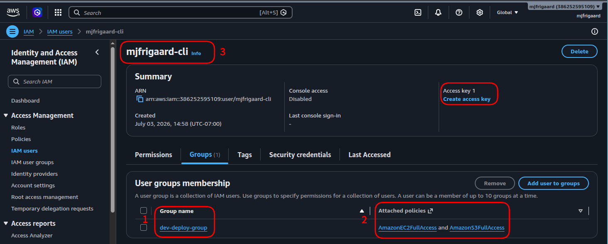{width="100%" fig-align="center"}

We want to click on **Create access key** under the **Security credentials tab**. The **Use case** we want is the **Command Line Interface (CLI)**:

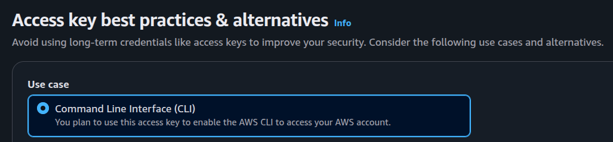{width="80%" fig-align="center"}

Follow the steps in the documentation (be sure to store the Access Key ID and Secret Access Key pair somewhere safe!).

Next we'll cover installing the AWS Command Line Interface (CLI) on our local machine. This will allow us to control AWS from the command line.

## Install AWS CLI

First we run the standard `apt update`:

```{bash}
#| eval: false 
#| code-fold: false 
sudo apt update
```

Next we download the latest version via the official installer:

```{bash}
#| eval: false 
#| code-fold: false 
curl "https://awscli.amazonaws.com/awscli-exe-linux-x86_64.zip" -o "awscliv2.zip"
```

Install an `unzip` utility:

```{bash}
#| eval: false 
#| code-fold: false 
sudo apt install unzip -y
```

Use `unzip` on the downloaded `awscliv2.zip` file:

```{bash}
#| eval: false 
#| code-fold: false 
unzip awscliv2.zip
```

Finally, we install `aws`:

```{bash}
#| eval: false 
#| code-fold: false 
sudo ./aws/install
```

You should see:

```{bash}
#| eval: false 
#| code-fold: false 
# You can now run: /usr/local/bin/aws --version
```

### Verify install

```{bash}
#| eval: false 
#| code-fold: false 
aws --version
```

```{bash}
#| eval: false 
#| code-fold: false 
# aws-cli/2.35.15 Python/3.14.5 Linux/7.0.11-76070011-generic exe/x86_64.pop.24
```

## Logging in

Use the `aws login` command to log in with the Terminal:

```{bash}
#| eval: false 
#| code-fold: false 
aws login
```

Select a region by clicking <kbd>Enter</kbd>:

```{verbatim}
No AWS region has been configured. The AWS region is the geographic location of
your AWS resources.

If you have used AWS before and already have resources in your account, specify
which region they were created in. If you have not created resources in your
account before, you can pick the region closest to you:
https://docs.aws.amazon.com/global-infrastructure/latest/regions/aws-regions.html.

You are able to change the region in the CLI at any time with the command "aws
configure set region NEW_REGION".
AWS Region [us-east-1]:
```

Then the browser opened and I was able to log in as the `root` user:

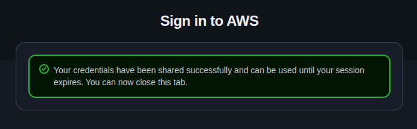{width="80%" fig-align="center"}

```{r}
#| label: co_box_cli_access_key
#| echo: false
#| results: asis
#| eval: true
co_box(
  color = "o",
  look = "default", 
  hsize = "1.25", 
  size = "1.00", 
  header = "Alternatives recommended", 
  fold = TRUE,
  contents = "
You might see the following recommendation for logging in: 

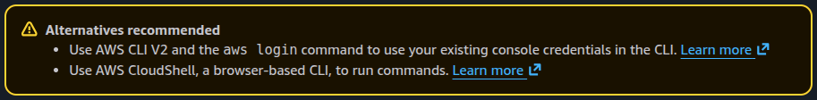{width='100%' fig-align='center'}
  
I used the `aws login` command from the Terminal, but still needed an Access Key ID and Secret Access Key to configure the group. 

")
```

### Terminology Review

We've just created a new group, user, access key ID, *and* secret access key. Lets review these before going forward, because it got confusing for me the first time I completed this lab.

#### 1. What is an ARN?

**ARN** = Amazon Resource Name. You may have noticed this under the **Summary** section for the `mjfrigaard-cli` user:

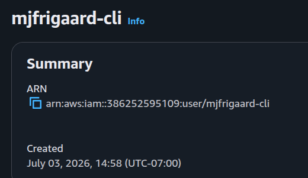{width="80%" fig-align="center"}

The ARN a unique identifier for a specific AWS resource (a user, bucket, instance, policy, etc).[^start-aws-2] ARNs are similar to fully qualified file paths, but for AWS resources.

[^start-aws-2]: Read more about AWS ARN's in the [official documentation](https://docs.aws.amazon.com/IAM/latest/UserGuide/reference-arns.html).

This is how it works:

```{verbatim}
arn:aws:iam::386252595109:user/mjfrigaard-cli
```

| Part | Value | Meaning |
|---------------------|--------------|------------------------------------|
| `arn` | arn | Fixed prefix |
| `aws` | aws | Partition (the standard AWS, not something like GovCloud or China) |
| `iam` | iam | Service |
| (blank) | — | Region (IAM is global, so it doesn't specify a region) |
| `386252595109` | Account ID | Which AWS account owns this user |
| `user/mjfrigaard-cli` | Resource | this is an IAM **user** named `mjfrigaard-cli` |

```{mermaid}
%%| fig-cap: ‘Amazon Resource Names (ARNs) uniquely identify AWS resources’
%%| fig-width: 7.0
%%| fig-align: 'center'
%%{init: {‘theme’: ‘base’, ‘themeVariables’: {‘fontFamily’: ‘monospace’}}}%%

graph LR
    ARN["ARN"] --"Partition"--> Partition["<strong>aws</strong>"]
    ARN --"Service"--> Service["<strong>iam<br>s3<br>ec2"]
    ARN --"Region"--> Region["<strong>us-east-1 </strong>"]
    ARN --"Account ID"--> Account["<strong>386252595109</strong>"]
    ARN --"Resource Path"--> Resource["<strong>user/mjfrigaard-cli</strong>"]
    
    style ARN fill:#E8A33D,stroke:#000000,stroke-width:1px,font-size:14px,text-align:left,font-family:monospace,color:#ffffff
    style Partition fill:#5B8C5A,stroke:#000000,stroke-width:1px,font-size:14px,text-align:left,font-family:monospace,color:#ffffff
    style Region fill:#3E2A1E,stroke:#000000,stroke-width:1px,font-size:14px,text-align:left,font-family:monospace,color:#ffffff
    style Service fill:#1B2A41,stroke:#000000,stroke-width:1px,font-size:14px,text-align:left,font-family:monospace,color:#ffffff
    style Account fill:#2A6F77,stroke:#000000,stroke-width:1px,font-size:14px,text-align:left,font-family:monospace,color:#ffffff
    style Resource fill:#D2562B,stroke:#000000,stroke-width:1px,font-size:14px,text-align:left,font-family:monospace,color:#ffffff
    
```

In plain English: *"IAM user named `mjfrigaard-cli` in AWS account `386252595109`."*

**Should I keep my ARN a secret?**

No--ARNs are not credentials. They are identifiers, similar to a username or a URL. It's safe to share, log, or put in documentation. It does not grant access by itself (they just identify a resource).

However, you should keep the Access Key ID + Secret Access Key secret, because these are used to authenticate.

#### 2. IAM Account IDs/Aliases

An account alias is a human-readable name you can set that will work like an Account ID. You may have seen the option to log in with an IAM account alias. By default, our AWS account is identified with a 12-digit number (called an Account ID). An Account ID is not secret like access keys (alone it can't grant access to anything), but don't share it unnecessarily.

To create an account alias, use the following command:

```{bash}
#| eval: false 
#| code-fold: false
aws iam create-account-alias --account-alias my-company-name
```

This changes your console log in URL from:

```{verbatim}
https://386252595109.signin.aws.amazon.com/console
```

to:

```{verbatim}
https://my-company-name.signin.aws.amazon.com/console
```

This is a purely cosmetic change; it doesn't affect permissions or ARNs.

## CLI Configuration

Back in the Terminal, we're going to configure the `dev-deploy` group using:

```{bash}
#| eval: false 
#| code-fold: false
aws configure --profile dev-deploy
```

This will prompt you for:

1.  Access Key ID
2.  Secret Access Key
3.  Region (`us-east-1`)
4.  Output format (`json`)

The commands above only create a named credential profile stored locally at the following location (nothing was sent to AWS yet):

```{verbatim}
~/.aws/credentials   (keys)
~/.aws/config        (region/output format)
```

We can test our configuration with:

```{bash}
#| eval: false 
#| code-fold: false
aws sts get-caller-identity --profile dev-deploy
```

This asks AWS: *"Using these credentials, who am I?"*

It returns the following:

``` json
{
    "UserId": "AWS_ACCESS_KEY_ID",
    "Account": "NUMBER_SET",
    "Arn": "arn:aws:iam::386252595109:user/mjfrigaard-cli"
}
```

The `sts` command uses AWS's security token service (STS) validated our keys and returned:

- `UserId`: unique internal ID for this IAM user
- `Account`: AWS account number
- `Arn`: confirms we are authenticated as `mjfrigaard-cli`

```{mermaid}
%%| fig-cap: ‘Humans and services’
%%| fig-width: 7.0
%%| fig-align: 'center'
%%{init: {‘theme’: ‘base’, ‘themeVariables’: {‘fontFamily’: ‘monospace’}}}%%


graph LR
    CLI(["CLI<br>(stored keys)"])
    STS("<strong>get-caller-identity<strong>")
    CLI --"Security<br>Token<br>Service"--> STS
    STS --Returns--> Response{{"<strong>UserId<br>Account<br>Arn</strong>"}}
    
    style CLI fill:#5B8C5A,stroke:#000000,stroke-width:1px,color:#ffffff
    style STS fill:#2A6F77,stroke:#000000,stroke-width:1px,font-size:14px,text-align:left,font-family:monospace,color:#fff
    style Response fill:#D2562B,stroke:#000000,stroke-width:1px,font-size:14px,text-align:left,font-family:monospace,color:#ffffff
    
```

This is the standard way to confirm we can CLI credentials are valid and check which identity they belong to. In the next lab, we'll cover uploading the `vetiver` model data in an S3 bucket.
